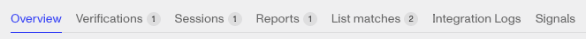
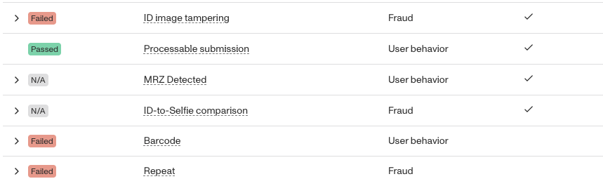

# Reviewing an Inquiry

Inquiries can collect a vast array of information not only covering what was collected from the end user, but also on how it was collected. This article aims to help you better parse all that information. Let’s start with the Inquiry Nav bar along the top.

### Object Tabs by Type

-   Overview: Displays an at a glance view of the inquiry with key information with Summary, Collected, Location, Signals, and Behavioral Risk Signals panels.
-   Verifications: Every verification from the inquiry run is collected here, each in their own collapsable dropdown articulating why the passed or failed.

-   Sessions: The summary panel at the top shows a map view of any sessions from the inquiry. The Sessions panel then provides detailed network and device information from each individual session.

What’s an Inquiry Session? A collection of data, including location and device info, related to a single and sustained network connection between the end user’s device and the Persona platform.

-   Reports: The reports tab displays the results of any reports that were run during the inquiry and for any workflows that ran a report based on that inquiry.

-   List matches: The List tab displays any matches from the inquiry against any list matches that were run during the inquiry and for any workflows that ran a list match based on the inquiry.

-   Integration Logs: If a workflow the triggered off of the inquiry used an integration, a log would be generated and displayed here.
-   Signals: This tab contains end user [behavioral signals](./11J1yKHLG0IKRWnvOKJ3ur.md) that can help detect and assess fraud risk.

-   Info Panel: Collect common tokens like the Inquiry, Reference, and Account IDs, along with the template used and status.

-   Tags: This panel allows users to add tags to the inquiry and displays any tags already attached to the inquiry.
-   Cases: If the inquiry is attached to a Case, that case will be listed here.
-   Event timeline: A chronological listing of all events relevant to the inquiry from Inquiry create up to the most current event. If you’re looking to understand why an inquiry run didn’t behave as expected, start here.

-   View run: Allows you to see the path taken through the inquiry template from this inquiry run.

## FAQ

### Why did this Inquiry Fail?

For an inquiry to Fail, it needs to reach a fail screen. This usually means a Verification failed multiple times, which can be found in the Verifications tab. Each attempt to pass a verification will be included. For a failed verification, look for which required checks failed.

If you’re looking for more details on an individual check, you can find them listed by Verification Type in the dashboard [here](https://app.withpersona.com/dashboard/resources/verification-checks).

### Why did this Inquiry Expire?

An Inquiry can expire from multiple expiration windows being exceeded. Each of these windows start from different starting points or not based on time but the number of inquiry sessions created.

-   **From Inquiry creation:** after the inquiry is first created, the status will change to `expired` after this time. Configure this to ensure that inquiries that are never accessed are not available forever. Defaults to 24 hours.
-   **From Inquiry pending:** after the inquiry enters the `pending` phase, the status will change to `expired` after the configured time. If left blank, this defaults to the value for the Inquiry Creation time option. Configure this if you would like to further control how long an Inquiry is available after an end user has accessed it.
-   **From Inquiry resume:** after the inquiry expires and is _resumed_ (via API call or in the Dashboard), this is how long the user has to complete the inquiry before the status changes to `expired` again. Defaults to 24 hours.
-   -   The inquiry can also be set to expire if the end user(s) start too many sessions with the inquiry. This is meant to help mitigate bad actors from passing a captured inquiry link around to different devices. Defaults to 25 sessions.

-   **Device Handoff Link :** This applies to device handoff links generated when a user elects to perform a handoff to another device. Because device handoff links are authenticated links, we recommend setting them to expire as quickly as your use case can tolerate. Defaults to 1 hour.

| Expire starting point | Default time |
| --- | --- |
| Creation | 24hrs |
| Pending | Same as Creation Expired’s duration |
| Resume | 24hrs |
| Device-Handoff-Link | 1hr |
| Inquiry Session Limit | 25 |

All five expiry windows can be configured at the template level. 

## Related articles

[How do I resume an expired Inquiry?](./7xYuQOCfXXjW4cgS3c7EOg.md)

[What is a Required Verification Check?](./3K8D1gIoUcAtYScf9nlrh7.md)

[Verification checks that improve other checks](./1r1p4vM8O6uJXbJw1hO8WP.md)
