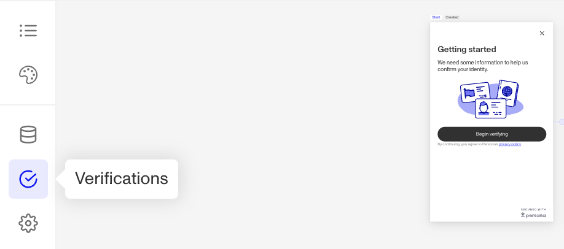
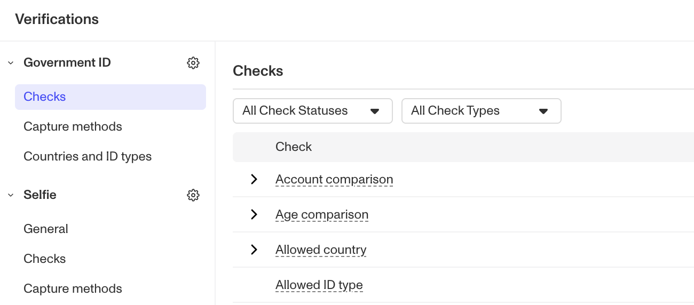

# What is a Required Verification Check?

❓ This question came from a member of the Persona community—a project admin who was trying to collect certain information without impacting the verification process. This question is useful for those who want to understand or change which Inquiry Verification Checks are required.

If a Verification Check is required, it must be passed for an Inquiry as a whole to be marked “Completed." Depending on your organization's Persona plan, you may be able to adjust Verification Check requirements in your Inquiry Templates.

# How can I see which Verification Checks are required for a given Inquiry Template?

1.  Open the dashboard.
2.  In the dashboard’s navigation bar, click **Inquiries** > **Templates**.
3.  Select the Inquiry Template you’re interested in.
4.  In the Inquiry Flow Editor, click on the **Verifications** icon in the left-hand sidebar.

5.  Under each verification method, navigate to the **Checks** section to view all of the checks run run for that method. The right-most **Required** column will have a checkmark if the Verification Check is required.

# How can I change which Verification Checks are required for a given Inquiry?

💡 You can customize verification requirements if your organization is on Persona's Essential, Growth, or Enterprise plan. If your organization is on the Startup plan, you will not have the option to adjust these settings.

You can modify which Verification Checks are required by following these steps:

1.  Open the dashboard.
2.  In the dashboard’s navigation bar, click **Inquiries** > **Templates**.
3.  Select the Inquiry template you’re interested in.
4.  Select the Verifications icon (check mark) in the left-hand sidebar.
5.  Under the verification method you'd like to edit, select **Checks**.
6.  Check or un-check the “Required” box for any Verification Check to adjust the verification requirements.
7.  Once you’re finished, click **Save** in the top right corner. You will need to **Publish** the revised template to use it.

# Learn more

See [this guide](./nqBDRxxIjiIvnOwsCpri6.md) to learn more about Inquiry details in the Dashboard.

Learn more about Verification Check attributes [here](./2Q2Mk72I8dHPC4MiF2noHo.md).
