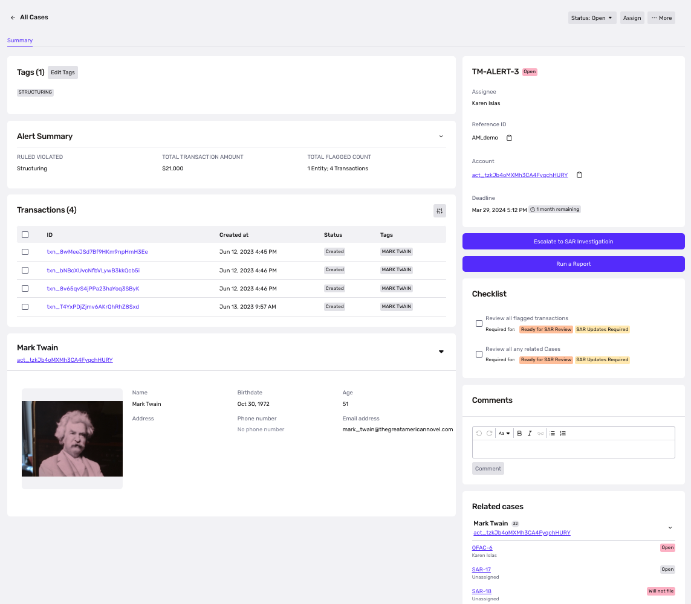
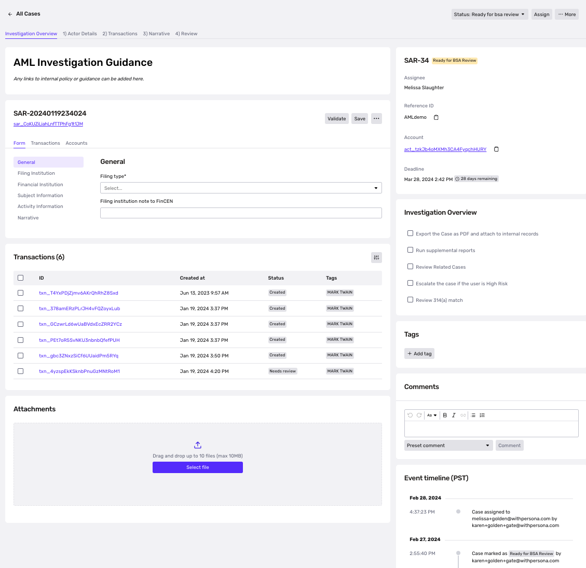

# AML Case Management & SAR Filing Overview

**AML Case Management and Automated SAR Filing** is Persona's solution designed to help your team adapt quickly to regulatory changes and conduct high-quality, streamlined investigations. Our out-of-the-box, end-to-end AML solution enables your compliance professionals to collect identity data, investigate suspicious activity, and file a SAR — all in one place. We also provide reliable tracking, so you can manage active and pending AML investigations, maintain an audit trail through our event timeline, stay notified on upcoming deadlines, and track approvals.

The following outlines key features included in Persona’s AML case management offering. Given the diverse nature of compliance programs, we tailor your default configurations to match your program’s requirements and needs.

| **Features** | **Overview** |
| --- | --- |
| **Assignment and Status Tracking** |  |
| Automated Case Assignment | Upon case creation, Cases can be automatically assigned to members of your compliance team. Our most common assignment distribution type is round-robin, which ensures that Cases assignments are distributed equally across assignees. You can also manually reassign any cases that were assigned automatically. |
| Case deadline (SLA) tracking | Persona Cases enables your organization to monitor review deadlines automatically when a new Alert or SAR case is created. You can customize case deadline SLAs and reminders based on your compliance program requirements.  
  
For example, you can set the case deadline to 28/30 days based on your requirements. Additionally, notification reminders can be tailored to trigger at any preferred interval before the case deadline expires (e.g., prompting the assignee 24/48 hours before case is due).  
  
Cases can be sorted and assigned by earliest SLA due. |
| Notifications | We offer dashboard notifications for the following:  
-   _A case has been created_
-   _A case has been assigned_
-   _A case review SLA has been breached_
-   _A case review SLA is X hours/minutes from breaching_

 |
| Case Status Tracking | You can use case statuses to track alerts and SAR case review lifecycles. These statuses can be configured to match your program’s unique review flow.  
  
As an example, for an Alert case, you might use the following statuses:-   `Open`
-   `In Review`
-   `Closed`
-   `Escalate to SAR Investigation`  
      
    For a SAR Investigation case, you might use the following statuses:
-   `Open`
-   `Under Review`
-   `Ready for BSA Officer Review`
-   `Will not File`
-   `Submitted to FinCen` |
| Internal Escalations | Our robust case state machine allows you to model any internal escalation paths for case review. For example, an organization might want the SAR case to be reassigned to a BSA Compliance Officer when the case has been moved to a “Ready for BSA Officer Review” status by a compliance analyst. Escalation paths can be fully customized based on your program needs. |
| **Review Guidance and Collaboration** |  |
| Checklists | Our platform provides customizable checklists designed to guide your team through the review process. Checklist items can be configured to a required state, ensuring that analysts must complete each item before transitioning the case to a new status. |
| Related Cases | The Related Cases module allows the case assignee to see a summary and the status of cases previously created for an account. |
| Attachments | We support the ability to attach screenshots or documents relevant to each alert / SAR investigation. |
| Comments | Our commenting feature facilitates seamless collaboration and record-keeping throughout the AML investigation process. Reviewers can add a comment to a case anytime they want to share additional context, ask questions, or change the status of the case. |
| **Permissions & Audit Logging** |  |
| Role-Based Permissions | We offer robust role-based permissions that allow you to limit who has view and edit access to case records.-   Allow this role to only view cases assigned to them
-   Allow this role to view cases from a certain template
-   Allow this role to create, see list of, view, and edit individual Suspicious Activity Reports (SARs)
-   Allow this role to export Suspicious Activity Reports as XML or PDF
-   Allow this role to e-file Suspicious Activity Reports
-   Allow this role to edit the Filing Institution Details for Suspicious Activity Reports |
| Event Timeline | We equip teams with a comprehensive audit trail to track the review process from start to finish. Every step, including assignment, reassignment, and status changes, is documented within the event timeline for thorough record keeping. |
| SARs | Our system offers the flexibility to export SARs as XML files or electronically file them directly to FinCEN. Moreover, permissions for exporting and e-filing can be tailored to specific roles using our role-based permissions feature, ensuring controlled access. |

**Alert Cases** Alert Cases are the first step in the AML case investigation flow within Persona. Cases can be created via the `Create Case` API endpoint whenever a transaction monitoring alert is triggered within your internal or third-party transaction monitoring system.

**❗ The Alert Summary shown below is for illustrative purposes only.**  
It is completely configurable and will be populated based on the signals provided by your transaction monitoring solution. Some organizations may choose to display additional external data here (e.g. risk signals, customer duration).

When an agent investigates the alert case, they can:

-   Review the associated account, alerts, and SAR cases
    
-   Add attachments to the alert case
    
-   Add comments to the alert case
    
-   Add tags to the alert case
    
-   Work through the investigation checklist
    
-   Track review deadlines
    
-   Re-assign or escalate case to another analyst or compliance officer
    
-   Change the status of the alert case (e.g. escalate, close)
    
    
    

**SAR Investigation Cases**

SAR Cases are records that let compliance teams centralize and track the end-to-end SAR investigation lifecycle. SAR cases can be built from alert cases or created from scratch.

As an analyst investigates the SAR Case, they can:

-   Review the associated account, alerts, and SAR cases
-   Run additional reports
-   Add attachments to the case
-   Add comments to the case
-   Add tags to the case
-   Work through the investigation checklist
-   Track review deadlines
-   Re-assign or escalate case to another analyst or compliance officer
-   Change the status of the alert case (e.g. Ready for BSA Officer Review)
-   Create, view, export or e-file SARs (only available for roles with these permissions)

## SAR e-filing

Persona connects to FinCEN using the Secure Data Transfer Mode (SDTM) connection type for e-filing. If your organization has not previously used an SDTM connection, you will need to request new credentials from the BSA E-Filing help desk. The Secure Data Transfer Mode (SDTM) credentials are granted at the filing institution level.

The amount of time it takes to obtain these credentials varies, but typically this can take between 2-8 weeks. In the meantime, your organization can download the SAR as an XML file that can be uploaded to the BSA portal.
