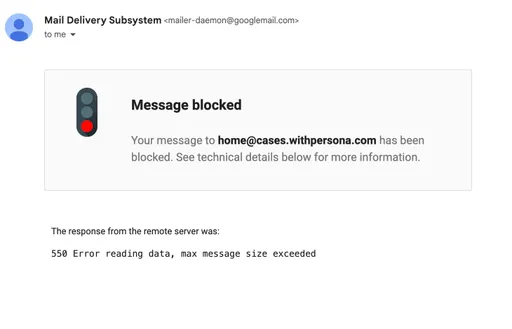

# Why did my email attachment fail?

⚠️ This question came from a member of the Persona Community - a team manager responsible for manual review of cases. This question is useful for those looking to debug issues with attachments within the Cases email module, often used to message end users.

# Question

Why did my email attachment fail?

# Answer

There are a few reasons why an attachment may fail when using the Cases email module. Below you’ll find some of the most common issues.

## File type issues

The following is a list of supported file types that can be attached to an email within the module.

| **File Type** | **Supported** |
| --- | --- |
| `.PDF` | ✅ |
| `.HEIC` | ✅ |
| `.PNG` | ✅ |
| `.JPEG` | ✅ |
| `.JPG` | ✅ |
| `.XLSX` | ✅ |
| `.XLS` | ✅ |
| `.CSV` | ✅ |
| `.DOCX` | ✅ |
| `.TXT` | ✅ |
| `.ZIP` | ✅ |
| `.TSV` | ✅ |

## Attachment size issues

Please note that there is a limit of `15 MB` for attachments per email (including threaded replies from the earlier parts of the email conversation). This means you can generally include one file of up to `15 MB` or up to three files of `5 MB` each.

⚠️ If you need to share email attachments larger than \`15 MB\` or of an unsupported file type, we recommend uploading them to Google Drive, OneDrive, or Dropbox. Once uploaded, please share the link directly in your email.

When attaching files, keep in mind that the total size of the email—including the content and any threads—can affect the maximum attachment size. For instance, if your email has a lot of HTML content or is part of a long thread, the limit may be lower than `15 MB`.

For end users, replying to an email conversation with an attachment, some email clients (i.e. Gmail) may notify when a message cannot be sent due to size restrictions.

_Example of an error message that an end user may receive from their email client when attaching a file that exceeds size restrictions._

📌 This answer was last updated on October 20, 2024 by Lynn Chou, a product marketing manager for Cases. FAQs, unlike other articles, are written to provide Persona Community members more specific answers to common questions. While we periodically review responses and answers, please note when this FAQ was last updated as information may have changed since then.

## Related articles

[Cases Email module](./qcQ5CqIFeDQaS8TJt0JUD.md)
