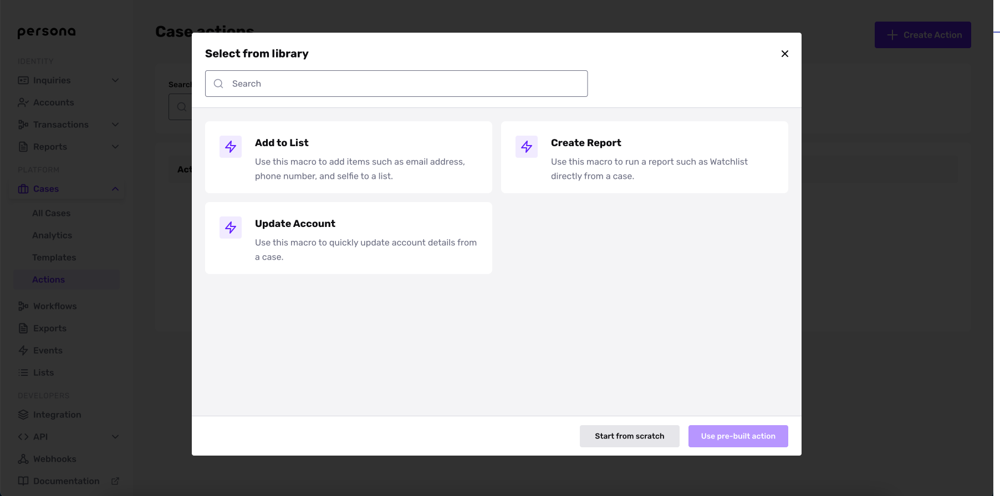
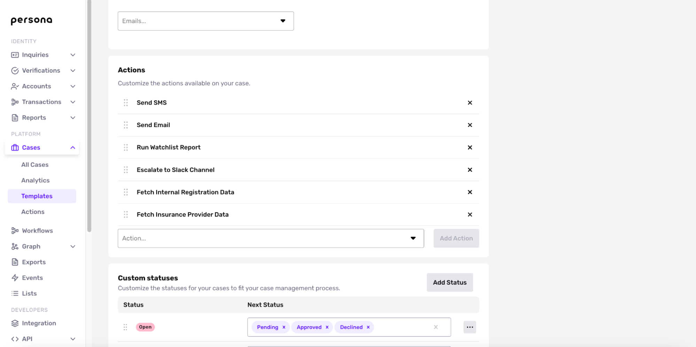

# Cases Actions

## Overview

Cases Actions are one-click macros that enable your team to automatically run an action for a given case. Case actions are built using workflows and supercharge what customers can do within a case. Any actions supported by workflows or custom code can be built as a case action and used within a case.

With Case Actions, you can run actions such as:

-   **Add to list:** Add items such as email address, phone number, and faces to a list from within a case so you can easily keep track of bad actors.
-   **Submit HTTP request:** Re-enable a user within your internal system at the same time that you approve a previously failed case.
-   **Send SMS or Inquiry link via Cases:** Send SMS or email inquiry links directly within Cases to reverify failed inquiries.

## When to use Case Actions versus Workflows

Case actions should be used whenever an action is not 100% automated and is dependent on assessment or judgment from someone on your team. If you want to reserve some sort of flexibility, use case actions instead of [Workflows](./6i3aAp6lBK3FCf08HJgPjh.md).

## How to set up Case Actions

To create a custom Case Action for your organization, navigate to Actions under Cases. You will then see a “Create Action” button on the upper-right corner.

You can then either create your own custom action or use a pre-built action such as Update Account or Run Report. You can create any Case Action supported by a workflow today.

Once created, you’ll need to add the Case Action to the Case template under Actions and hit save. You will now be able to access their new case action on the hamburger menu within a case.

