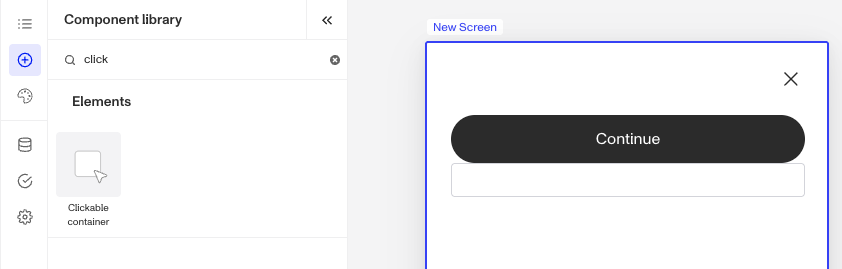

# Inquiries: Clickable Container component

# What is the Inquiry Clickable Container component?

The **Clickable Container** is an Inquiry screen component that provides an interactive layout element used to grouping and organizing other components. When users click it, it triggers an action. You can customize its appearance and define logic that governs when it appears.

A Clickable Container component helps structure content by controlling alignment, spacing and styling. Clickable Containers can be used to manage the overall layout of a screen.

# How do you add an Inquiry Clickable Container component?

1.  Navigate to the Dashboard, and click on **Inquiries** > **Templates**.
2.  Find and click on the Inquiry template you want to edit, or **Create** a new template.
3.  Hover over a screen and click the **Pencil** icon, or double-click the screen to open it in the Screen Editing View.

4.  In the Left Panel, click **Component Library** and search for ‘**Clickable Container**’.
5.  Drag and drop the Clickable Container component into your screen, and reposition it by dragging it around.
6.  Click on the Clickable Container component, and go to **Properties** in the Right Panel.
    1.  Under **Settings**, you must set a **Transition Type**. This defines what happens when users click the container. You can choose between two types: **Screen** and **Action Sequence**.
        1.  **Screen** transition allows the screen to change to a different screen when the container is clicked.
            1.  Click the **Screen** dropdown menu to select the **transition screen**. You will see a list of available screens from your Inquiry.
        2.  **Action Sequence** transition uses an action sequence to determine the next screen.
            1.  **Action Sequences** run logic within an Inquiry to determine which screen to show users based on specific conditions. Click the **Action Sequence** dropdown menu to select the sequence. You will see a list of available actions from your inquiry.
            2.  **Action Sequence Error Screen**: If your **Action Sequence** fails for any reason, users will be routed to this screen. Click the **Action Sequence Error Screen** dropdown menu to select the error screen. You will see a list of screens from your Inquiry.
    2.  To customize the Clickable Container component you can drag and drop any component. For example, if you want to add important links you can drag and drop a **Text** component into the **Clickable Container.**
7.  (Optional) In the **Styles** tab, you can edit the **Clickable Container’s** sizing, spacing, layout, color and border. You can read more about **Styles** below.
8.  (Optional) In the **Logic** tab, you can add rules that govern when the component appears, and when it does not. You can read more about **Logic** below.
9.  **Close** the step. You’ll have to **Save** and **Publish** the template to begin using it.

# Styles

You can customize how your component appears to users in the Styles tab, modifying elements like sizing, spacing, layout, color, and border to align with your branding and enhance usability.

## Sizing

**Clickable Container** size can be defined by adjusting its width. Under **Sizing**, select **Fixed Width** to set a custom size, this is the default selection. Or choose **Fill Width** to make the container fill the screen.

## Spacing

Margins can be adjusted on all four sides of the Clickable Container component (top, left, bottom, right) to control the spacing between it and other elements on the screen. For instance, increasing the top margin can create more breathing room above the Clickable Container component, while adjusting the bottom margin can ensure consistent spacing with subsequent elements, reinforcing a clean and organized layout.

Padding can be adjusted on all four sides of the Clickable Container component (top, left, bottom, right) to control the spacing between it and the edge of the screen. Increasing padding creates more space inside the Clickable Container, ensuring its content doesn’t feel cramped and aligns neatly with the overall design.

## Layout

The alignment options allow for control over the positioning of elements inside the Clickable Container, offering vertical alignment choices (left, center, right) and a horizontal alignment (top, center, bottom). Adjust the spacing between items in the Clickable Container by increasing or decreasing the **Spacing.**

Use **Frame positioning** to control the width of the Clickable Container with respect to the screen. **Edge-to-edge** sets the Clickable Container component to span the entire screen, while inside margins sets the width with respect to the screen margins.

## Colors

Setting a background color allows you to customize the visual appearance of the **Clickable Container**, providing contrast and enhancing the overall design.

## Border

You can add a border to all four sides of the Clickable Container component (top, left, bottom, right) for custom styling. Adding a border radius creates rounded edges, which softens the Clickable Container’s appearance for a more modern look. You can also customize the border's color to match your design.

# Logic

Persona provides you with the ability to add logic to a Clickable Container component. For example, a component may only become visible to a user if certain conditions are met. There are two options for logic rules:

-   **On screen load**: Logic rules are evaluated only when the screen loads. They can reference any field configured on the template.
-   **On screen update**: Logic rules are evaluated in real time. They can only reference inputs on the current screen.

## Logic Rules

Logic rules consist of three main components:

1.  **Field**: The object that will have a condition linked to it.
2.  **Condition**: How the field is compared to the value (e.g., equals, does not equal).
3.  **Value**: The value to test against.

### Creating Logic Rules

-   **AND Statements**: Combine multiple conditions that must all be true for the rule to pass. Add these using the **"Add"** button.
-   **OR Groups**: Combine conditions where only one needs to be true for the rule to pass. Create these by clicking **"Add OR Group"**.

## How to use Logic Rules

1.  Click on the Clickable Container component, and go to **Logic** in the Right Panel.
    1.  Choose either “**On screen load**” or “**On screen update**” and click **Add.**
    2.  Choose what **Component Update to apply**. This determines what happens to the component when the logical rules are met.
    3.  Create a logical rule by filling in the three boxes following **When**, which correspond to an object, its condition, and its value being assessed, respectively. When that logical rule passes, the component update is applied.
    4.  (Optional) Add additional logical rules by clicking either **\+ Add** (if you want to add 'AND' rules, where all must be passed to continue) or **\+ Or** (if you want to add 'OR' rules, where one must be passed to continue). You can also nest a group of OR statements within an AND statement by clicking **\+ Add Group**.
    5.  (Optional) To edit the logic directly, you can open the **code editor**.

# Plans Explained

## Clickable Container component by plan

|  | Startup Program | Essential Plan | Growth Plan | Enterprise Plan |
| --- | --- | --- | --- | --- |
| Clickable Container component | Available | Available | Available | Available |
| Styles for Clickable Container component | Available | Available | Available | Available |
| Logic for Clickable Container component | Not Available | Not Available | Available as part of Inquiries Enhanced | Available as part of Inquiries Enhanced |

[Learn more about pricing and plans](./6oZbzp7jb7AWGClF5vpY3K.md).

# Learn more

[Learn more about Inquiries.](../../docs/docs/inquiries.md)
