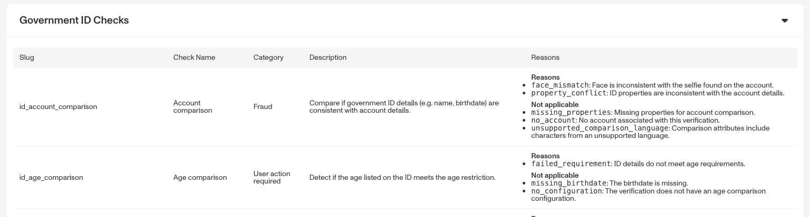
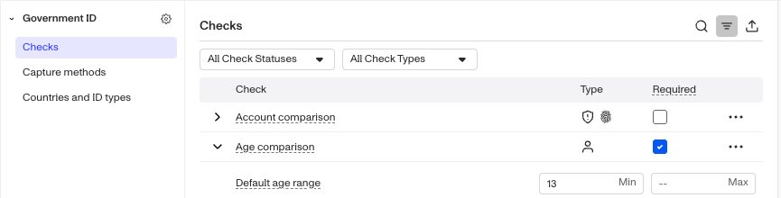
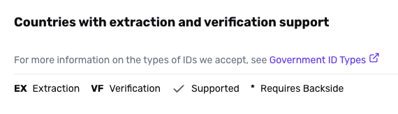

# Configuring Government ID Verification checks

# Overview

Below, we'll guide you through choosing and configuring [Government ID Verification](./5vXD7S7pQCq8Q9Z4RztxLw.md) checks. We'll walk through each of these steps:

1.  Review possible Verification checks
2.  Choose which Verification checks to require
3.  Edit required checks
4.  Configure Capture methods
5.  Configure Enabled countries and ID types

Each step is important. The first two steps will help you decide which Verification checks you want to include. The last three steps walk through how to configure the changes.

### Prerequisites

-   The ability to configure Verification checks is available on paid plans. If you're on the Startup Program and want to upgrade, please contact us [here](https://app.withpersona.com/dashboard/contact-us).
-   If your Verification check configurations are fully managed by your Persona team, you will not be able to edit them yourself. Please reach out to your customer success manager if you would like to make changes.

### Background

-   [Government ID Verification](./5vXD7S7pQCq8Q9Z4RztxLw.md) is one of the many types of Verification Persona offers.
-   Each type of Verification has an associated suite of _Verification checks._ These checks validate what an end user submits.
-   Checks can be required or not required.
    -   If any required check fails, the Inquiry fails.
    -   If a check is enabled but not required, it will still be performed and the results logged for information purposes, but it will not affect the results of the Inquiry.
    -   You can pick which checks you want to require by following the steps below.

## Step 1: Review possible Verification checks

Navigate to **Documentation > [Verification Checks](https://app.withpersona.com/dashboard/resources/verification-checks/)** reference in the Dashboard. Find the section for Government ID checks. The table includes all possible checks to choose from.

**Some checks compare what a user submits against other data.** To learn more, see: [Government ID Verification checks that compare Inquiry and Account data](./1rP2K32vfelQX6406OYi5j.md).

## Step 2: Choose which Verification checks to require

The Verification checks you choose to require will depend on your organization's specific needs. There is no one-size-fits-all configuration for these checks, but the following guidelines can help you optimize your setup:

**Consider the business goals of the Inquiry Template**. For example:

-   Do you want to prioritize avoiding false positives (people passing verification who should not), or avoiding false negatives (people failing verification who should not)? The more strict your verification needs are, the more checks you may want to require.
-   Are you most concerned with preventing fraud, checking whether user IDs meet specific requirements, or a combination of both?
    -   Some checks are more oriented toward preventing fraud (e.g., determining whether an ID document is an electronic replica).
    -   Others are more oriented toward ensuring that end users are submitting documentation that meets your requirements (e.g., determining whether an ID document is a valid driver’s license).

Use the [Verification check reference](https://app.withpersona.com/dashboard/resources/verification-checks/) to find the combination of checks that is most suitable for your business.

**Monitor and iterate**. You can adjust Verification checks as you observe pass/fail trends and as your needs change. For example, you can start with the defaults, then change one check and use [Inquiry Analytics](./6wdZdwn9m4T8eY7EfqWRmB.md) to determine how that change affected your pass rates.

## Step 3: Edit required checks

Once you decide which Verification checks to require, you can [add or remove a required Verification](./5Tc5tsWfBX03AHRkr2vqv2.md).

**For Government ID Verification Templates within an Inquiry Template:**

1.  In the Persona Dashboard, navigate to **Inquiries > Templates**. Select a template that uses Government ID Verification.
2.  Once you are in the Flow Editor, use the Left Panel to navigate to Verifications.
3.  Select the Government ID Verification template.
4.  Navigate to checks.

5.  Some checks have additional options. Click the arrow to expand the check and modify its requirements.

The following is available on Enterprise Plans

**For Government ID Verification Templates used alongside a Transaction, Workflow, or via API:**

1.  In the Persona Dashboard, navigate to **Verifications > Templates**. Select a template that uses Government ID Verification.
2.  Here you can review Verification checks.

## Step 4: Configure Capture methods

Capture methods determine how users can submit their Government ID during verification. Capture methods are configured separately for desktop web, mobile native submissions, and can be found under Verifications in the Inquiry Flow Editor. To learn more, see [Capture Methods](./7JQ78WDWLj5L63qXEu7AqJ.md).

-   Guided capture: Provides on-screen instructions to help users correctly capture their ID.
-   Unguided capture: Allows users to capture or upload their ID without step-by-step instructions.
-   File upload: Allows users to upload an existing file or image of their ID instead of capturing it live.
-   Device handoff: Allows users continue the capture process on a mobile device, which may offer better camera quality.
    -   Send Email: Sends a link to the user’s email address.
    -   Scan QR code: Displays a QR code the user can scan with their mobile device.
-   Accepted File Types: Determines which file formats users can submit. Choose to accept PDFs and/or Images (`JPG`, `PNG`, `HEIC`, `TIFF`).
-   Autoclassification: Allows users to submit an image their ID without explicitly selecting a country or ID type.

| Capture method | Desktop web | Mobile web | Mobile native |
| --- | --- | --- | --- |
| Guided capture | ✓ | ✓ | ✓ |
| Unguided capture | — | ✓ | — |
| File upload | ✓ | ✓ | ✓ |
| Device handoff | ✓ | ✓ | — |
| Autoclassification | ✓ | ✓ | ✓ |

## Step 5: Configure Enabled countries and ID types

This step is important, these settings are sometimes required for your Verification checks to work. **Here are settings unique to Government IDs:**

-   **ID type**
    -   Government IDs come in a few flavors. The main types are:
        -   Driver's license
        -   Passport
        -   National ID
    -   You can choose which type(s) to accept. Consider what ID types your users will likely have, and have easy access to. For setup details, see [Set allowed ID types for Government ID Verification](./21vQsGuteiH2m05oM297f3.md) and [Set accepted fallback ID types for Government ID Verification](./PF0H0WuZaInkYNun8GTMg.md).
-   **Front side, back side**
    -   IDs have a front side, and a back side. Back sides often contain a barcode.
    -   You can choose to require the front and/or back side.
        -   If the back side has a barcode, collecting the back side can help with extracting information from the ID.
        -   In some countries, you _must_ collect the back side in order to extract information from the ID. See the [international coverage map](https://app.withpersona.com/dashboard/resources/coverage-map/government-id) for details.
    -   See the [international coverage map](https://app.withpersona.com/dashboard/resources/coverage-map/government-id) to confirm country-specific requirements, and see [Require front and/or back of IDs for Government ID Verification](./6RqFh33a2D2W9OBsTefqQt.md) for configuration steps.

## Related articles

[Understanding Government ID Verification](./425G1MJXb8d9w6hTr7Huwg.md)

[Government ID Verification: Account comparison check](./h6kxly8QuyORcWYQFeaEw.md)

[Government ID Verification: Inquiry comparison check](./1qEE7AZz4NfDuCFqCBF7ZE.md)

[Government ID Verification: Repeat check](./6pGzYouPWF1Z4SKzLWRMT5.md)

[Government ID Verification: Checks that compare Inquiry and Account data](./1rP2K32vfelQX6406OYi5j.md)

[Government ID Verification: Setting allowed ID types](./21vQsGuteiH2m05oM297f3.md)

[Government ID Verification: Setting accepted fallback ID types](./PF0H0WuZaInkYNun8GTMg.md)

[Government ID Verification: Requiring front and/or back of IDs](./6RqFh33a2D2W9OBsTefqQt.md)
