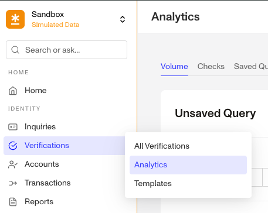
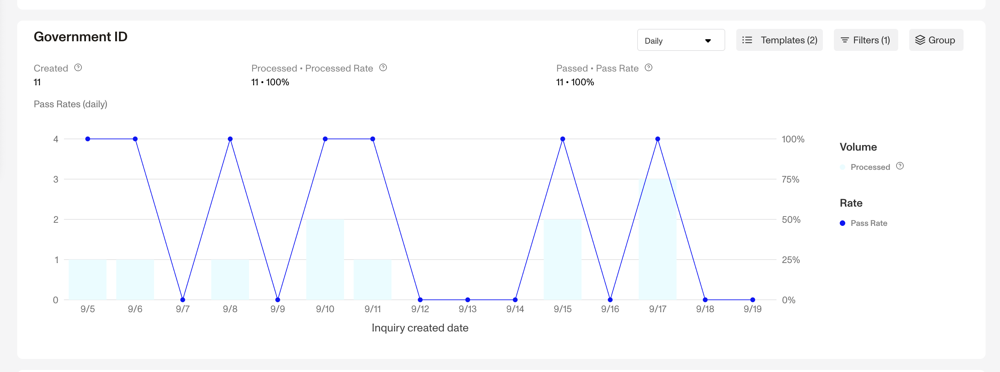
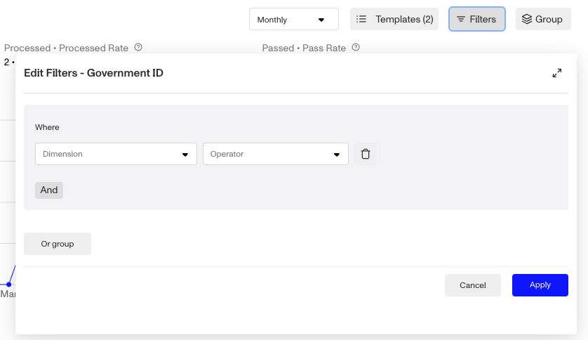

# Viewing Capture Method analytics

## Overview

When reviewing Government ID, Selfie, or Document verification performance, it’s helpful to understand how users are submitting images, whether through live camera capture or by uploading files. For those verifications run within Inquiries, capture method analytics can help you evaluate:

-   The share of Verifications completed by each capture method (Auto, Manual, Upload, Combo)
-   Pass rates across different methods
-   Whether disabling uploads could improve fraud prevention and/or affect conversion

Verifications run outside of an Inquiry (for example, via API or workflows), the ability to analyze verifications by capture method may not exist or be relevant.

This article will walk you through how to access and interpret capture method analytics, giving you actionable insights into how image submission methods affect pass rates and fraud risk.

## Open Verification analytics

To get started:

1.  In the Persona Dashboard, go to **Verifications > Analytics** from the side menu.

2.  Scroll down to the Government ID or Selfie verification section, depending on what type of verification you'd like to understand more about.
    
3.  Set up your query:
    
    1.  Choose a date range.
    2.  Select one or more Verification types.
    3.  (Optional) Select one or more Inquiry templates.
    4.  Click **Run Query.**
4.  The results graph will display the following metrics:
    
    
    
    1.  **Created**: Number of Verifications created for the selected Verification type.
    2.  **Processed** : Number of Verifications that Persona was able to process (pass/fail/retry).
    3.  **Passed**: Number of processed Verifications that passed all required checks.

### Filter analytics by Capture Method

You can filter your results by a specific capture method:

1.  Click the **Filters** button.

2.  In **Edit Filters** under **Where:**
    1.  Set the **Dimension** to **Capture method.**
    2.  Set the **Operator** to **Contains**.
    3.  Under **All Values**, select a capture method:
        1.  Auto, Manual, Upload or Combo.
    4.  Click **Apply**.

### Group analytics by Capture Method

To compare performance across capture methods:

1.  Click **Group** button.
2.  Choose **Capture method**.

This will split the analytics results by each method used, allowing you to compare volume and pass rate by method.

## Capture method types in analytics

Persona classifies each image submission on how it was captured. These labels appear in analytics dashboards and exports.

| **Capture Method** | **What it means** |
| --- | --- |
| **Auto** | Persona automatically captured the image when the document or face was positioned correctly in the frame. The user did not tap a button. |
| **Manual** | The user manually tapped a button to take the photo during the capture step. |
| **Upload** | The user uploaded an image from their device (rather than using the camera). |
| **Combo** | If a combination of methods are used for to capture the front and back of ID (e.g. auto-capture front and manual-capture back). |

You can also filter by these methods in when using Exports to understand which methods are most commonly used and which perform best.

## Related articles

[Capture Methods](./7JQ78WDWLj5L63qXEu7AqJ.md)

[Why should I disable image uploads?](./3bU3AKdWw5gSN8DxWQVv8p.md)
