# Using filters and saved views of Cases

## Overview

Saved Views let you create customized views of the Cases index page, giving you access to commonly filtered lists of cases. Whether you want to focus on cases from a specific template, with a specific status, or created between a certain date range, you can filter and save views that align with your business processes.

## Default view

From the Dashboard, navigate to **Cases > All Cases** to open the Cases index page. By default, the page opens on a Default view, which starts with two filters applied:

-   A **Created at** filter.
-   A **Status** filter, which is set by default to **Open**. You can adjust this filter to focus on other statuses as needed.

You can add additional filters as needed, but if you find yourself applying the same set of filters repeatedly, consider saving that configuration as a **Saved View**.

## What you can configure in a saved view

Saved views make it easy to return to your preferred filters with a single click, instead of re-creating them each time. Your Case list view offers several configurable components:

-   **Filters** applied to each view
-   Visibility and ordering of columns displayed
-   Ability to add multiple filters

## Filtering Cases

To filter your Case list view and display only the items that meet your criteria:

1.  Open the **filter menu** (toggle button with three lines to the right of the search bar).

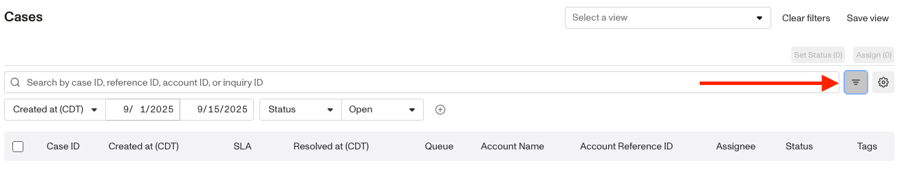

2.  Apply filters such as:
    
    1.  Created at: Narrow results to cases created within a specific date or date range.
    
    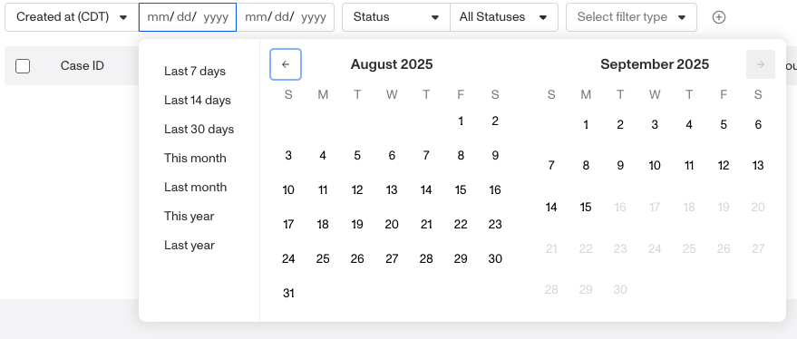
    
    2.  Resolved at: Narrow results to cases resolved within a specific date or date range.
    
    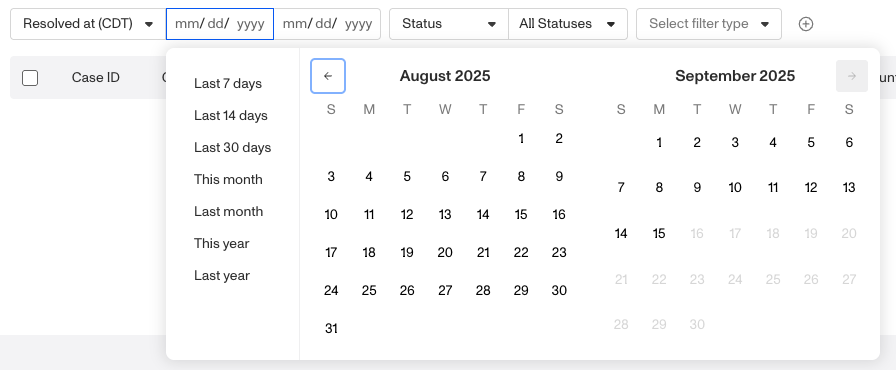
    
    3.  Status: Show only cases with a certain status (approved, declined, open, pending).
    
    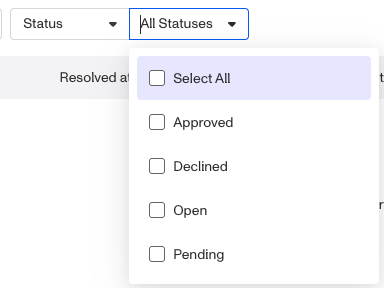
    
    4.  Case template: Limit results to cases generated from a specific case template.
    5.  Assigned to: Show only cases assigned to a specific user.
    6.  Not Assigned to: Show cases that are unassigned or not assigned to a specific user.
    7.  Account reference ID: Filter by the reference ID associated with the account linked to the case.
3.  To add more than one filter, hover next to the last filter row until the **“+” button** appears, then click it to add another filter.
    

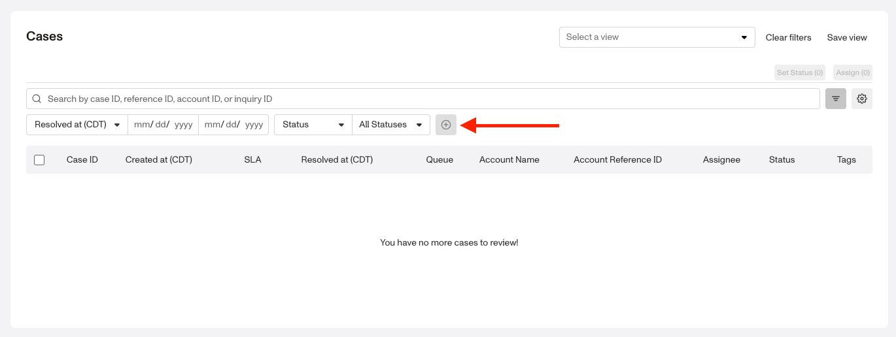

## Customizing columns

You can also customize the columns shown in the Case index:

1.  Open the **configure columns menu** (click the gear button next to the **filter menu** button).

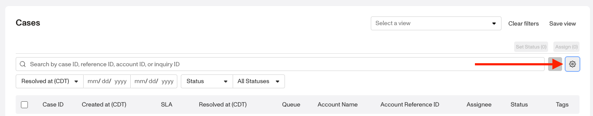

2.  Use the toggles to turn attributes shown on or off.
    
    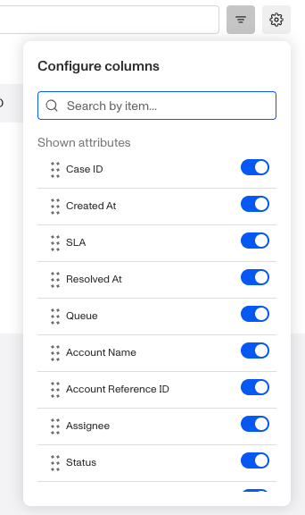
    
    1.  Attributes that are on appear under **Shown attributes.**
    2.  Attributes that are off appear under **Hidden attributes.**
3.  Drag the six dots next to an attribute name to rearrange the order in which columns appear.
    

## Creating saved views of filtered Cases

If you’ve applied filters in the Default view and want to save them for future use, you’ll need to create a new view:

1.  Add the filters you want on the view.
2.  Click the **“Save view”** button to create your view.

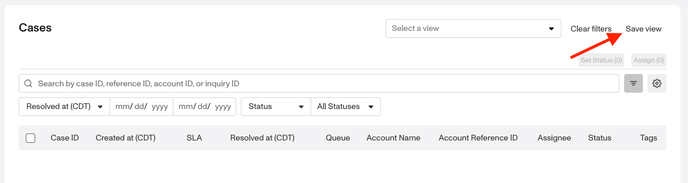

3.  Give the view a **name,** set the Date range, and click **“Save as new view.”**

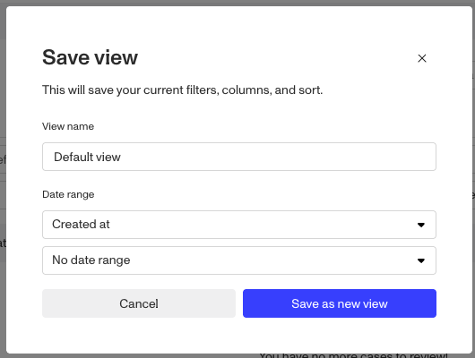

4.  Use the drop-down menu to **save or delete** the view. Access this menu later by hovering over the view name and selecting the **three-dot menu.**
5.  Once you’ve configured your filters, click “**Save view”** button to preserve your setup for later.

## Managing saved views

To edit a saved view:

1.  Navigate to **Cases > All Cases**.
2.  Select the saved view from the existing views.

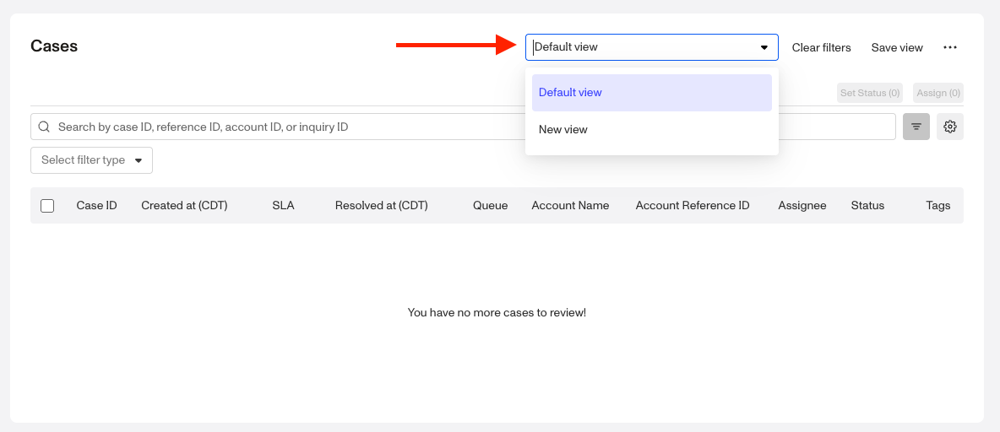

3.  Adjust filters, columns, or other settings as needed.
4.  Select “**Clear filters**” to reset all filters.
5.  Click “**Save view”** to apply your changes.
6.  To rename or delete the view, click the **three-dots menu** to the right of the “**Save view**” button.

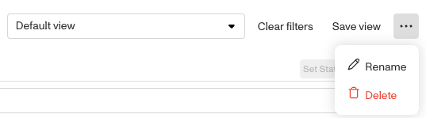

Your updates will overwrite the existing saved view, so you’ll see the new configuration the next time you open it.

## Items per page

At the bottom of the Cases index page, you can control how many cases are displayed at once. Use the **Items per page** dropdown to select from the available options: **10, 25, 50, 100, or 200**.

Adjusting this setting is helpful if you want to:

-   View more cases on a single page when scanning large datasets.
-   Limit the number of cases displayed for easier navigation.

Your selection will update the table immediately.
