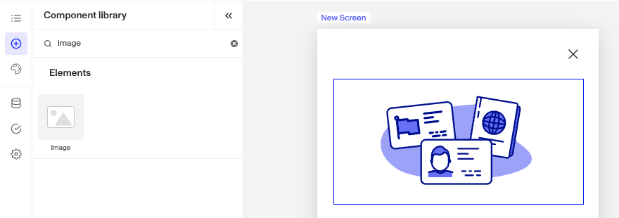
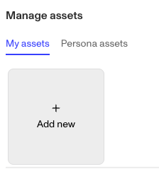
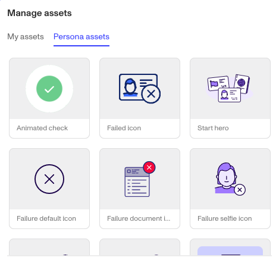

# Inquiries: Image component

# What is the Inquiry Image component?

An **Image** component is an Inquiry screen component that adds an image to the screen. You can customize its appearance and define logic that governs when it appears.

Adding an image to a screen is useful for enhancing visual appeal, supporting branding, or providing content. Examples include displaying a logo at the top of the screen or adding an illustration to guide users through a process. Images help capture attention and make the interface more engaging and informative.

# How do you add an Inquiry Image component?

1.  Navigate to the Dashboard, and click on **Inquiries > Templates**.
2.  Find and click on the Inquiry template you want to edit, or **Create** a new template.
3.  Hover over a screen and click the **Pencil** icon, or double-click the screen to open it in the Screen Editing View.

4.  In the Left Panel, click **Component Library** and search for ‘**Image**’.
5.  Drag and drop the Image component into your screen, and reposition it by dragging it around.
6.  Click on the Image component, and go to **Properties** in the Right Panel. To upload an image:
    1.  Click the **Replace** button. Under **My assets**, click **Add new** to upload your own image. Alternatively, select **Persona assets** to browse through Persona's provided image library.
    2.  **Alt text** can be added to uploaded images. Alt text improves accessibility by describing an image for users who rely on screen readers and provides context if the image fails to load. It ensures all users can understand the content and purpose of the image.

7.  (Optional) In the **Styles** tab, you can edit the image’s sizing, spacing, layout, colors. You can read more about **Styles** below.
8.  (Optional) In the **Logic** tab, you can add rules that govern when the component appears, and when it does not. You can read more about **Logic** below.
9.  **Close** the step. You’ll have to **Save** and **Publish** the template to begin using it.

# Styles

You can customize how your component appears to users in the **Styles** tab, modifying elements like image sizing, spacing, layout, colors.

## Sizing

Image size can be defined by adjusting its height or width. Under **Resizing**, choose either **Fill Height** or **Fill Width** to make the image fill the screen, this is the default selection. Or select **Fixed** **Height** or **Fixed Width** to set a custom size. The image will always maintain its original proportions and won't become distorted when resized.

## Spacing

Margins can be adjusted on all four sides of the Image component (top, left, bottom, right) to control the spacing between it and other elements on the screen.

## Layout

The alignment options allow for control over the positioning of elements, offering horizontal alignment choices (left, center, right).

## Colors

For images included in the **Persona assets**, you can customize various color properties including fill color, background color, highlight color, and stroke color. Note that available color options may vary depending on the specific image. Feel free to experiment with colors to achieve your desired design.

# Logic

Persona provides you with the ability to add logic to an Image component. For example, a component may only become visible to a user if certain conditions are met. There are two options for logic rules:

-   **On screen load**: Logic rules are evaluated only when the screen loads. They can reference any field configured on the template.
-   **On screen update**: Logic rules are evaluated in real time. They can only reference inputs on the current screen.

## Logic Rules

Logic rules consist of three main components:

1.  **Field**: The object that will have a condition linked to it.
2.  **Condition**: How the field is compared to the value (e.g., equals, does not equal).
3.  **Value**: The value to test against.

### Creating Logic Rules

-   **AND Statements**: Combine multiple conditions that must all be true for the rule to pass. Add these using the **"Add"** button.
-   **OR Groups**: Combine conditions where only one needs to be true for the rule to pass. Create these by clicking **"Add OR Group"**.

## How to use Logic Rules

1.  Click on the Image component, and go to **Logic** in the Right Panel.
    1.  Choose either “**On screen load**” or “**On screen update**” and click **Add.**
    2.  Choose what **Component Update to apply**. This determines what happens to the component when the logical rules are met.
    3.  Create a logical rule by filling in the three boxes following **When**, which correspond to an object, its condition, and its value being assessed, respectively. When that logical rule passes, the component update is applied.
    4.  (Optional) Add additional logical rules by clicking either **\+ Add** (if you want to add 'AND' rules, where all must be passed to continue) or **\+ Or** (if you want to add 'OR' rules, where one must be passed to continue). You can also nest a group of OR statements within an AND statement by clicking **\+ Add Group**.
    5.  (Optional) To edit the logic directly, you can open the **code editor**.

# Plans Explained

## Image component by plan

|  | Startup Program | Essential Plan | Growth Plan | Enterprise Plan |
| --- | --- | --- | --- | --- |
| Image component | Available | Available | Available | Available |
| Styles for Image component | Available | Available | Available | Available |
| Logic for Image component | Not Available | Not Available | Available as part of Inquiries Enhanced | Available as part of Inquiries Enhanced |

[Learn more about pricing and plans](./6oZbzp7jb7AWGClF5vpY3K.md).

# Learn more

[Learn more about Inquiries.](../../docs/docs/inquiries.md)
