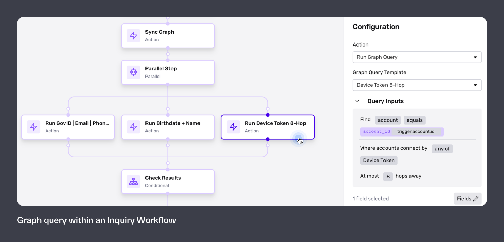
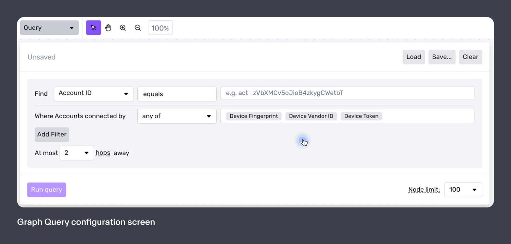

# Getting started with Graph

This article will provide a brief overview on how to configure Graph. You can find additional information in the Graph [glossary](./mDyQ4BlICWkXzVyUQyFwo.md) and [properties](./2dlG9Q9liRn43wUIxHntRT.md) .

# How to use Graph

Organizations use Graph **proactively** to run fraud investigative checks at scale or **reactively** to conduct fraud investigations.

### How might my organization use Graph _proactively_?

After an end user completes their inquiry, we will sync their account with Graph in the post-inquiry workflow and run queries to find linked accounts. Depending on the results, you may opt to create a case or decline the user outright.

### **How might my organization use Graph _reactively_?**

After you detect a fraudulent user on your platform, you might use Graph to search for accounts linked to their Persona account and determine if the extent of the fraud.

# Get started

## Use account statuses

Persona recommends using account statuses to make better Graph decisioning recommendations. The general idea is that accounts sharing properties with Fraudulent accounts are also likely to be fraudulent, so we can have higher confidence in auto-declining those inquiries.

| Account status | Description |
| :-- | :-- |
| **Active** | User has passed KYC (inquiry status = approved) |
| **Inactive** | User is not active on the platform (their Persona inquiry was declined or they have been offboarded) |
| **Fraudulent** | User is confirmed fraudulent (this is likely a manual process to change an account to this status) |

## Recommended queries

A Graph Query is a search request within Graph that surfaces accounts.

👩‍💻 **Query formatting**  
When you make a Query, you specify at least one property (like IP Address or device fingerprint) and the value of that property. The Query result includes all accounts with a matching value for that property.

  
Persona can auto-decline inquiries that are revealed to have Graph clusters above a certain size or mark them for manual review. The action taken will depend on the fraud patterns you see with your demographic, how conversion-optimized you are, and your bandwidth for manual review.

| Query | Description |
| :-- | :-- |
| Shared device fingerprint, device token, **or** device vendor ID. | All of these properties indicate device sharing. At higher cluster numbers (3+), it becomes improbable that the accounts that share these field values are all good actors. |
| Shared name **and** birthdate | This might indicate one user creating multiple accounts. |
| Shared SSN **or** shared Government ID number | This might indicate one user creating multiple accounts. |
| Shared device fingerprint with a Fraudulent account | Device fingerprint by itself is not always an indicator of shared devices (as many people may have the same browser settings). However, many fraudsters do share the same browser settings (the same extensions). This has been seen as an effective way to link fraudsters together, but it does return more false positives than other queries. |
| Shared IP Address with a Fraudulent account within the last 12 hours | On its own, a shared IP address may have high false positives (individuals on a work IP or campus network, for example), but there’s a chance you may have a fraud ring operating out of the same network. **At higher cluster numbers (3+) this signal becomes a more reliable indicator of fraud.** |
| Shared custom properties | You can configure custom properties on your Graph instance, based on the information you have on the user (e.g. hashed bank account or hashed credit card numbers) and query them using Graph. |

## Create cases to review

For any query results requiring manual review, you’ll want to view them in a Case. You can add the Graph module to any case template to view these results.

# Still have questions?

Graph is available to Enterprise and managed Growth customers. Please reach out to your Customer Success Manager or [contact our support team](https://app.withpersona.com/dashboard/contact-us).
