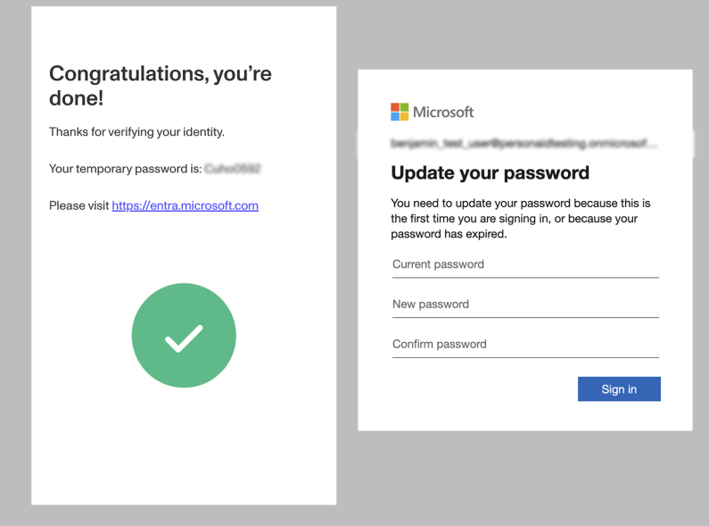

# What to expect when verifying your identity with Persona to reset your Microsoft Entra ID password

## What is Persona?

[Persona](./huT4RcIBnrAulAHamu6Gz.md) is a secure identity verification platform trusted by organizations around the world. We help companies confirm identities quickly and safely, so individuals can securely access the services they need. Millions of people have used Persona to verify their identity for banks, government agencies, technology companies, and more.

## How does Persona work with Microsoft Entra ID?

Persona provides organizations using [Microsoft Entra ID](https://www.microsoft.com/en-us/security/business/identity-access/microsoft-entra-id) with a seamless and secure identity verification experience. This allows helpdesk teams to remotely and safely trigger sensitive account actions—such as password resets—without needing to be in the same physical location as the user. With Persona, companies can maintain high standards for security, compliance, and user experience.

## Why am I being redirected to Persona?

You’re seeing Persona because the organization you’re working with wants to verify your identity. This helps keep your account secure, prevent fraud and social engineering, and ensure regulatory compliance. The process is designed to be fast, secure, and user-friendly.

## What will happen next?

After being redirected to Persona, you’ll be guided through a few simple steps:

1.  Enter your work email.
    
2.  Upload a government-issued ID (like a driver’s license or passport).
    
    
    
3.  Take a selfie to confirm you’re the person on the ID.
    
    
    
4.  (Optional) Complete any additional verification steps, such as confirming your phone number or email, depending on your organization’s requirements.
    

5.  Use your temporary password to log in at [https://entra.microsoft.com](https://entra.microsoft.com), where you’ll be prompted to set a new password.

Persona’s interface includes clear instructions and guidance at every step. If you encounter issues, check out our [end-user help section](../for-end-users.md).

## How is my data handled?

Your privacy and security are top priorities:

-   **Data protection:** Persona is GDPR- and CCPA-compliant and uses industry-leading security practices to safeguard your information.
-   **Transparency:** Only the organization requesting your verification can access your information.
-   **No data selling:** Persona does not sell your data or share it with third parties.
-   **Retention control:** The organization requesting your verification determines how long your data is retained. You can request deletion through them or via our privacy resources.
-   **Certifications:** Persona meets strict security standards and undergoes regular audits.

## Frequently asked questions

**What if I have trouble completing my verification?**  
Check out our [troubleshooting guide](../for-end-users.md) for help with issues like uploading photos or dealing with expired links.

**Who can I contact for support?**  
If you're having trouble with your verification, contact the organization that referred you to Persona. For general questions, visit our [end-user resources](../for-end-users.md).

**How do I know this is safe?**  
Your data is protected with industry-standard encryption and security protocols. Persona is trusted by leading companies around the world.

---

**Need more help?**  
Visit our [Help Center](../index.md) for more information about how Persona works. For specific questions about your verification, please reach out to the organization that referred you.

---

> **Note:** This article is intended for individuals completing a Persona verification flow after receiving a link from their helpdesk to reset their Microsoft Entra ID account password. For technical or configuration support, please visit our Help Center or contact your service provider.
