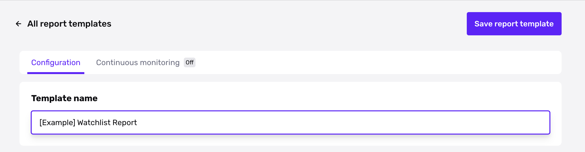
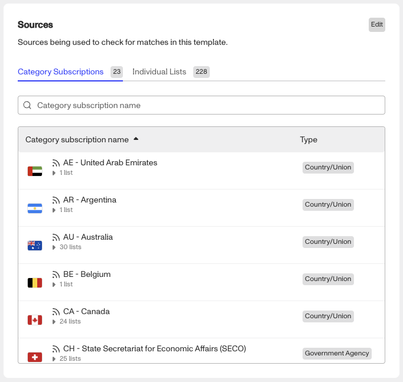
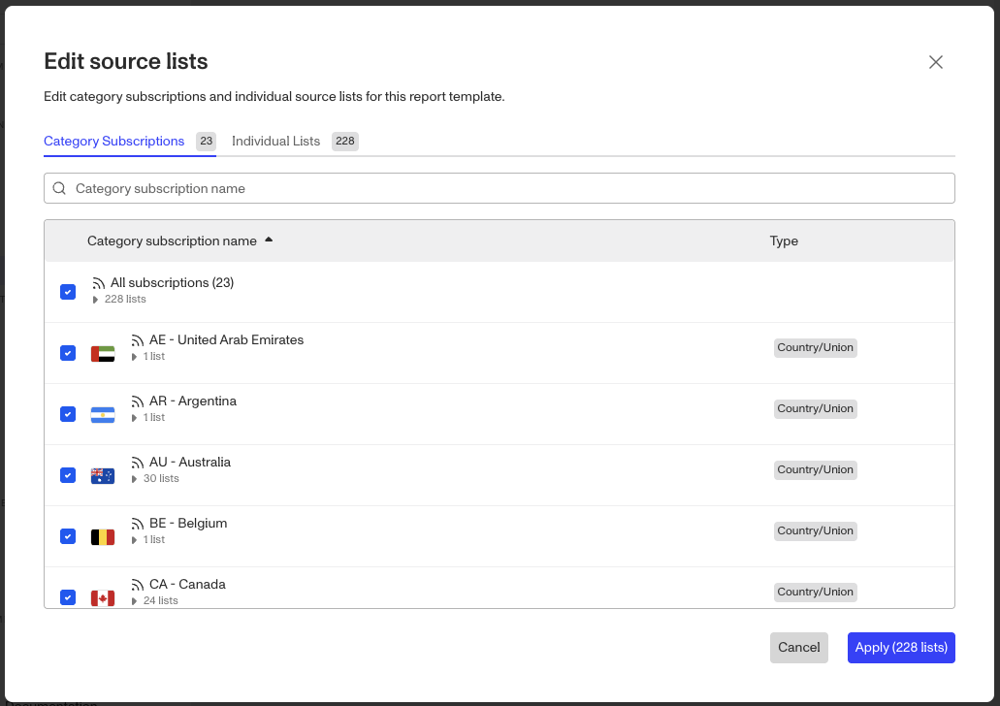
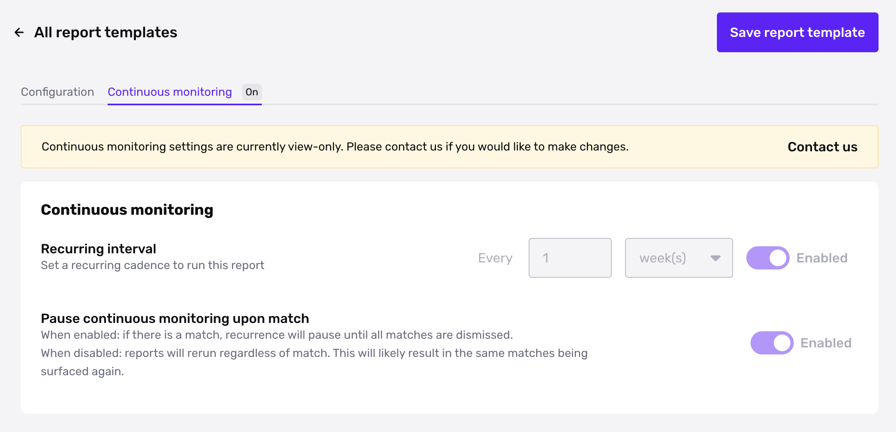

# Configure a Watchlist Report

✍🏻 Configuration is only available for Person Watchlist Report. For changes to other report types, please contact the Persona support team.

## Overview

Configuring the [Watchlist Report](./UQGaDEhkQ7TLAMJsjuXiX.md) to meet your business needs can be complex. This guide is designed to empower you to make informed decisions about the sources and match requirements that best fit your business needs. Persona offers customization options to give you control over the data you receive and its frequency.

## Configuration Options

To configure your Watchlist Report, navigate to **Reports** > **Templates** in your dashboard and select a Watchlist template. You can edit the following settings in the Reports Template Editor.

### Template name

The Watchlist Report includes “Watchlist Report” in the name by default, and can be renamed to something more descriptive or appropriate for your use case.

### Sources

Source data is organized in two ways - category subscriptions and individual lists. Individual lists are grouped into category subscriptions and are viewable under their respective tabs.

**Category Subscriptions** make it easy to apply a group of related lists to your Report Template. If your template is subscribed to a category, your template will check for matches for all source lists in that category. For example, OFAC is a category, and OFAC is made up of numerous lists from the U.S. Office of Foreign Assets Control.

**Individual Lists** offers more targeted screening and lets you subscribe to one list at a time. This option is useful if you do not require all lists in a category.

To edit the sources for your Watchlist Report, click **Edit** in the upper corner of the **Sources** section:

1.  Make your selections.
    
    -   To add an item, select the checkbox.
    -   To remove an item, unselect the checkbox.
    -   If you want to change from using a category subscription, to using only some of the lists in that category subscription: first unselect the category subscription, then select the individual lists.  
        
2.  Click **Apply**.
    
3.  In the upper corner, click **Save Report Template**.
    

### Name matching

Name matching settings let you decide how closely the name of your end user must match an entity in a source list.

Name matching for Watchlist has four options:

1.  **Exact:** matches on an exact name and AKAs in the article or source.
2.  **Strict:** matches on exact name, allowing for subset name matching and initial matching.
3.  **Tolerant:** flexible matching inclusive of all settings and allows room for typos.
4.  **Custom:** custom match profile.

For a deep dive into what these options mean, please see our [Name Match Requirements](./1FOJzuI3uMFmcDuR5zkged.md) article.

### Birthdate matching

Birthdate matching settings let you decide how closely the birthdate of your end user must match an entity in a source list.

Birthdate matching for Watchlist has two options:

-   **Exact date:** matches on the date that is input into the report.
    -   Example: If your organization inputs 12-25-2000, only 12-25-2000 will match.
-   **Exact year:** matches on the year that is put into the report.
    -   For example, if your organization inputs 12-25-2000, then 01-01-2000 and 12-30-2000 would both match, along with any other date within the year 2000.
-   **Within +/- 1 year from birth year (default setting):** matches on the year +/- 1 year to allow for additional catches.
    -   Example: If your organization inputs 12-25-2000, then 01-01-1999 and 12-30-2001 will both match, along with any other date in 1999, 2000, or 2001.

### Country matching

Country matching lets you decide how to use country-related information about your end user to match against an entity in a source list. Country matching will only filter out matches if all 3 criteria below are met:

-   You provide country information for an end user
-   The potential match in a source list has country information
-   The two pieces of country information do not match.

You can decide to match against one or more of these country-related fields in a source list:

-   **Birthplace**: Where an individual was born
-   **Citizenship**: Where an individual is registered as a citizen. One can hold citizenship in more than one country, and it can change over one's lifetime
-   **Nationality**: Where an individual or their parents are born. One's nationality remains the same throughout their lifetime, as it is inherited or innate
-   **Residency**: Where an individual resides

## Continuous Monitoring

The Watchlist Report can be set to recur at a regular cadence that meets your compliance requirements. [Continuous monitoring](./7LRMBbxLshF7sCcLhfhwF4.md) allows you to stay alert in the event that a previously approved individual ends up on a source list.

If you’d like to set up continuous monitoring, please [contact the Persona support team](https://app.withpersona.com/dashboard/contact-us).

## Related articles

[Name Match Requirements for Reports](./1FOJzuI3uMFmcDuR5zkged.md)
