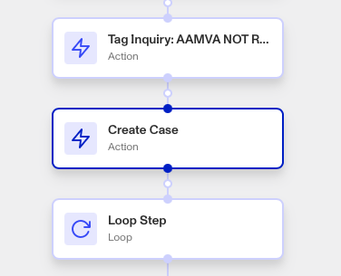

# Workflows: Create Case step

# What is the Create Case step?

**Create Case** is a Workflow Action step that creates a new Case when triggered.

Cases are Persona products that collect together data on an end user to allow for manual investigation and decisioning on.

Your organization may need to investigate a user using a Case for a variety of reasons:

-   **Onboarding**: Should this user be allowed to onboard to the platform?
-   **Account takeover investigation**: If a user is claiming that their account has been taken over, is there enough information to validate their claim?
-   **Fraudulent activity**: Are there suspicious signals associated with this user that require further action (e.g. account freezing, sending a follow-up inquiry for verification, etc.)?
-   **Transaction monitoring review**: Are there suspicious transactions associated with this user that require further investigation?

The Create Case step is useful for automatically triggering Case creation when certain parameters are met in your Workflow.

# How do you add a Create Case step?

1.  Navigate to the Dashboard, and click on **Workflows** > **All Workflows**.
2.  Find and click on the workflow you want to edit, or **Create** a new workflow.
3.  Click on **+** when hovering over a circle to add an **Action** step.

4.  Use the **Find Action** select box to click on **Case** > **Create Case**.
5.  Select a **Case Template**. The Case Template determines which team the Case should be sent to for review, and what information is included within that Case. Choosing or creating a relevant Template is useful for streamlining Case investigation.
6.  **Close** the Step Type. You’ll have to **Save** and **Publish** the workflow to begin using it.

# Plans Explained

## Create Case step by plan

|  | Startup Program | Essential Plan | Growth Plan | Enterprise Plan |
| --- | --- | --- | --- | --- |
| Create Case Step | Limited to pre-configured solutions | Available | Available | Available |

[Learn more about pricing and plans.](./6oZbzp7jb7AWGClF5vpY3K.md)
