# How to scan your passport, ID card, or residence permit with NFC

⚠️ Note: This guide is for individuals going through a Persona-powered identity verification flow. While we’ve included helpful tips, the verification was set up by the business, service, or organization that asked you to verify. They use Persona as a tool, and they ultimately decide what’s required and can assist with your specific situation, if you’re having trouble.

This article provides step-by-step instructions for uploading an ID document (such as a passport, ID card, or residence permit) to a Persona flow for identity verification purposes. For companies looking to set up NFC or passport collection on Persona, please see our guide on [Collecting passports and other IDs using NFC](./1iu1Fak8y9RiOE2FddXrHJ.md).

**You will need a phone with an NFC reader and an electronic passport to proceed.** This article will help you check that you're prepared and offer troubleshooting tips.

# Make sure your mobile device has an NFC reader

You need a phone or mobile device with an NFC reader (an NFC-enabled mobile device) to scan your passport and upload it to Persona.

### How do I know if my phone is NFC-enabled?

If you have ever used your phone for a Tap to Pay transaction, then your phone has a qualifying NFC reader. Otherwise, search the web to confirm your device model's NFC capability or consult your device's user manual.

❓ **What is NFC (Near-Field Communication)?**  
Two electronic devices with NFC or RFID (Radio Frequency IDentification) technology can communicate information within close proximity. You may have seen this before at payment registers that offer Tap to Pay. [Learn more →](./C6sdm6k7AnVBOmvlRP9ic.md)

### Where is the NFC reader in my phone?

-   **iPhone:** The NFC reader is at the top of the back of your phone.
-   **Android:** The NFC reader is either at the top or in the middle of the back of your phone.
-   **Other device:** Search the web to confirm the location of the NFC reader in your specific device model or look up your device's user manual.

# Check whether your ID document has an RFID chip

The NFC scan only works with ID documents that contain a readable RFID chip. Refer to the guidelines below to determine if your ID document meets the criteria.

### How to determine if your passport has an RFID chip

The NFC scan works with biometric passports or e-passports (electronic passports), which contain an RFID chip. You can confirm that your passport contains an RFID chip by checking the cover for this symbol:

### Find the NFC chip in your passport

The chip in your passport is in one of these places:

-   Front cover
-   Back cover
-   Photo page or biodata page
-   Dedicated chip page

Due to extra shielding on some passport covers, the chip may be easier to scan from one side of the cover than the other.

|   | Chip location |   |
| --- | --- | --- |
| Front cover |   
Outside

 | 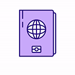  

Inside

 |
| Back cover |   

Outside

 |   

Inside

 |
|   |   

Passport Photo Page

 |   
  

Passport Card

 |

### How to determine if your ID card or residence permit has a readable RFID chip

The NFC scan works with ID cards and residence permits containing RFID chips that [comply](https://www.icao.int/publications/Documents/9303_p3_cons_en.pdf) with ICAO (International Civil Aviation Organization) standards. Note that some countries use RFID chips that do not follow the ICAO standard.

Most European residence permits and identity cards contain ICAO-eligible RFID chips. **The United States Passport Card does not contain an ICAO-eligible RFID chip.**

You can confirm that your ID card contains an ICAO-compliant RFID chip by checking for this symbol, which may be on the front or the back of the ID:

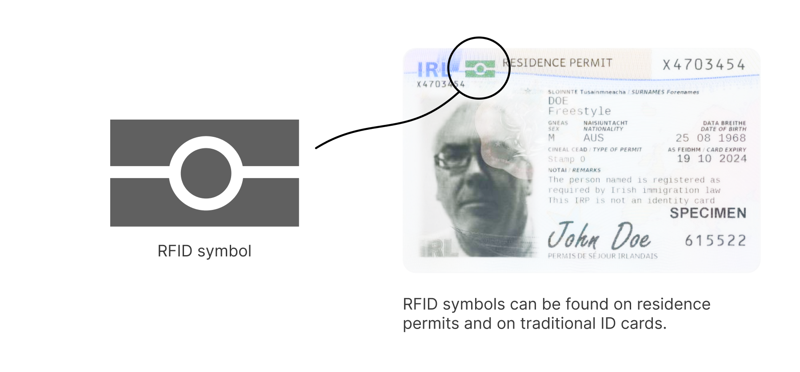

**If the symbol is not printed anywhere on your card, your card isn’t RFID-enabled**. RFID chips are embedded within cards, so the chips themselves are invisible to the human eye. The only visual indicator that your ID contains an eligible RFID is the symbol noted above.

**Every country that uses RFID-enabled IDs prints the RFID symbol in a different location on the ID at a unique size.** Some IDs prominently feature the symbol, while other designs make the symbol blend in among decorative details.

#### Check the back of your ID

Some IDs have the RFID symbol on the back of the ID.

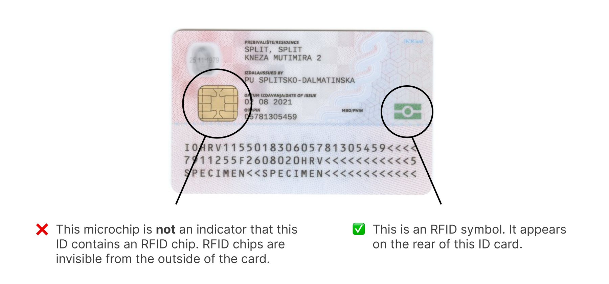

#### Ignore other electronic symbols & microchips

Other electronically readable symbols or microchips do not indicate that an ID contains an RFID chip. **If your card does not show the RFID symbol anywhere, it won’t work with Persona’s ID scan.**

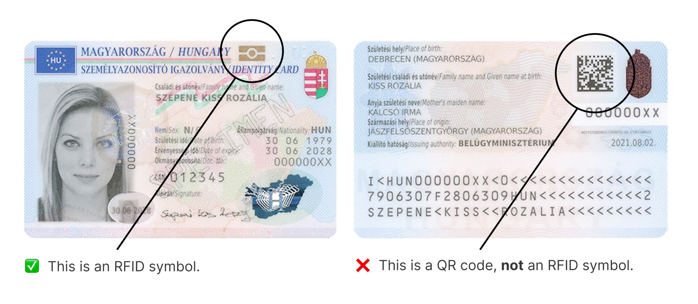

The following is an example of a different kind of microchip that people often mistake for an RFID chip. These chips will not work with Persona’s NFC scan.

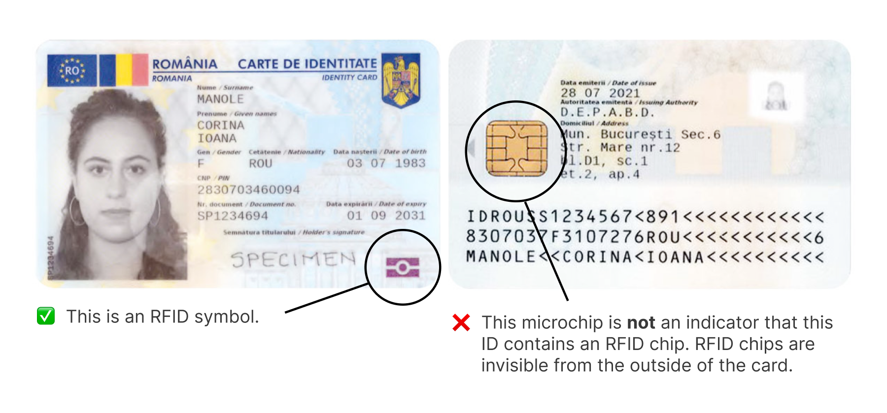

# Troubleshooting

If you having trouble scanning your passport with your NFC-enabled device, try these steps:

1.  Remove your phone and passport from any wallets, cases, or added protective covers.
2.  Lay your passport on a hard, flat surface.
3.  Hold your mobile device flat against the top of the passport, with **no gap** between the two items.
4.  Run your phone _very_ slowly across the surface of the passport in all directions, until your phone indicates that scanning has begun.
5.  As soon as scanning begins, hold your phone still against the passport until the scan completes.

If you're struggling to find the chip, scan the front cover, the back cover, the photo page, and any dedicated chip page inside your passport. Scan each cover or page from both sides.

For example, if you scanned the front cover of your passport with the passport closed, try again by scanning the inside of the front cover with the passport open.

# Example Screenshots

Below are screenshots of what you can expect during an [NFC verification](../../landing/blog/nfc-e-passport-verification-guide.md).

## Successful scan

| iOS | Android |
| --- | --- |
| 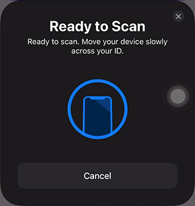 |  |

## Select errors

| Error | iOS | Android |
| --- | --- | --- |
| **No scan performed:** no scan was completed and the scanner timed out. | 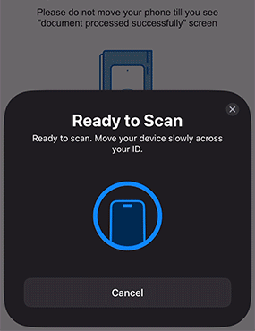 |  |
| **Lost connection:** the device was moved away and there was not enough time to scan. | 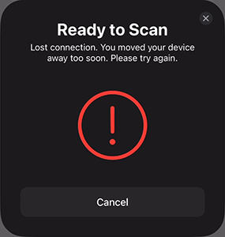 | 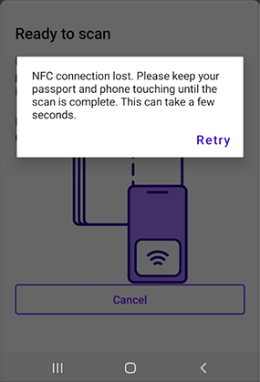 |
| **Access error:** scanner was unable to access the NFC data. In the previous step, check if the fields on the ID were extracted correctly. | 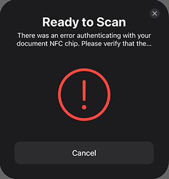 | 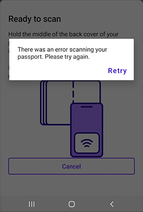 |

### Error logging and getting help when encountering errors

While most businesses that use Persona manage their own user experiences and support, if you encounter an error, following the steps below will help ensure the necessary details are logged so they can assist you.

If you run into an error while scanning your passport’s NFC chip, **use the exit options within the scan experience instead of closing the app directly**. This helps ensure that error details are logged properly, making it easier for support teams to assist you.

When encountering the above errors on Android or iOS, look for an ‘X’ button or a cancel option within the Persona UI to properly exit the flow. This prevents issues with error tracking.

**For example, for iOS users:**

1.  Do not close the app by swiping up or force quitting—this may make it harder to receive support.
2.  Instead, press the ‘X’ in the top-right corner of the Persona experience (marked 1 in the screenshot below).

-   If other ‘X’ or close buttons appear first (such as the Xs marked with 2 and 3), tap them as needed to proceed. However, you must press the final ‘X’ marked 1 in the scanning experience to properly exit.

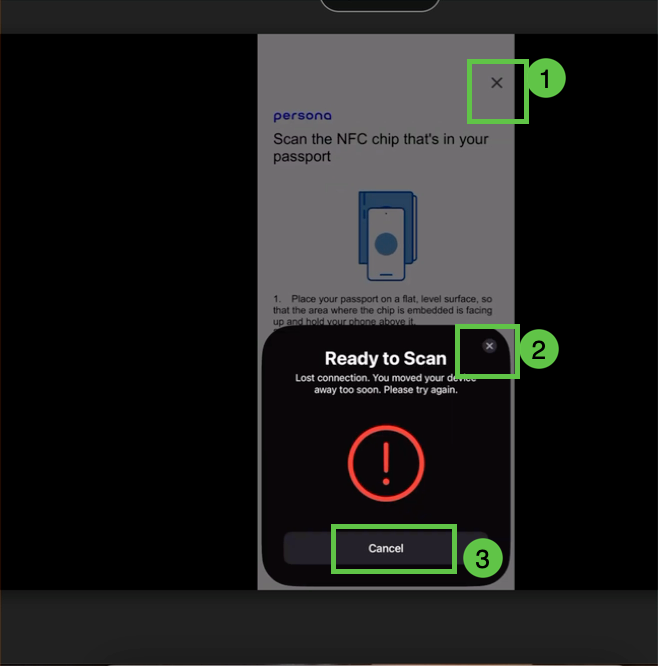

For Android users, while the UI may differ, the same principle applies—use the on-screen exit options instead of force closing the app.

## Related articles

[NFC technology and benefits](./C6sdm6k7AnVBOmvlRP9ic.md)
