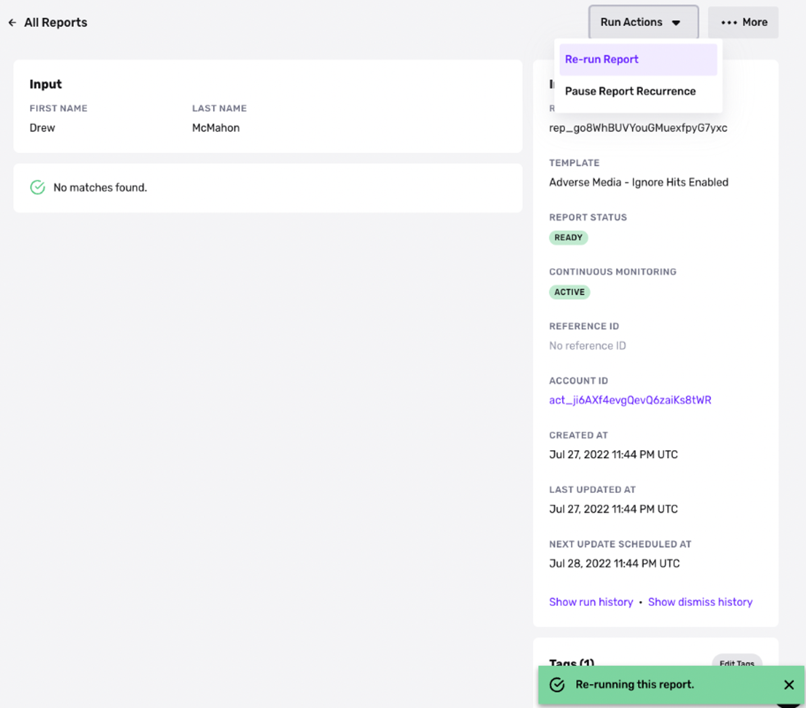
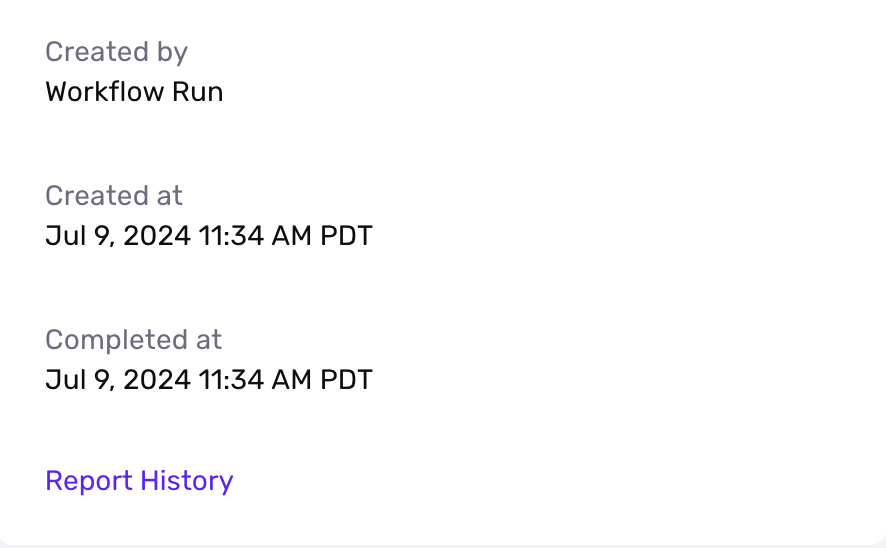
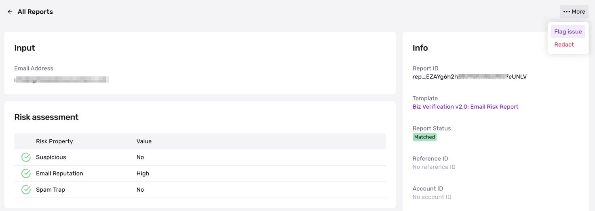

# Re-run a Report / Flag Issue

## Re-Run a Report

✍🏻 This feature only applies to recurrable reports:

-   Watchlist (person & business)
-   Adverse Media (person & business)
-   PEP
-   Crypto Address Watchlist
-   Business Nonprofit

To set up recurrable reports, see [here](./7LRMBbxLshF7sCcLhfhwF4.md).

To re-run a Report outside of the recurrence schedule, click into the Report in question and select “Re-run Report”. You can check that the Report successfully re-ran by either looking at `last updated at` timestamp on the Report view or by clicking into `Report History`.

## Report History

You can now view the full history of Report runs or actions taken for any given Report. This will be helpful for audit purposes and tracking down timelines of how Reports are processed against any individual or entity on your platform.

To view the History of a given Report, click into the Report in question and select “Report History” in the info card.

## Flag Issue

Flagging an issue via Reports will automatically create a ticket sent to Persona’s support team. They will review the ticket to understand the issue and reach out with any questions.

Common examples of issues that would be relevant to flag here would be issues with matches or a Report not running when it should.

