# Getting started with your Dynamic Flow Template

This article will provide a high-level overview of your Dynamic Flow Template (aka Inquiry Template).

📖 **Recommended reading:** [What is Dynamic Flow?](./2BerKqpgNIRG81jX0goCMU.md)

## What is an Inquiry Template?

The Inquiry Template defines the inquiry flow shown to end users. It encompasses themed screens, Verifications, and all logic within the flow. Persona provides an intuitive no-code interface (The Flow Editor) that allows you to utilize numerous configuration options for your inquiry template so you can tailor the experience to your specific needs for any use case. In this article, we'll explore the general structure of the Flow Editor.

## Structure of the Flow Editor

### Flow Tree - Canvas

The most prominent section in the Flow Editor is the Canvas, where you can see the Inquiry Flow Tree. The Flow Tree in the Flow Editor displays all possible pathways through the inquiry. End users navigate these paths as they progress through each screen, with their specific route determined by branching and routing configurations set in the Dashboard.

We will go through each of the different types of steps we see in the flow. We will use a template named “Government ID and Selfie” from the Inquiry Template Library when you click on the “+Create template” button.

This flow guides users through a Government ID and Selfie verification process. First, it asks users to select their government ID's country. Next, it presents them with allowed ID types for that country. After the user submits their ID photo, the system verifies the information and displays an appropriate screen based on the verification result. If the Government ID verification passes, the system saves the relevant data to an account and prompts the user to submit a selfie for additional verification. Both the Government ID and Selfie verification steps allow for a configured number of retry attempts.

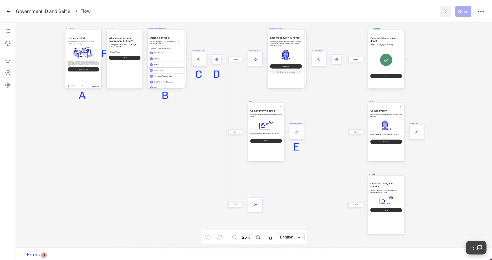

**A. Screen step**: Screens show what the end user sees. This particular screen is the first one in the flow that users will see when an inquiry is created for them. The next screen, indicated to the right, is the Country Select screen, where users identify the country of origin for their Government ID.

**B. Combined screens step**: These are sets of screens (shown as stacked screens) that work together for specific verification types. For example, this combined step manages Government ID collection through several screens (ID selection, image capture, submission verification, etc.). You can expand the view in the editor to see the full experience.

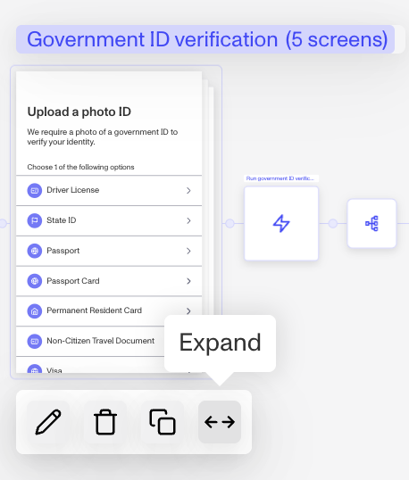 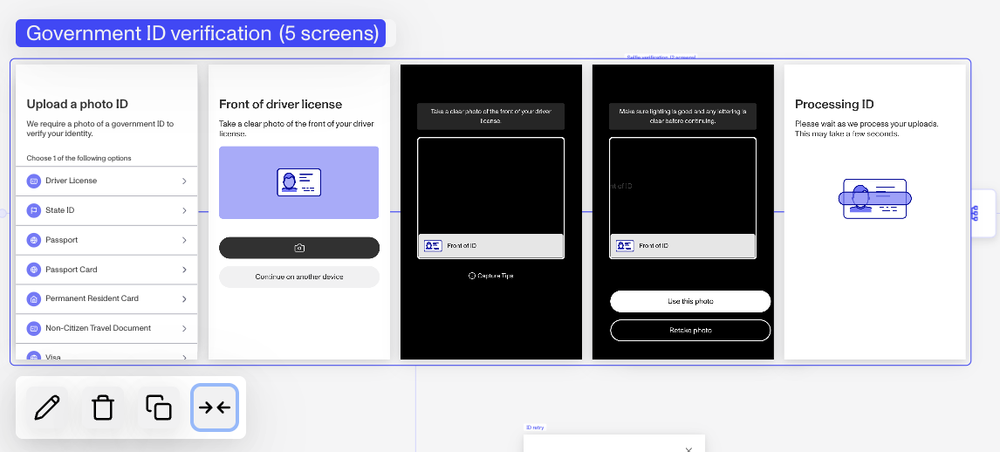

**C. Action sequence:** This denotes a sequence of actions (powered by Workflows) that are performed between two screens. For example, after collecting the user's ID, we run a verification action on it. Hovering over this action sequence in the editor reveals its two steps: one runs the verification, and another writes the extracted ID info from verification back to the inquiry. You can also edit to view the actual workflow.

**D. Branching step:** A branching step conditionally routes the user to the next screen based on specific conditions - in this case, the result of a verification. For example,

-   If the user passes the verification, they proceed to Selfie collection (after another action step updates the account fields).
-   If the user fails but has not used all their allowed attempts, they see the "Couldn't verify photos" screen and are routed back to the Government ID screen to try again.
-   If neither of these conditions are met, the user is directed to the Fail screen.

**E. Connector step**: At the end of the second and third routes, you'll see boxes with arrows in them. These are Connector Steps that route users to screens located elsewhere in the flow.

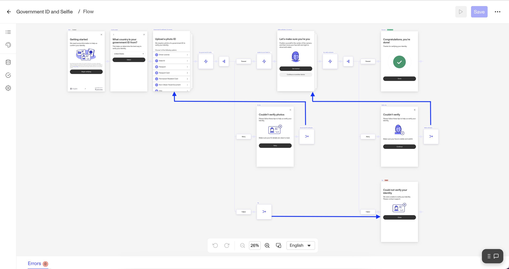

**F. Insert step node**: When you click on the node between two steps, you will see all the possible step types that can be inserted into that spot in the flow. Depending on where you are in the flow, not every step will be enabled for you to use. We covered all the step types except for Module and Paste.

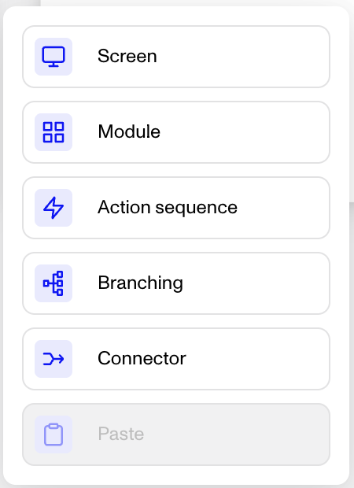

-   Paste: When you copy a screen using the copy button, the Paste will be enabled.

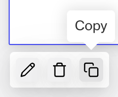

-   Module: Module in the context of the Flow Editor is a group of steps that are pre-configured for a particular purpose for builder’s convenience.

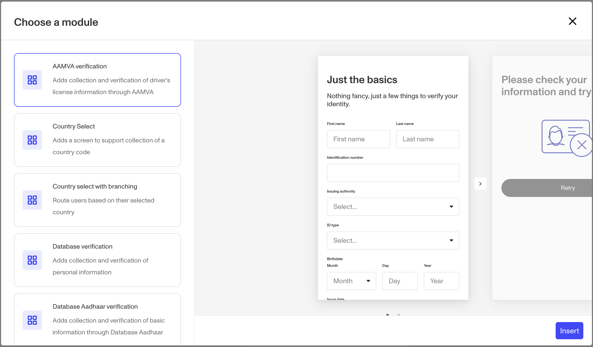

Learn more about different types of steps in Inquiry Templates [in this article.](./1z8F1l9Q28qNxQFtKoMfY3.md)

### Toolbar - Canvas

Now that we've covered how to navigate through a Flow Tree on the Canvas, let's explore other sections of the Flow Editor.

-   In addition to Undo, Redo, and Zoom In/Out, this tool bar allows you to change locale so you can see how screens display in different languages. Also, you can adjust the preview dimensions to see how it looks on screens of varying dimensions.
-   The "Scale to fit" option, when checked, automatically scales down the preview screens when they're too large to fit within the available Canvas space.

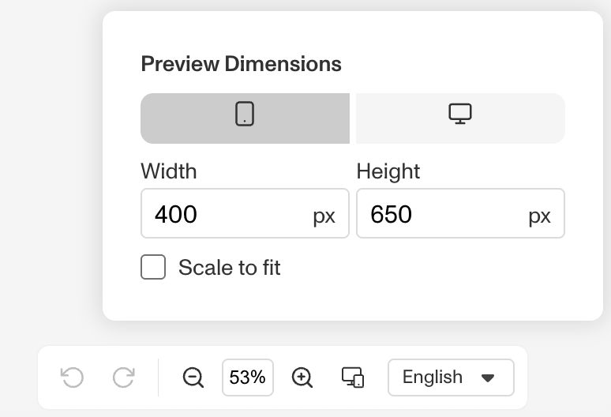

### Command Center - Left Panel

On the left, you can see this navigation bar. The Flow Editor's Left Panel provides a centralized command center for navigating and configuring your Inquiry and Verification templates. It organizes all template-level controls into a persistent, resizable panel that remains accessible whether you're editing the Flow Tree or individual screens.

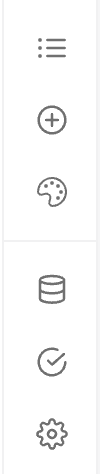

This structure makes it easier to move between high-level design tasks and detailed configuration work, reducing context-switching and improving your overall building experience.

-   **Persistent Access** - The panel remains accessible throughout your editing experience
-   **Flexible Workspace** - Collapse, resize, or expand the panel to full screen as needed
-   **Contextual Configuration** - Edit settings without leaving your current work context
-   **Organization** - Related tools are grouped together for intuitive workflows

The Left Panel is organized into these sub-sections:

-   **Navigation** - Browse and search through your flow's steps, screens, and components
-   **Theme Editor** - Apply an existing [Theme Set](./6SIHupp847yaEuVMucKAff.md). Or create and customize visual themes specifically for your flow.
-   **Component Library** - Access a grid of available components to add to your screens. Shown only in the Screen Editor.
-   **Fields** - Manage all fields used in your flow with bulk editing capabilities
-   **Verifications** - Configure verification templates with dedicated tabs for configuration pertaining to each type of verification, such as checks, capture methods, countries and IDs, and more.
-   **Settings** - Access all other general inquiry template settings such as Reusable Personas, Device handoff, Screen sizes, Session management, Redirect, Security and more.

Learn more about how to configure each section in [Configuring your Inquiry Template](./ETA0GIS8K60DSoiFRpA9z.md).

### Screen Editor Right Panel

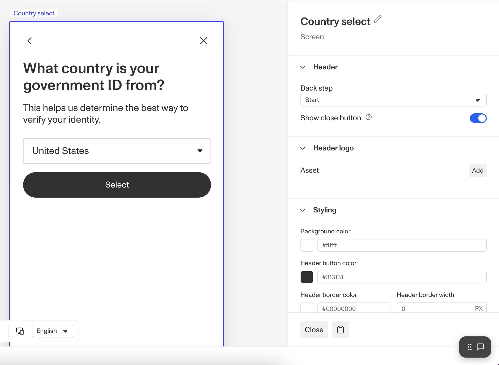

When you click into a component on that screen, you will see configurations related to that component type. You can also see the navigation in the Left Panel to see all the components that are on the screen. For example, when you click on the Title component, you can see ways to configure:

-   Properties - copy and its translations
-   Styles - spacing, font, alignment and color, etc.
-   Logic - logic rules to evaluate on screen load and update in order to hide or show the component conditionally

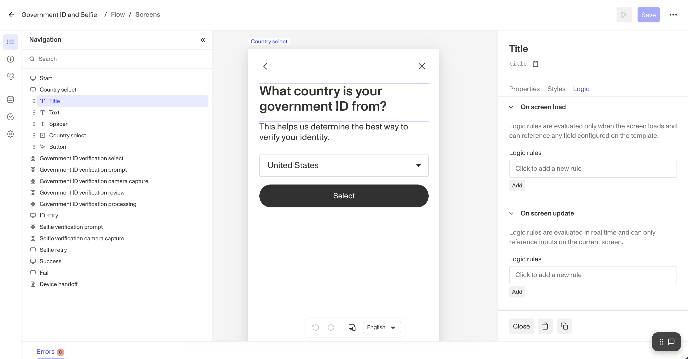

### Errors Panel - Bottom Panel

-   At the bottom of the Flow Editor, one can see all the configuration errors. You can still save a draft with errors, but you need to resolve all the errors before you can publish a new version of your template. You can click on the errors to get directed to the pertaining step or component.

### Dashboard Header

-   In addition to the name of the template and the breadcrumb to indicate which view you are currently on (Flow View vs. Screen Editing View), the header provides buttons to access other useful actions or sections.
-   When you are in the Sandbox Environment, you can simulate the inquiry flow through the play button. You can learn more about the Simulate feature in [Testing your Inquiry Template](./1az3sGqpcW5Zrne9I7lm49.md).
-   In the …, you can find links to Version History and [Connections](./5OiTipzrYE2g2lVofMtKMp.md) as well as keyboard shortcuts and help center.

# Next

Now you know the basics of Dynamic Flow Template and how to navigate your way around the Flow Editor. You can learn how to [configure an Inquiry Template](./ETA0GIS8K60DSoiFRpA9z.md) more in detail. Once you have configured your template, the next steps are to [test your flow](./1az3sGqpcW5Zrne9I7lm49.md), then go live!

## Related articles

[What are Inquiries/Dynamic Flow?](./2BerKqpgNIRG81jX0goCMU.md)

[Configuring your Inquiry Template](./ETA0GIS8K60DSoiFRpA9z.md)
