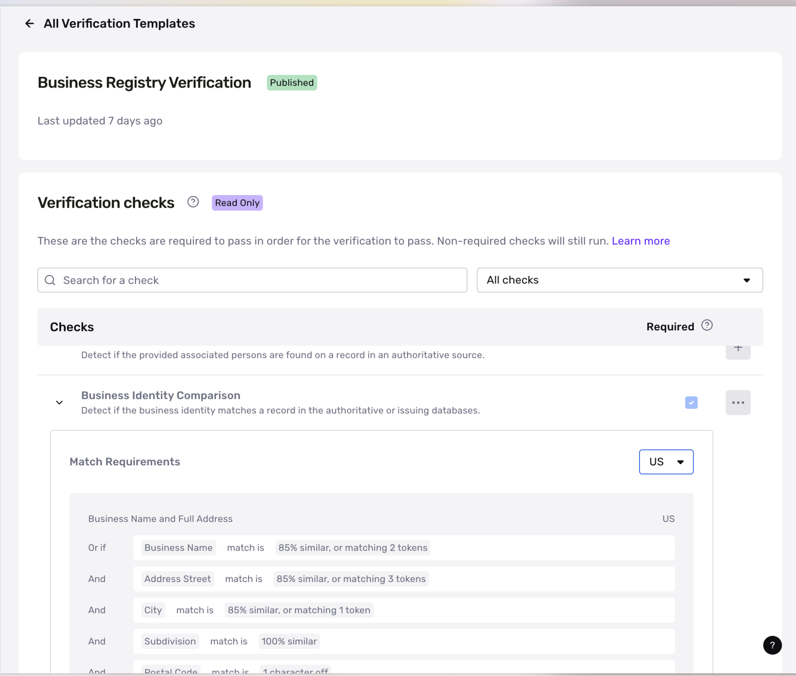

# Business Registry Verification

## Overview

The Business Registry Verification (BRV) is used in [KYB](./3OGe9IwySJmDvXL2DOfV7N.md) to verify the existence of a business within an authoritative or government data source. Customers use the BRV to:

### Validate and verify business information

A Business Registry Verification checks that business information an end-user provides—such as business name, business address, and, where applicable, a business registration number—matches a record in a given country’s business registry. The provided information must match a registry’s record in order to pass the verification.

### Search against global business registries with customizable matching logic

The Business Registry Verification has access to business registries across 100+ countries. For details about coverage and access, contact your Persona account team.

### Set a foundation for global KYB

Business Registry Verification is one of the many [Verification types](./14hgKH7lZo9b6ja7tRJobW.md) that Persona offers for KYB. It is typically used as the initial verification in global KYB before additional enrichment via reports like the Business Registrations Report or Business Associated Persons Report.

## How the Business Registry Verification works

At a high-level, the Business Registry Verification works as follows:

1.  **Submission of information:** End-users submit the business name, registration number, and business address for verification. While these attributes can be configured to be optional, providing more information allows Persona to expand our search capabilities. We recommend that all fields be required to improve match rates.
    
2.  **Match against identity records via Contextual Matching:** Persona then searches the normalized information against global business registries using [different matching frameworks.](./5XZjwO60QVMt9b0CPMFQn7.md)
    
    a. Each national registry has its own characteristics that need to be flexibly accounted for (e.g. number formats, languages, address formats, etc.). As a result, the Business Registry Verification has default Match Groups for each supported country for accurate fuzzy matching. To adjust your Match Groups, please reach out to your Persona account team.
    
3.  **Return verification result:** Persona returns a pass or fail result, based on if the minimum match group requirements (“identity comparison check”) or other checks were met. As long as one of the applicable match groups is satisfied, the BRV’s identity comparison check will move into a passed state.
    
    a. Note that there are other dimensions of the BRV that can fail even if the match group passes. For example, if the Active Business Detection check is required, and the business is currently inactive, then the BRV will fail that check but may fully match on all provided fields.
    

## Using the Business Registry Verification for US businesses

In the United States, businesses are registered at the state level through Secretary of State (SOS) offices. Each state issues its own business registration or filing number, and these numbers vary by state in format, availability, and consistency.

Because there is no centralized national business registry and no standardized business registration number, the Business Registry Verification does not use or verify a registration number for US businesses. For US businesses, verification is performed using the business name and address only.

Tax Identification Numbers (TINs), such as EINs or SSNs, are not business registration numbers and are not surfaced or verified as part of the Business Registry Verification. If you need to verify a business’s TIN, use the dedicated [TIN verification (US)](./2lGG2fqJwUO9ziVAFZNeTG.md).

## Understanding Business Registry Numbers

One attribute that the BRV may verify is a business registration number. These numbers are issued by authoritative business registries at the time of registration or incorporation and vary by country.

Each country’s business **registration number** format is different and is sourced directly from the registry used in that country. For example, in the United Kingdom, businesses use an 8-character Company Registration Number (CRN), while in China, an 18-character Unified Social Credit Code (USCC) is used.

In countries with centralized national registries, a business registration number is typically a required and reliable identifier. In contrast, the United States does not issue a standardized national business registration number, which is why registration numbers are not used for US Business Registry Verification.

In some regions, tax identifiers are distinct from business registration numbers and require separate verification. For example, VAT numbers in the EU should be verified using [VAT verification (EU)](./7zCCnX7CTtGHo5PdXFgzO3.md).

Some common business registration numbers are listed below:

<table><tbody><tr><td><strong>Country</strong></td><td><strong>Registration Number Type</strong></td><td><strong>Format</strong></td><td><strong>Issuing Registry</strong></td></tr><tr><td>United Kingdom</td><td>Companies House Registration Number</td><td>8 digits</td><td>Companies House</td></tr><tr><td>Canada</td><td>Business Number</td><td>9 digits</td><td>Corporations Canada</td></tr><tr><td>Australia</td><td>Australian Business Number</td><td>11 digits</td><td>Australian Business Register (ABR)</td></tr><tr><td>Germany</td><td>Handelsregisternummer</td><td>Variable length</td><td>Local trade registry (Handelsregister)</td></tr><tr><td>Spain</td><td>Número de Identificación Fiscal (NIF)</td><td>Variable format</td><td>Official Gazette of the Commercial Registry</td></tr><tr><td>Italy</td><td>Codice Fiscale</td><td>16 characters</td><td>Chambers of Commerce National Business Register</td></tr></tbody></table>

## Default match groups within the Business Registry Verification

Because each country has its own nuances for business number and address, Persona has invested in default match groups per each country inside the Business Registry Verification to optimize accuracy. These default match groups consist of country-specific normalization and comparison methods and set match requirements

These match groups can be found in the verification template for the Business Registry Verification and are filterable by country.

Customers can work with their account team to adjust the match requirements in each country or the required match groups needed to pass.

## Frequently Asked Questions

**What is the difference between the Business Registry Verification and other reports?**

With the BRV’s Match Group framework, customers can define at a very granular level what qualifies as a matched business. You can also quickly automate decisioning in our workflows product based on which match group was used to pass or off other information such as whether the business has an active status.

Once the BRV identifies a business that meets the customer-defined match criteria, other reports like the Business Registrations Report use this identified business to provide a comprehensive set of enrichment data pertaining to the verified business.

In other words, the BRV, as an verification, acts as the source of truth for what constitutes a “verified” business, while reports like the Business Registrations Reports enriches that verified business with additional data points. Persona recommends using the BRV as the starting point for business verification before moving onto enrichment.

**Is the VAT the same as a business registration number?**

VAT is not the same as a business registration number. A VAT number is issued by the EU while a business registration number is issued by the specific country’s business registry.

**Why doesn’t the Business Registry Verification verify US business registration numbers?**

The United States does not issue a single, standardized business registration number. Businesses are registered at the state level, and state-issued registration numbers are inconsistent in format and availability across authoritative sources.

To ensure accuracy and consistency, the Business Registry Verification verifies US businesses using business name and address rather than a registration number.

## Related articles

[Understanding match groups](./1gZBzL78LmIZblpOSJNpW6.md)

[TIN Verification](./2lGG2fqJwUO9ziVAFZNeTG.md)

[Verifying Businesses: How Persona can help verify businesses](./3OGe9IwySJmDvXL2DOfV7N.md)

[Matching Frameworks within the Business Registry Verification](./5XZjwO60QVMt9b0CPMFQn7.md)
