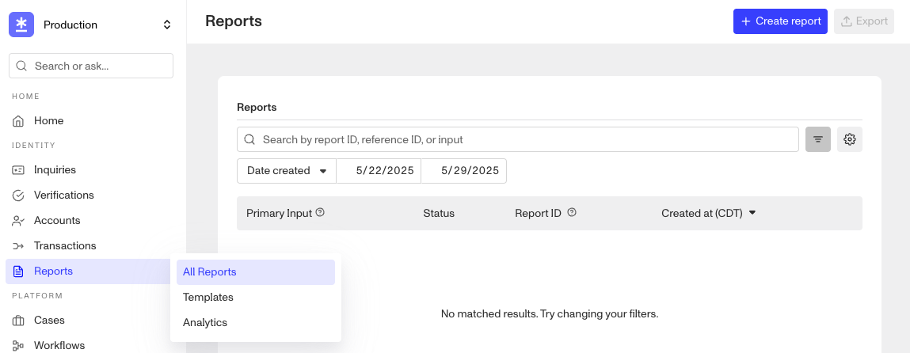
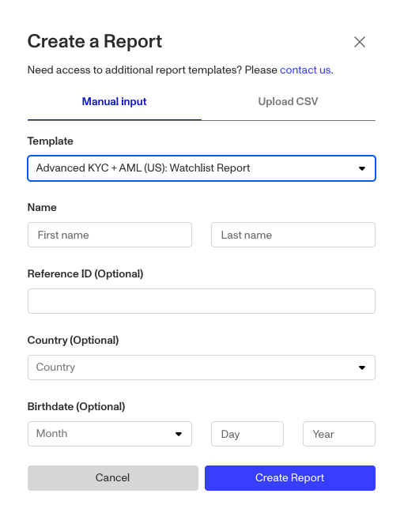

# Creating Reports

# Overview

A [Report](./hI9YUPxjW7v46pFfyk6J1.md) provides additional information about an individual or business beyond what they submit directly in an Inquiry. Reports enrich identity profiles by pulling from both authoritative and non-authoritative sources such as databases, public records, watchlists, media mentions, and behavioral signals. They play a key role in helping organizations satisfy compliance requirements and mitigate fraud risk.

This article outlines the primary ways you can create a Report using Persona’s platform and APIs.

## Methods for creating a Report

### 1\. Within a Workflow (recommended)

You can create Reports within a Workflow using different steps. This provides a solution when a Report is not included in an Inquiry Template or when a Reports Template needs to be used independently.

#### Relevant Workflow steps

-   [Workflows: Run Report Step](./20fGyKJCYgiR9NMY9nlKkN.md)

Similar to the method above, you will need to specify the Reports Template for newly created Verifications. See the article on [Workflows: Run Report step](./20fGyKJCYgiR9NMY9nlKkN.md) for step-specific configurations.

### 2\. Directly creating a Report via API

You can create a Report directly via API.

#### Relevant API endpoint

The relevant API endpoint to execute this request is:

-   [Create a Report](../../docs/reference/create-a-report.md)

#### Specifying the creation of a Report in the API request

The Create a Report endpoint generates a Report directly. You'll need to include additional values in your request. We recommend consulting our API reference documentation to review, test, and explore our OpenAPI specification for more details.

**Required values in the `data` > `attributes` > `report_type` object:**

-   query: Varies based on the selected report type.

Required query fields vary by Report type. Please consult the [Create a Report in the API documentation](../../docs/reference/create-a-report.md) for specific requirements and examples.

### 3\. Within the Persona Dashboard

The last way to create a new report is within the Persona Dashboard. Navigate to **Reports > All Reports** and click the **\+ Create report** button.

After this you will get a popup to select a Reports Template.

Select your desired Reports Template from the drop down, fill out the fields and click **Create Report**.

## Related articles

[Reports Overview](./hI9YUPxjW7v46pFfyk6J1.md)

[Workflows: Run Report step](./20fGyKJCYgiR9NMY9nlKkN.md)

[Bulk create a Report](./1rzpXVJt1tTpRdhPuhaIkX.md)

[Running reports and reviewing matches](./042goubhldtkoKAA6AmiZ.md)
