# Using filters and saved views of Inquiries

## Overview

Saved Views let you create customized views of the Inquiries index page, giving you access to commonly filtered lists of inquiries. Whether you want to focus on inquiries from a specific template, with a specific status, or created between a certain date range, you can filter and save views that align with your business processes.

## Default view

From the Dashboard, navigate to **Inquiries > All Inquiries** to open the Inquiries index page. By default, the page opens on the **Default view**, where you can search, apply filters, and adjust the layout.

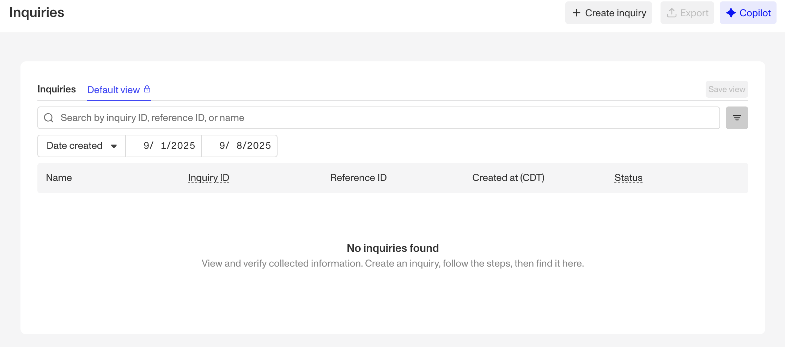

The Default view starts with only one filter available: **Date created.** It is also sorted from the most recently created inquiry to the oldest created inquiry within that the date range specified in the filter. You can add additional filters as needed, but if you find yourself applying the same set of filters repeatedly, consider saving that configuration as a **Saved View**.

## What you can configure in a saved view

Saved Views make it easy to return to your preferred filters with a single click, instead of re-creating them each time. Your Inquiry list view offers several configurable components:

-   **Filters** applied to each view
-   Ordering of columns displayed
-   Ability to add multiple filters

## Filtering Inquiries

To filter your Inquiry list view and display only the items that meet your criteria:

1.  Open the **filter menu** (toggle button with three lines to the right of the search bar).

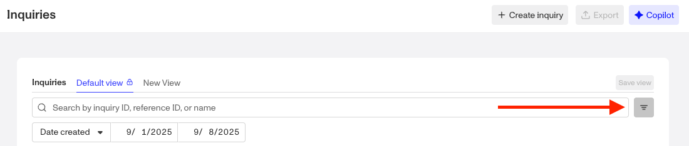

2.  Apply filters such as:
    
    1.  Date created: Narrow results to inquiries created within a specific date or date range.
    
    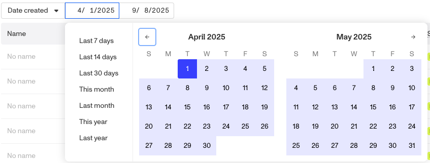
    
    2.  Verification checks: Filter by the outcome of verification checks (select the verification, the check, and the status).
    
    
    
    3.  Status: Show only inquiries with a certain status (e.g., pending, approved, or declined).
    
    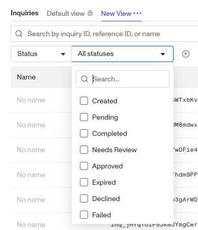
    
    4.  Reusable Persona used: Identify whether the inquiry reused an existing Persona profile instead of creating a new one.
    
    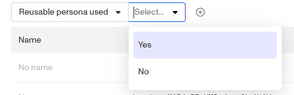
    
    5.  Inquiry templates: Limit results to inquiries generated from a specific template.
    
    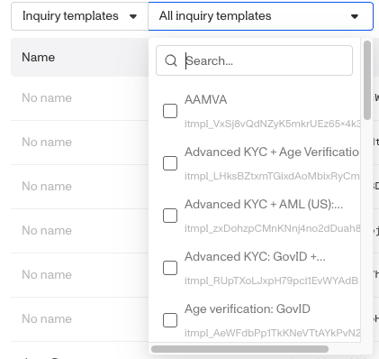
    
    6.  Tag: Filter by tags applied to an inquiry. Tags can classify inquiries by conditions or business rules (e.g., Under 21 years old, Non-eligible geo, Watchlist match).
    
    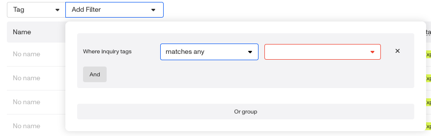
    
3.  To add more than one filter, hover next to the last filter row until the **“+” button** appears, then click it to add another filter.
    

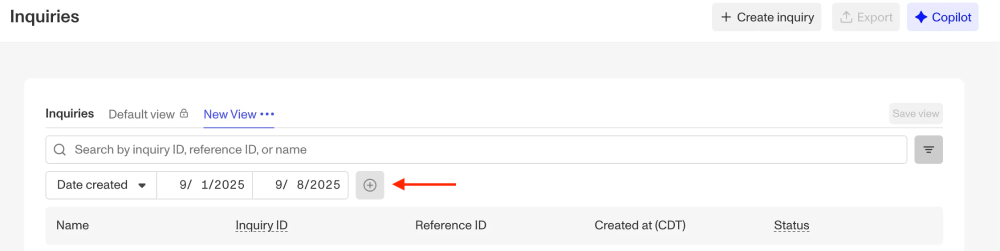

## Creating saved views of filtered Inquiries

If you’ve applied filters in the Default view and want to save them for future use, you’ll need to create a new view:

1.  Hover next to **Default view** until the **“+” button** appears.

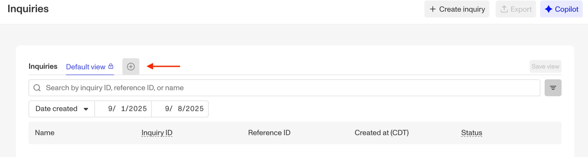

2.  Click the button to create your view.
3.  Give the view a **name**.
4.  Use the drop-down menu to **duplicate, save, or delete** the view. Access this menu later by hovering over the view name and selecting the **three-dot menu.**

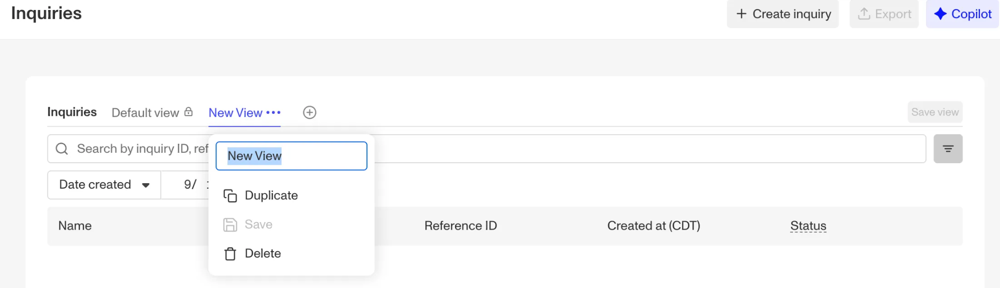

5.  Once you’ve configured your filters, click **Save view** to preserve your setup for later.

If the **Save view** button is inactive, you may not have applied filters that differ from the Default view.

## Managing saved views

To edit a saved view:

1.  Navigate to **Inquiries > All Inquiries**.
2.  Select the saved view from the existing views.

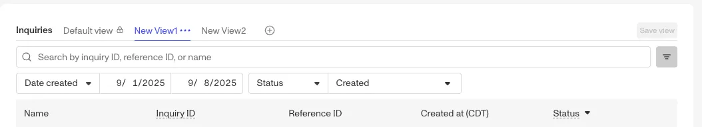

3.  Adjust filters, columns, or other settings as needed.
4.  Click **Save view** to apply your changes.

Your updates will overwrite the existing saved view, so you’ll see the new configuration the next time you open it.

## Items per page

At the bottom of the Inquiries index page, you can control how many inquiries are displayed at once. Use the **Items per page** dropdown to select from the available options: **10, 25, 50, 100, or 200**.

Adjusting this setting is helpful if you want to:

-   View more inquiries on a single page when scanning large datasets.
-   Limit the number of inquiries displayed for easier navigation.

Your selection will update the table immediately.
