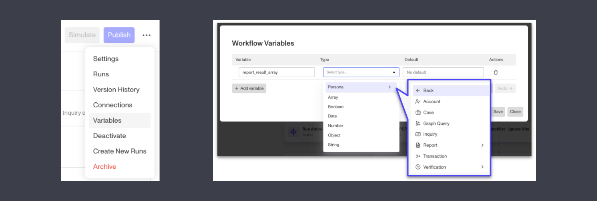
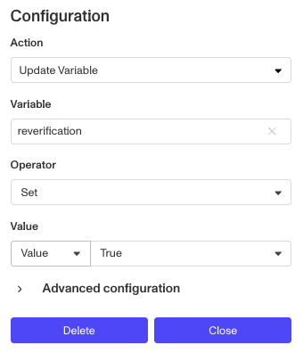
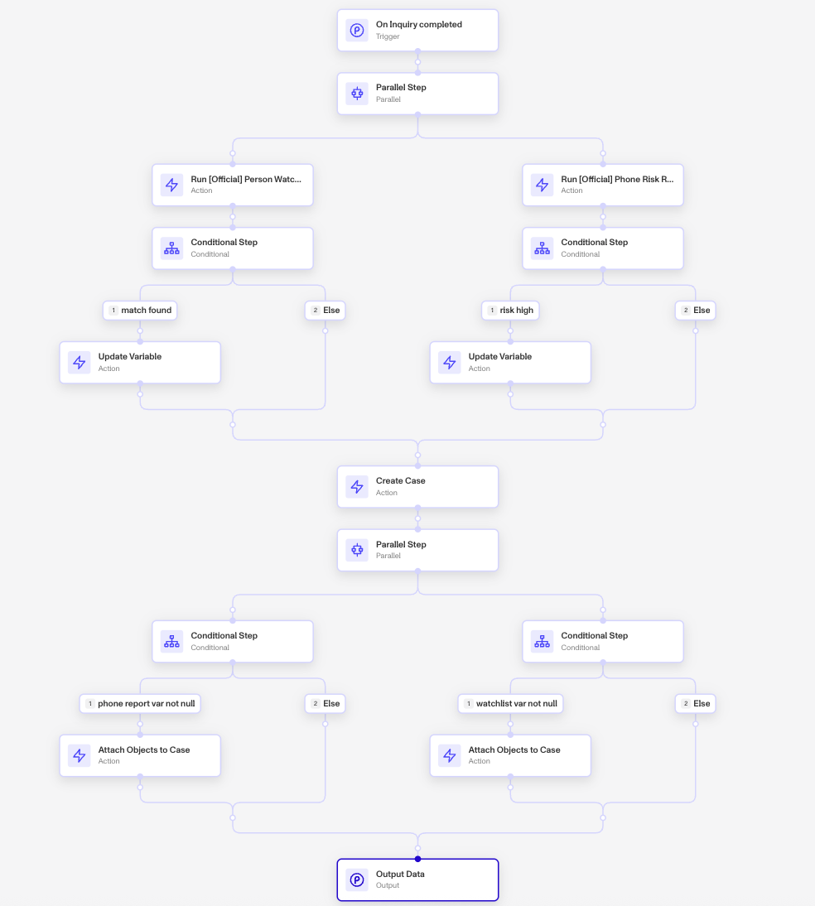
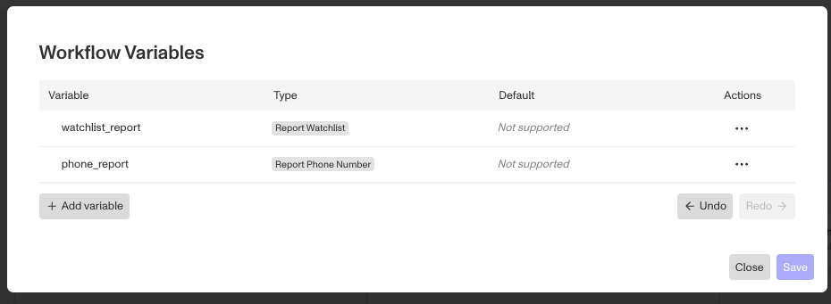
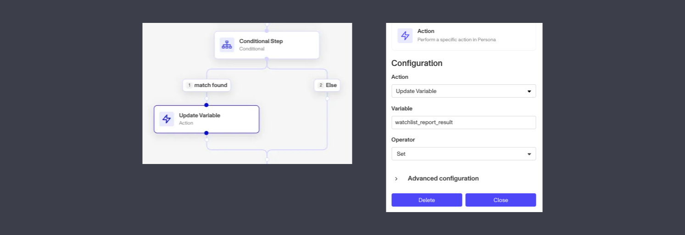
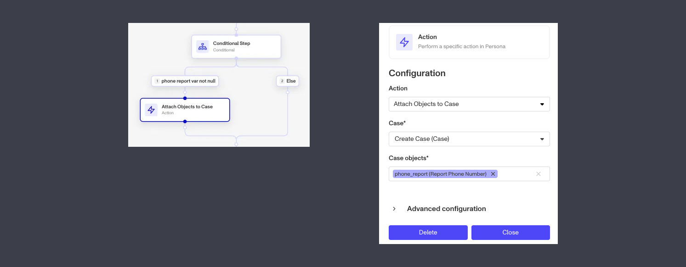

# Using Workflow Variables

## What are Workflow Variables?

A **Workflow Variable** is a stored value that can be used and changed through a workflow.

## Why use Workflow Variables?

Variables can help support more complex use cases without having to use Evaluate Code steps or create workflow specific fields/ tags. For example, using Variables will allow builder to natively:

-   **Store, update and reference a temporary value throughout the workflow**
    
    For instance, a workflow builder would like to loop through an account’s inquiries to see if there’s been an inquiry created with a particular template and if so, set a boolean to true that can be referenced later in the workflow.
    
-   **Access objects created in conditional steps later in the workflow**
    
    A builder may have reports running in conditional paths and want to attach the results of the reports to a case or account outside the conditional step.
    

## How to Use Workflow Variables

Using Workflow Variables follows 3 steps - creating or declaring the variable, updating the value of the variable and referencing that variable in workflows.

### 1\. Declare a Variable

To create a variable:

-   Open the **Variables** panel from the workflow editor’s context menu.

-   Click **\+ Add variable** and provide:
    
    -   A name
    -   Select variable type
    
    > 🔎 Supported types include both Persona objects and non-Persona values (e.g., string, number, boolean, object, array).
    
    -   Optionally provide a default value - if a default is provided, variables will be created with this value, instead of null
    
    > 🔎 Defaults are only supported for string, number, date and boolean variables.
    

### 2\. Update a Variable

To assign a value to a variable, use the **Update Variable** step under **Action > Compute**.

-   Select the variable to update
-   Select an operator:
    -   `set` replaces current value with new value, available for all variable types
    -   `unset` clears value/ sets variable to null, available for all variables types
    -   `push` adds single item, only available for variables of array field type
    -   `remove` removes all instances of specified item, only available for variables of array field type
-   Provide a value, which can be a manually input value or reference to a field

### 3\. Reference the Variable in a Workflow

You can now reference your variable throughout your workflow, just as you would any other step!

> ⚠️ If a variable is empty (e.g. not updated or no default set), action steps using it will error. To avoid this, wrap those actions in a conditional check or use defaults where possible.

## Best Practices & Reminders

-   Remember that Variables exist purely within the context of a workflow run, which means they are not accessible outside of the workflow run.
-   If a variable is empty (e.g. not updated / no default set), action steps using it will error. To avoid this, wrap those actions in a conditional check or use defaults where possible.
-   There are no order of operation guarantees if you run Update Variable steps in parallel. This means you should avoid updating the same variable in multiple parallel branches unless using non-destructive operators like `push`.
-   Variables are available in Case and Account Actions, but not in workflows embedded in Flow Editor.
-   You cannot declare variables in modules, but you can pass variables declared in the parent workflow into modules as an input. In this case, the variable will be treated as read-only (you cannot update the variable of a parent workflow in a module).
-   Reports and Verifications support the ability to create a template-agnostic Persona object variable. This means you can create an array of Reports and use the Any Report type which will allow Reports of different templates to be stored in the variable.

## Example Use Cases

In this end to end example, we’ll walk through how to use variables to store Report results generated in conditional steps and access them later in the workflow.

This inquiry completed workflow runs a Watchlist and Phone Risk report in parallel. Later, we want to create a case and if either of the reports have a match/ are high risk, we want to attach the results to the case. Without Variables, we would not have access to the Report results and would be forced to create the case within the conditional, forcing us to create multiple nested conditional routes.

Instead, we create 2 variables (1 for each Report step):

Within the workflow, if a match is found we then update the variable to store the Report results

Finally, after our Create Case step we use the Attach Objects to Case step and attach the variables. Note that because Report results are only updated if a Report match is found, we put the Attach Objects step within a conditional that checks to make sure the variable is not blank. This ensures the Attach Objects to Case step will not error for Reports without matches.

