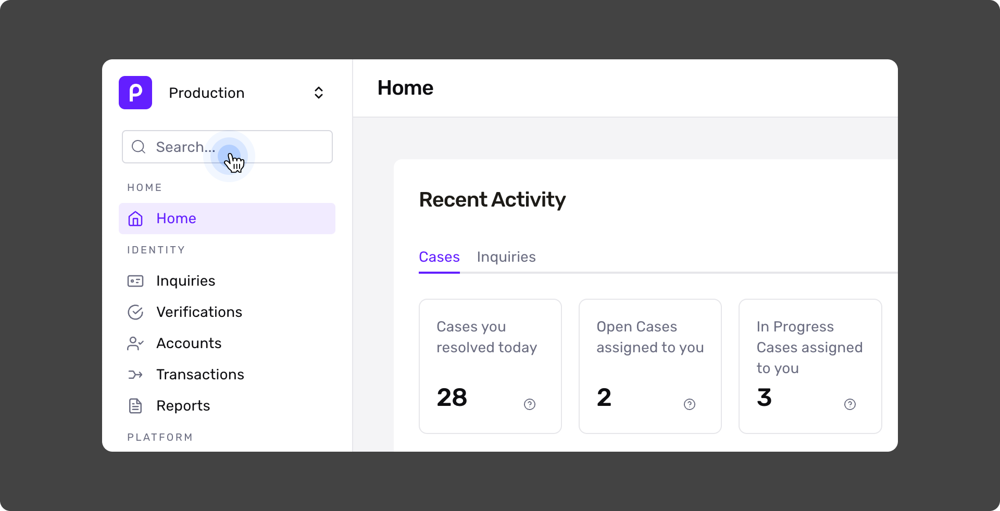
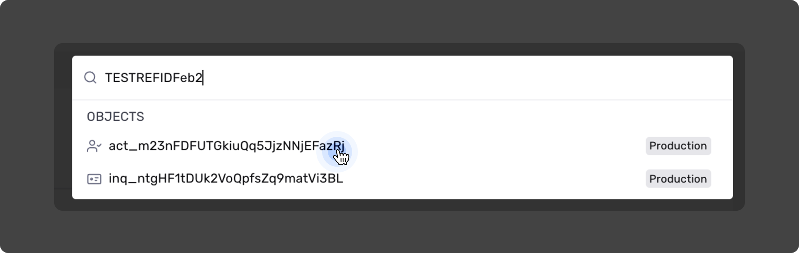
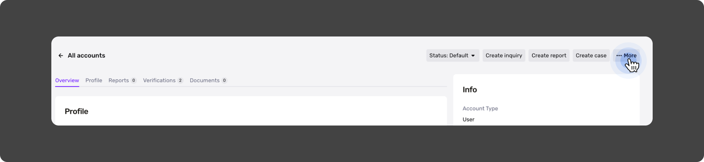
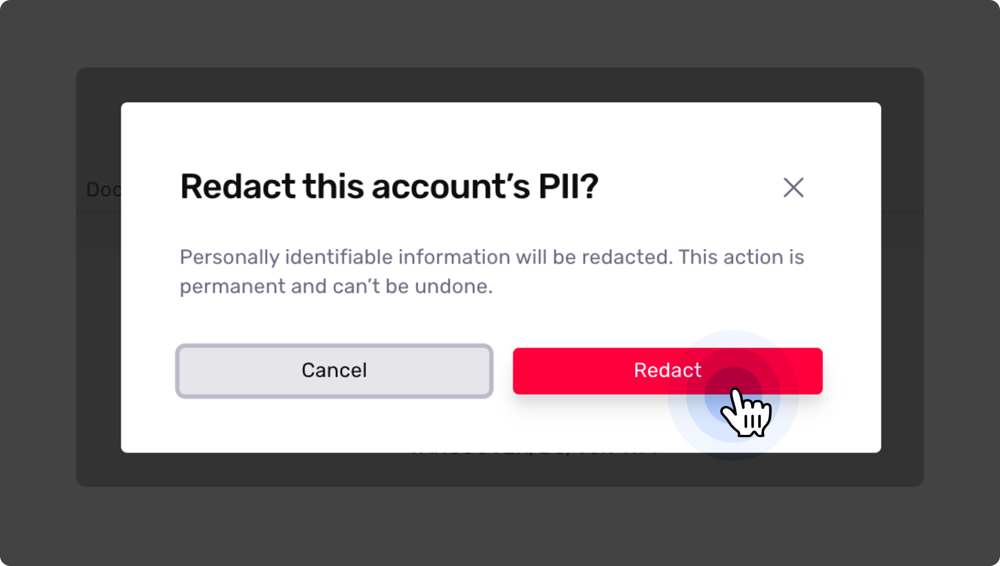
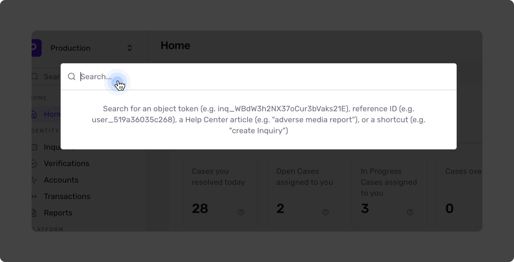
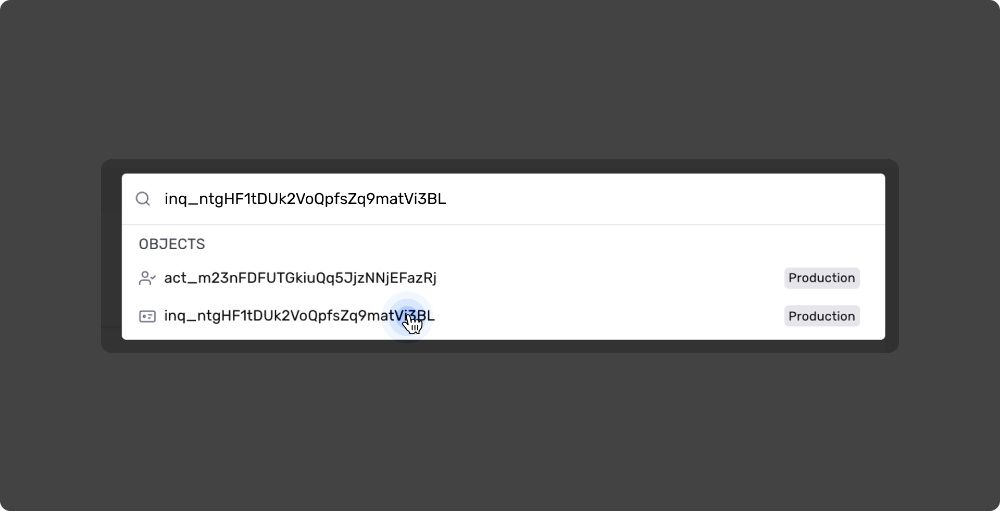
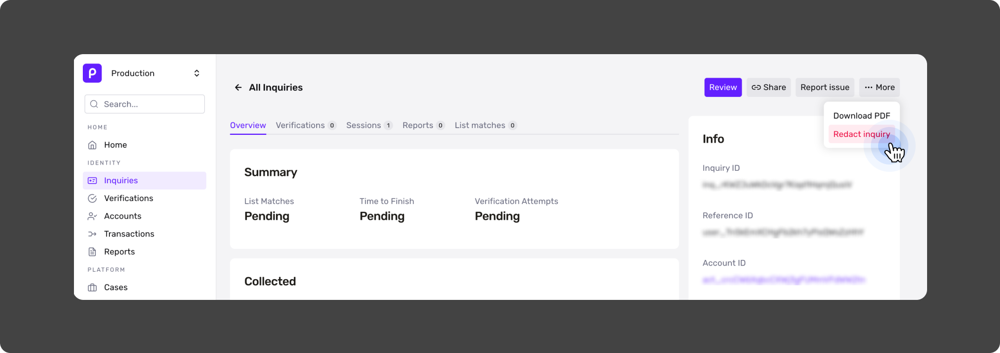
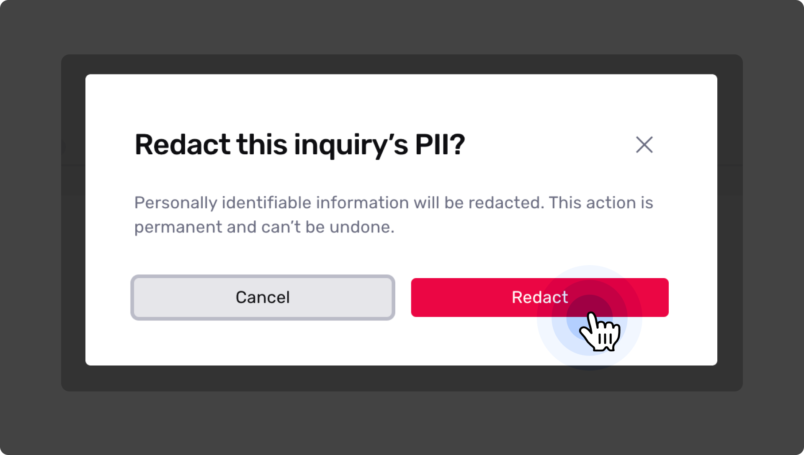

# How do I manually redact PII from a Persona Account or Inquiry?

In the Persona Dashboard, you can manually redact all PII associated with a Persona Account or PII specific to individual Inquiries. This article walks you through the steps for both processes.

⚠️ **Should I redact PII from an Account or from an individual Inquiry?**

| **Action** | **Outcome** |
| --- | --- |
| **Redacting PII on the Account level** | By redacting PII on an Account, you will irreversibly redact all its associated Inquiry PII. |
| **Redacting PII from an individual Inquiry** | If you redact PII from a single Inquiry, you will not prompt Persona to auto-redact PII from any other Inquiry associated with the associated Account. |

### Important tips

🛑 **Persona cannot recover redacted information.** All redactions are irreversible.

-   **Redacting on the Account level will automatically and permanently redact all PII associated with the Account, including all Inquiries associated with the Account**.
-   If you redact PII from a single Inquiry, Persona will not automatically redact all PII from the Persona Account with which the Inquiry is associated.

# Redact all PII associated with a Persona Account

Redacting on the Account level will automatically and irreversibly redact PII from **all** associated Inquiries.

⚠️ You need to be signed into your Persona account to proceed.

## Find the Account from which you want to redact information

Using the Dashboard search bar, search for an Account by its [RefID](../../docs/docs/reference-ids.md), the unique identifier provided by your organization to identify the Account.

❓ **Can you use another unique identifier?** You can also use an Inquiry ID and an Account ID, but we don’t recommend it. The Inquiry ID will return individual Inquiries and the Account ID is the Account token, which is generated by Persona.

 _Dashboard search bar_

 _Search via Reference ID_

**Your search will return several objects.** Select the Account object, which is written as `act_############################`.

### Find the Redact button

In the top right corner of the Account Configuration Page, click **••• More** , then click **Redact**.

 _Click the **••• More** button in the upper right corner of the Account panel._

 _In the dropdown menu, click **Redact**._

### Confirm your decision

Persona will ask you to confirm or cancel your choice to redact all of the PII associated with this Account. Click **Redact** to confirm your choice. This is an irreversible decision.

 _Confirm your choice to redact all PII from the account by clicking **Redact** once more._

# Redact PII from a single Inquiry

You may need to redact PII from a one or multiple Inquiries while keeping some Inquiries intact. The following section explains how to do so.

## Find the Inquiry from which you want to redact information

You can find an individual Inquiry by under All Inquiries, but you may be able to find it faster by searching Persona for the Inquiry or the Account with which it’s associated.

If you have the Inquiry ID, you can search for the Inquiry itself. Your second option is to search for the Account, which will display all associated Inquiries, so that you can decide which Inquiries to redact.

### Search for the Inquiry

Using the Dashboard search bar, search for an Inquiry by its [Inquiry ID](../../docs/reference/retrieve-an-inquiry.md), the unique identifier that Persona associates with each Inquiry. If you don’t have it, see the next section.

 _Dashboard search bar_

 _Search via Inquiry ID_

**Your search will return several objects.** Select the Inquiry object, which is written as `inq_############################`.  _Select the Inquiry object_

### Find the Redact button

In the top right corner of the Inquiry Configuration Page, click **••• More** , then click **Redact**.

 _Click **••• More** , then click **Redact**_

### Confirm your decision

Persona will ask you to confirm or cancel your choice to redact only the PII associated with this Inquiry, without affecting any additional Inquiries associated with the Account.

Click **Redact** to confirm your choice. This is an irreversible decision.

 _Confirm your choice to redact PII from the Inquiry by clicking **Redact** once more._
