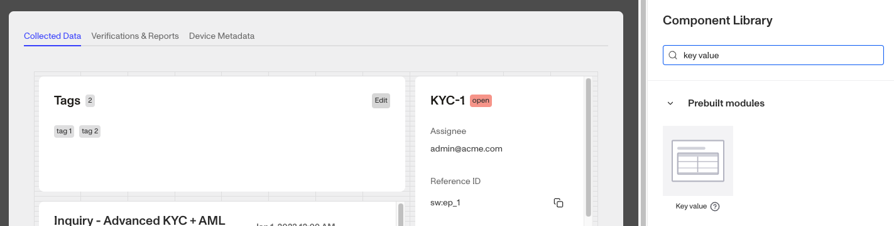
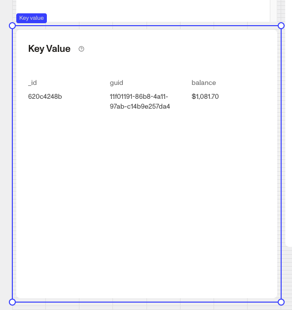
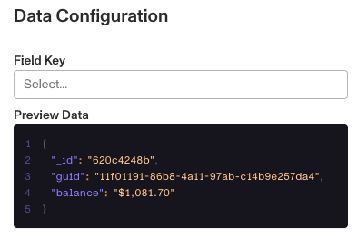
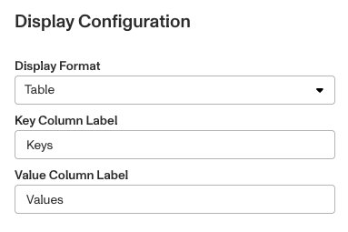
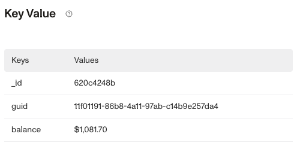

# Cases: Key Value prebuilt module

# What is the Case Key Value module?[](#what-is-the-case-key-value-module)

The **Case Key Value module** is a prebuilt component that can be added to a Case Template. It displays JSON data, in grid or table format. You can define logic that governs when it appears.



# How do you add a Case Key Value Module?[](#how-do-you-add-a-case-key-value-module)

1.  Navigate to the Dashboard, and click on **Cases** > **Templates**.
2.  Find and click on the Case template you want to edit, or **Create** a new template.
3.  Navigate to the **Tab** you want to add a Case component to. Click an empty space to view the Component Library.
4.  In the right toolbar, search for ‘**Key Value**.’
5.  Drag and drop the **Key Value module** into your Case UI and reposition it by dragging it around.



6.  Click on the **Key Value module** on the right toolbar you can customize the module.
    1.  Under **Settings,** you can edit the **Title** text to change the text displayed on the top of the module.
    2.  Under **Data Configuration**, you can add the **Fields** you want to display on the module. Learn more about **Data Configuration** below.
    3.  Under **Display Configuration**, you can change how the **Key Values** are displayed. Learn more about **Display Configuration** below.
    4.  Under **Module Layout**, you can change:
        1.  Dynamic height: Module will grow or shrink to fit its contents.
        2.  Visibility: Dynamically control whether the module is hidden. This is a toggle button that lets you set conditions for when the button should be displayed or hidden from view based on your case requirements. You can read more about **Visibility configuration** below.
    5.  Under **Advanced Options > Module Enablement**, you can define custom control conditions that determine when the **Key Value module** is enabled or disabled. Advanced options are typically configured for specific customers by a Persona team member.
7.  Click the **“Delete”** button if you want to remove the component from the Case UI.

## Data Configuration[](#data-configuration)

Begin typing the **Field** you want to add into the text box below **Field Key**.



You can directly edit the code by clicking on the **Preview Data** code sample. To use this module, you’ll need a Case field with a `hash` data type, which you can select in the **Field Key configuration**. The module will display this data in either table or grid format.

The **Preview Data Editor** displays the hash structure. Here’s an example using `field key = Person_basic_info`:

```
    {
      "name_full": "Jonathan Miller",
      "name_last": "Miller",
      "name_first": "Jonathan",
      "birthdate": undefined,
      "identification_number": null,
      "identification_number_type": null,
      "email_address": "jonathan@gmail.com",
      "phone_number": null,
      "address_country_code": null,
      "address_city": null,
      "address_subdivision": null,
      "address_postal_code": null,
      "address_street_1": null,
      "address_street_2": null
    }
```

## Data Configuration[](#data-configuration-1)

There are two options for display:

1.  Grid: This is the default display configuration.
2.  Table: The table format gives you the option to further customize the module. You can edit the Key and Value Column Labels.





## Visibility configuration[](#visibility-configuration)

If you toggle this on you will have two options to customize visibility.


1.  **Basic** visibility allows you to set rules on the **Key Value module** to determine when it will be visible. You can read more about **Basic visibility configuration** below.
2.  **Advanced** visibility allows you to set logic to control when the **Key Value module** is enabled or disabled based on custom conditions. Advanced visibility configurations are typically configured for specific customers by a Persona team member.

## Basic visibility configuration[](#basic-visibility-configuration)

Visibility configuration consist of three main components:

1.  **Field**: The object that will have a condition linked to it.
2.  **Condition**: How the field is compared to the value (e.g., equals, does not equal).
3.  **Value**: The value to test against.


### Creating Visibility Configuration[](#creating-visibility-configuration)

-   **AND Statements**: Combine multiple conditions that must all be true for the rule to pass. Add these using the **"Add"** button.
-   **OR Groups**: Combine conditions where only one needs to be true for the rule to pass. Create these by clicking **"Add OR Group"**.

## How to Use Visibility Configuration[](#how-to-use-visibility-configuration)

1.  Click on the **Key Value module**, and go to **Module Layout** and toggle the button next to **Visibility** in the right toolbar.
    1.  Click on “**Empty rule**” to see **Visibility configuration**.
    2.  Create a logical rule by filling in the three boxes following **Show if**, which correspond to an object, its condition, and its value being assessed, respectively. When that logical rule passes, the **Checklist module** is shown.
    3.  (Optional) Add additional logical rules by clicking either ”**Add”** (if you want to add 'AND' rules, where all must be passed to continue) or ”**Or group”** (if you can also nest a group of OR statements within an AND statement).

# Plans Explained[](#plans-explained)

## Case Key Value module component by plan[](#case-key-value-module-component-by-plan)

|  | Startup Program | Essential Plan | Growth Plan | Enterprise Plan |
| --- | --- | --- | --- | --- |
| Case Key Value module component | Not Available | Available | Available | Available |
| Advanced options - Module enablement | Not Available | Not Available | Limited | Available |
| Visibility - Advanced configurations | Limited | Limited | Limited | Available |

[Learn more about pricing and plans](./6oZbzp7jb7AWGClF5vpY3K.md).
