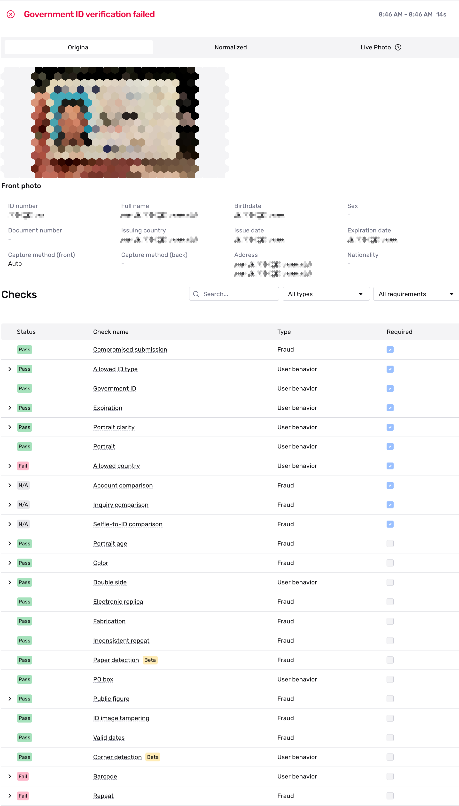
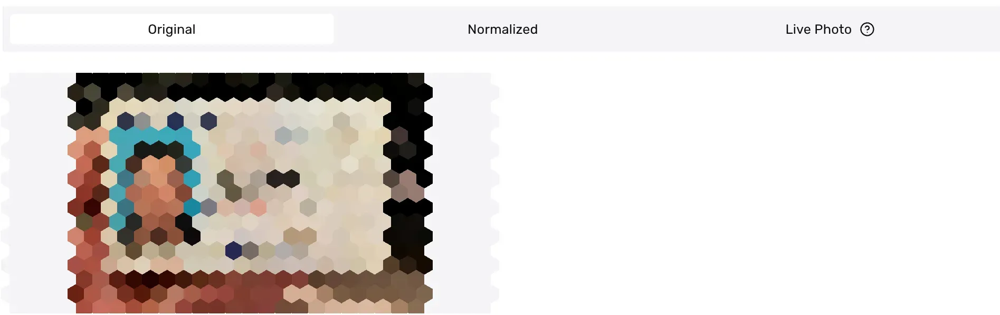
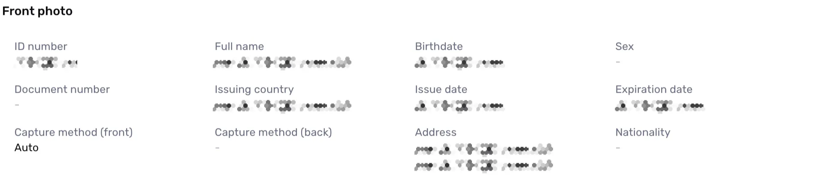
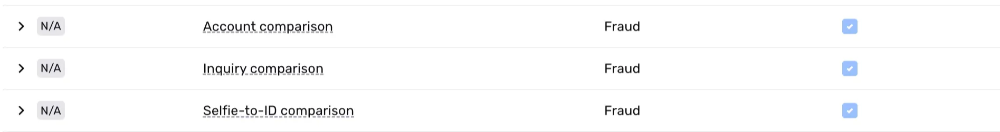
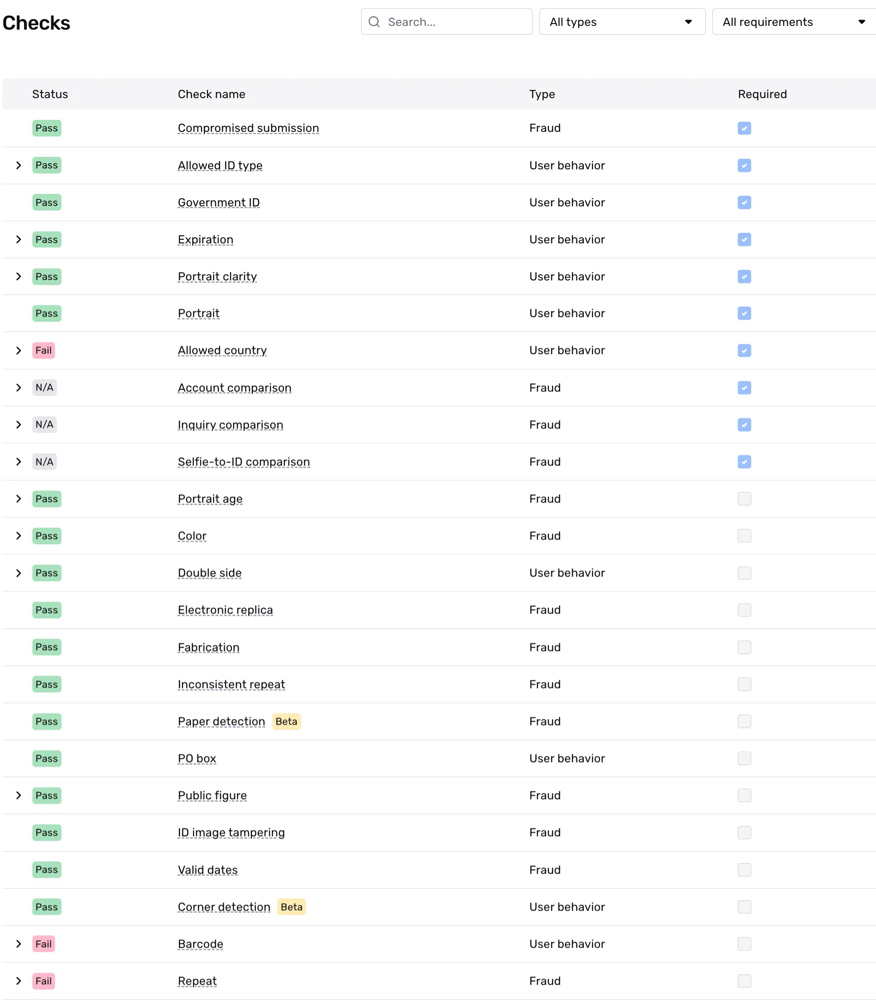
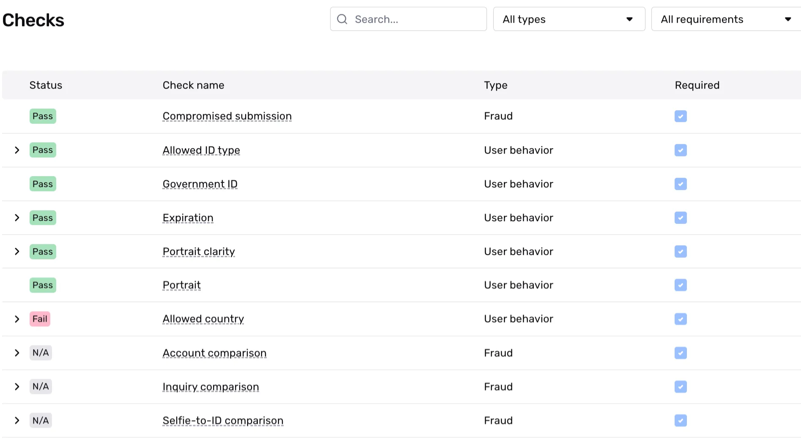

# Understanding Government ID Verification results

## Overview

Government ID Verification analyzes and verifies IDs from over 200 countries and territories. For more details, see the [Government ID Verification overview](./5vXD7S7pQCq8Q9Z4RztxLw.md).

This page examines an example of a Government ID Verification run and guides you through the results. You'll learn how to interpret Verification checks and understand why they **passed** or **failed**.

ℹ️ Note: A Verification run represents a single attempt to verify specific information. Within an Inquiry, users may get multiple Verification results due to user error, network issues, or other configureable factors in Persona. For this reason, we recommend reviewing, listening, or retrieving the status of the parent Inquiry or Transaction rather than individual Verifications. This approach allows you to use Inquiry Templates or Workflows to better evaluate approval conditions, declines, and cases needing additional review.

## Example Government ID Verification run result

As an example, we'll look at a Government ID Verification—specifically, verifying a United States driver’s license. We'll walk through the example Verification below, section by section.

 Note: Image and input fields in these screenshots are intentionally blurred for privacy, but represent the actual data submitted during verification.

## Overall Verification run result

When viewing a Government ID Verification run, you’ll first see the overall Verification result. In this example, the Government ID Verification **failed**.

This top-level status is commonly in a “**passed**” or “**failed**” state. The information below the overall result offers further explanation or reasons as to why it “**failed**” and shows the Verification Template configurations that led to that “**failed**” status.

Here’s how to understand Verification results and their status:

### A note on Inquiry status vs. Verification status

A common best practice for solutions within Persona is to rely on statuses. For example, when integrating via Inquiries (Hosted, Embedded, or Mobile SDK), businesses typically listen for the status of an Inquiry to decide whether a user should proceed within a user experience or not—if **passed**, otherwise it may require additional review. That additional review allows you to automatically or manually review the different verification attempts by conditioning on or reviewing the statuses of those verifications. You can also go one level deeper and review the statuses of the verification checks within a Verification to further understand the exact reasons for Verification failures.

These different statuses, let you quickly determine if an identity meets your Verification threshold and which ones don't. It gives you the ability to automate the attempts you feel most confident about, while leaving a pathway open for the longer tail, more complicated situations. For those complicated situations that need review—such as higher-risk, failed, or declined identities—you can drill down into specific details based on what you need to investigate further.

## Images

The original image shows the unprocessed, collected image of the ID, which is typically gathered through Inquiries—our recommendation method for collecting images and running Government ID Verifications. Normalized images are processed versions that have been standardized to ensure consistency for subsequent Verification steps, such as data extraction and Verification checks.

## Extracted Information

For an individual Government ID Verification run, the Verification extracts values and attributes from captured or uploaded images and displays them in the results. The extracted attributes shown below the image section include the identification number, document number (a secondary number specific to the ID), issue and expiration dates, personal details (address, name, birthdate), and information about how the image was captured.

While this example shows a US Driver’s License, it’s important to note that ID classes vary across countries and contain different pieces of information. One of the major benefits of using Persona Government ID Verification is its ability to scalably collect, verify, and review IDs from various local, state/provincial, and federal government bodies worldwide.

# Verification Checks

## What are Verification Checks?

Verification checks evaluate specific aspects of the submitted information and images. Each Verification type has its own set of Verification checks that run instantly during the Verification run. A check can result in one of three statuses: "**passed**,” "**failed,**" or "**not applicable (N/A)**.” The following section explains these statuses in detail.

In this example, a Selfie-to-ID comparison check would be "**N/A”** because a Selfie Verification does not exist within the same Inquiry as the Government ID Verification.

## What does each Verification Check mean?

Every Verification Type has it's own Verification Checks, as each type verifies different pieces of information. For a complete look at the definition of Verification Checks per Verification Type, active customers can view a complete list of Verification Checks and associated failure reasons by going to Documentation > [Verification Checks](https://app.withpersona.com/dashboard/resources/verification-checks) in your Persona Dashboard.

## What do Verification Check results look like?

Let's zoom in on all the checks.

Here's what each column means at a high level:

-   **Status**: This is a high-level result of the check. Possible values are:
    -   `Passed`: The check passed in the Verification attempt and meets the check’s configuration.
    -   `Failed`: The check failed in the Verification attempt and does not meet the check’s configuration.
    -   `N/A`: Not applicable. The check was not evaluated in the Verification attempt. This may happen because this check’s configuration depends on a piece of information that was not collected as part of the Inquiry and the check can not be performed.
-   **Check Name**: The name of the Verification check.
-   **Type**: If a Verification check falls into the `Fraud` or `User behavior` category.
    -   `Fraud`: Checks in this category are designed to help catch fraudulent submissions. If a check in this category fails, there may be a higher chance the submission is fraudulent.
    -   `User behavior`: Checks in this category are designed to flag instances when a user submits information that does not meet the quality bar Persona requires. If a check in this category fails, it does not necessarily indicate a higher chance that the submission is fraudulent. Note: You may see this as `user action required` in the API response.
-   **Required**: The Verification checks required to pass in order for the Government ID Verification to successfully complete.

Note: if you find that a required check isn’t something you want to require, then you should update the configurations on the Verification Template. You can read more about that [here](../verifications/features/government-id-verification-configurations.md).

Some checks have deeper configuration options. For example, the Inquiry Comparison check allows you specify which Verification attributes should be compared with Inquiry fields (useful for prefill-based use cases). Within a Verification run result, you can use toggles to examine the underlying details of the check.

## How do I know if a Verification check is required?

In this example, we see ten [required](./7IAy61dAMRDQ1Q77ugwpcA.md) Verification checks (indicated by blue checkmarks in the Required column). Of these, six **passed**, one **failed**, and three were marked as **not applicable (N/A)**. While reviewing non-required Verification checks is common practice, consider updating your Verification Template to require any check whose failure would be unacceptable. This ensures future Verification runs will properly evaluate these critical checks.

## Verification Check details

Some Verification checks offer deeper levels of information allowing you gain an even granular view of what information was checked or verified. For all Verification Checks that offer additional detail, you can use the toggle to further explore that information.

## Related articles

[Government ID Verification](./5vXD7S7pQCq8Q9Z4RztxLw.md)

[Government ID Verification: Setting allowed ID types](./21vQsGuteiH2m05oM297f3.md)

[Configuring Government ID Verification checks](./3WnqX7N26sshPLKPQbuW4O.md)
