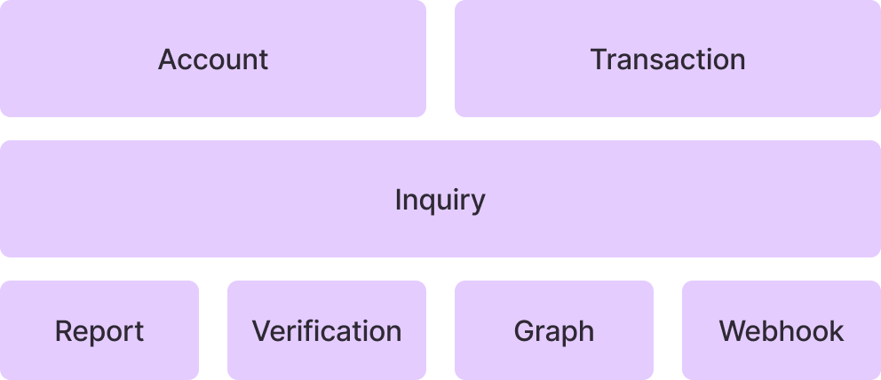
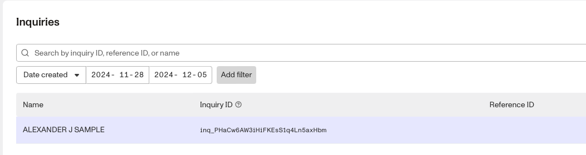
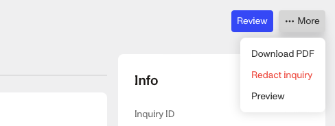
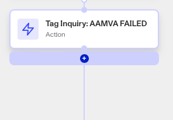

# How do I redact data, or set up a redaction policy?

❓ This question came from a member of the Persona community - a developer who wanted to use redaction to comply with specific local regulations. This question is useful for those who want to redact or protect certain pieces of personal identification information (PII).

# Overview

Persona's ecosystem offers redaction capabilities to help organizations manage and protect personal identifiable information (PII). PII can be a wide range of things, such as Name, Birthdate, and IP Address.

# How redactions work

When information is redacted, it is permanently removed from the Persona ecosystem. Persona does not retain any copies of deleted data or metadata related to that record.

You can choose whether you want to:

-   Manually redact information within a specific object (such as an Inquiry or Account).
-   Set up automatic redactions for specific information in a workflow.
-   Implement organization level redaction policies.

💡 You can use either the API or the Dashboard to redact information. In the API, use “Delete” endpoints to redact information.

Redactions cascade and also redacting ‘downstream’ objects.

-   Eg. Redacting an Account will also redact its associated Inquiries… but redacting an Inquiry _will not_ redact its parent Account.

The graphic illustrates which objects lie downstream of others. Redacting one object will redact all objects below it, but not objects beside or above it. Objects not included in this graphic (such as Cases, List, and Exports) will only redact themselves.

# How to manually redact all information in an object

1.  Choose what kind of object you’re going to redact information within, such as an Inquiry or Verification.
2.  Open the **Dashboard**.
3.  Click on the object’s subpage in the left menu, such as **Inquiries.**
    1.  If it’s an option, click on **All** within that subpage, such as **Inquiries** > **All Inquiries**.
4.  Click on the specific object you want to redact.

5.  In the top right corner, click **More** > **Redact**. The attached image shows this for an Inquiry.

# How to automatically redact, or redact specific information, in an object

You cannot redact specific information for a created object. However, you can configure an object template, such as an Inquiry template, to automatically redact specific information. Here’s how you do that:

1.  Open the **Dashboard**.
2.  Click on **Workflows** > **All Workflows**.
3.  **Create** or **Edit** a Workflow.
4.  Click to add a **Step** to your Workflow.

5.  Make it an **Action**. Choose **Redact Object** in the “Find Action” box.
6.  Choose an Object to Redact, followed by which fields to Redact. By default, it will redact all Personally Identifiable Information (PII).
7.  In the top right corner, click **Save** and **Publish** to save your updated Workflow.

# How to create organization-level redaction policies

Setting organization level redaction policies requires help from Persona to enable. Organizational-level redaction policies are turned off by default to avoid hindering the information used by other objects such as Graphs and Cases. However, you can choose to set them up by contacting your Customer Success Manager.

When configured, organization level redaction policies will automatically redact all Persona-defined personal identification information (PII) after a certain amount of time. It is a blanket policy for your entire organization over a timeframe you select. Redaction policy timeframes can range from 2 days to 2 years, depending on your needs.

If your organization does not work with a Customer Success Manager, you can reach out to Support instead by following these steps:

1.  Open the Dashboard.
2.  Click on **Documentation** > **Help Center**.
3.  In the left sidebar, click **Submit a request** under 'Get help now'.
