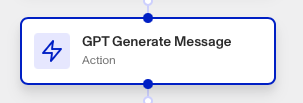

# OpenAI integration overview

# What is the GPT Generate Message step?

**GPT Generate Message** is a Workflow Action step that asks OpenAI’s ChatGPT to generate text based on a submitted prompt.

ChatGPT’s natural language processing model allows you to automate text creation within your workflow, then pass the text along to other action steps for use.

# GPT Parameters

To generate a GPT message, you’ll need the following information:

-   **Your OpenAI API key**. [Learn how to create and export an OpenAI API key here.](https://platform.openai.com/docs/quickstart)
-   The **GPT Model** you want to use. Different GPT models may exhibit different behavior or output more relevant results.
-   Your **prompt**, which can be entered manually or pulled from elsewhere in your workflow. A good prompt is descriptive: it outlines the result you want, the format of that result, and the context required to generate it.
-   **The maximum length** of your response.
    -   Specifically, you can set the maximum number of tokens (where one English character equals roughly four tokens) shared between your prompt and the GPT result.
    -   The maximum length of your response therefore also depends on the length of your prompt.

You can optionally adjust GPT parameters such as:

-   **Temperature**, which controls the randomness or creativity of the generated message.
-   **Top-P**, which limits the generated message’s word selection to more likely candidates.
-   **Frequency Penalty**, which limits how often a generated message can include repetitive language.
-   **Presence Penalty**, which encourages a generated message with new words and ideas introduced throughout.

These parameters’ inputs are each a decimal number that can range from 0 to 1, where 0 generally creates more factual writing, and 1 generally creates more creative writing.

# How do you add a GPT Generate Message step?

1.  Navigate to the Dashboard, and click on **Workflows** > **All Workflows**.
2.  Find and click on the workflow you want to edit, or **Create** a new workflow.
3.  Click on **+** when hovering over a circle to add an **Action**.

4.  Use the **Find Action** select box to click on **Marketplace** > **OpenAI**.
5.  Add your **OpenAI API Key**.
6.  Choose the **GPT Model** that will generate your message.
7.  Add a prompt for the GPT model, either manually or from elsewhere in your workplace by clicking ‘**+**’.
    1.  If you use a long prompt, adjust the **Max Length** higher to accommodate for that (since that parameter includes both the prompt and resulting message).
8.  (Optional) In ‘Advanced Configuration’, adjust **Temperature**, **Top-P**, **Frequency Penalty**, and **Presence Penalty** to configure the writing tone and content of the generated message.
9.  (Optional) In ‘Advanced Configuration’, click the **Continue on error** box if you want the workflow to continue running even if this step raises an error.
10.  **Close** the step. You’ll have to **Save** and **Publish** the workflow to begin using it.
