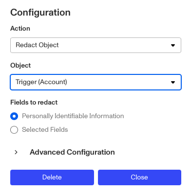

# Workflows: Redact Object step

# What is the Redact Object step?

**Redact Object** is a Workflow Action step that redacts (deletes) a Persona object's data including personal identifiable information (PII).

Persona's ecosystem offers redaction capabilities to help organizations manage data and PII at scale. Common types of PII can include Name, Birthdate, and IP Address and for many businesses, having the ability to track and delete these types of sensitive data can be a requirement from any business function including compliance, legal, engineering, and/or security.

## How redactions work

Persona objects like Inquiries, Cases, and Accounts, can contain sensitive user data including PII. Using the Redact Object step within a Workflow allows you to build in automatic redaction and deletion of that PII.

⚠️ When information is redacted, it is permanently removed from the Persona ecosystem. Persona does not retain any copies of deleted data or metadata related to that record.

Redactions cascade and also redact ‘downstream’ objects.

-   Eg. Redacting an Account will also redact its associated Inquiries, however redacting an Inquiry will not redact its parent Account.

_The graphic illustrates which objects lie downstream of others. Redacting one object will redact all objects below it, but not objects beside or above it. Objects not included in this graphic (such as Cases, List, and Exports) will only redact themselves._

## What information can you redact?

Redact Object allows you to either redact _all_ PII within an object, or only information within selected fields (such as birth date or email address).

Redact Object is useful if you need to comply with specific local regulations, for example. But since it permanently removes information from the Persona ecosystem, its use requires balancing security with conversion and visibility.

# How do you add a Redact Object step?

1.  Navigate to the Dashboard, and click on **Workflows** > **All Workflows**.
2.  Find and click on the workflow you want to edit, or **Create** a new workflow.
3.  Click on **+** when hovering over a circle to add an **Action** step.

4.  Use the **Find Action** select box to click on **Other** > **Redact Object**.
5.  Select the Object you want to redact information from.

6.  Select whether you want to redact _all_ personally identifiable information, or just selected fields (and if so, what fields to redact).
7.  (Optional) In ‘Advanced Configuration’, click the **Continue on error** box if you want the Workflow to continue running even if this Action raises an error.
8.  **Close** the Action. You’ll have to **Save** and **Publish** the workflow to begin using it.

# Plans Explained

## Redact Object step by plan

|  | Startup Program | Essential Plan | Growth Plan | Enterprise Plan |
| --- | --- | --- | --- | --- |
| Redact Object Step | Not Available | Available | Available | Available |

[Learn more about pricing and plans.](./6oZbzp7jb7AWGClF5vpY3K.md)
