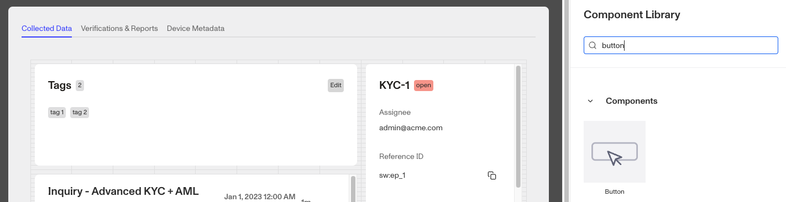

# Cases: Button component

# What is the Case Button component?

The **Case Button** is a Case component that can be added to a Case Template. Cases that are created from this Case Template provide reviewers with an an interactive element. When users click it, it can trigger a [Case Action](./3QokSTOfV7ZC7hNDPQ5HnT.md). You can also customize the component's appearance, function, and define logic that governs when it appears.

A **Case Button** is often used to trigger Case Actions such as editing multiple fields on the Case or creating additional Reports.

# How do you add a Case Button component?

1.  Navigate to the Dashboard, and click on **Cases** > **Templates**.
2.  Find and click on the Case template you want to edit, or **Create** a new template.
3.  Navigate to the **Tab** you want to add a Case component to. Click an empty space to view the Component Library.
4.  In the right toolbar, search for ‘**Button**.’
5.  Drag and drop the Button component into your Case UI and reposition it by dragging it around.
6.  Click on the **Button.** On the right toolbar, you can customize the Button component:
    1.  Under **Settings > Name,** you can change the text displayed on the **Button.**
    2.  Under **Settings > Action,** you can change the action the **Button** completes when clicked.
    3.  Under **Styling**, you can set the **Button color**
        1.  Default: The most common button style (Gray)
        2.  Primary: To highlight important actions. (Blue)
        3.  Critical: For actions that will delete data or be difficult to recover from. (Red)
    4.  Under **Module Layout**, you can change:
        1.  Dynamic height toggle: Module will grow or shrink to fit its contents.
        2.  Visibility toggle: Dynamically control whether the module is hidden. This is a toggle button that lets you set conditions for when the button should be displayed or hidden from view based on your case requirements. You can read more about **Visibility configuration** below.
    5.  Under **Advanced Options > Module Enablement**, you can define custom control conditions that determines when the **Button** is enabled or disabled. Advanced options are typically configured for specific customers by a Persona team member.
7.  Click the **“Delete”** button if you want to remove the component from the Case UI.

## Visibility configuration

If you toggle this on you will have two options to customize visibility.

1.  **Basic** visibility allows you to set rules on the **Button** to determine when it will be visible. You can read more about **Basic visibility configuration** below.
2.  **Advanced** visibility allows you to set logic to control when the **Button** is enabled or disabled based on custom conditions. Advanced options are typically configured for specific customers by a Persona team member.

## Basic visibility configuration

Visibility configuration consist of three main components:

1.  **Field**: The object that will have a condition linked to it.
2.  **Condition**: How the field is compared to the value (e.g., equals, does not equal).
3.  **Value**: The value to test against.

### Creating visibility configuration

-   **AND Statements**: Combine multiple conditions that must all be true for the rule to pass. Add these using the **"Add"** button.
-   **OR Groups**: Combine conditions where only one needs to be true for the rule to pass. Create these by clicking **"Add OR Group"**.

## How to use visibility configuration

1.  Click on the Button component, and go to **Module Layout** and toggle the button next to **Visibility** in the right toolbar.
    1.  Click on “**Empty rule**” to see **Visibility configuration**.
    2.  Create a logical rule by filling in the three boxes following **Show if**, which correspond to an object, its condition, and its value being assessed, respectively. When that logical rule passes, the **Button** is shown.
    3.  (Optional) Add additional logical rules by clicking either ”**Add”** (if you want to add 'AND' rules, where all must be passed to continue) or ”**Or group”** (if you can also nest a group of OR statements within an AND statement).

# Plans Explained

## Case Button component by plan

|  | Startup Program | Essential Plan | Growth Plan | Enterprise Plan |
| --- | --- | --- | --- | --- |
| Case Button component | Limited | Limited | Available | Available |
| Advanced options - Module enablement | Limited | Limited | Limited | Available |
| Visibility - Advanced configurations | Limited | Limited | Limited | Available |

[Learn more about pricing and plans](./6oZbzp7jb7AWGClF5vpY3K.md).
