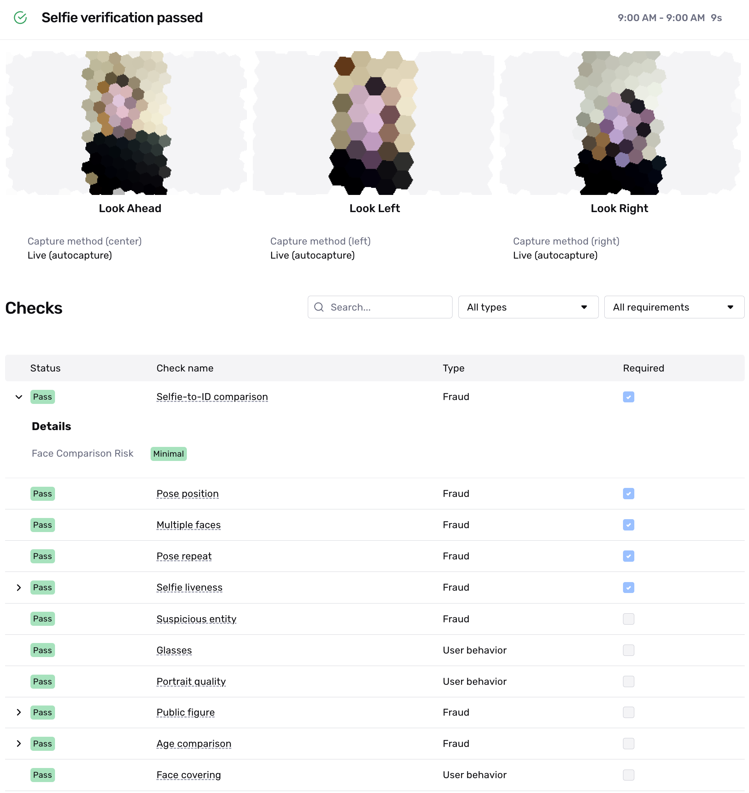
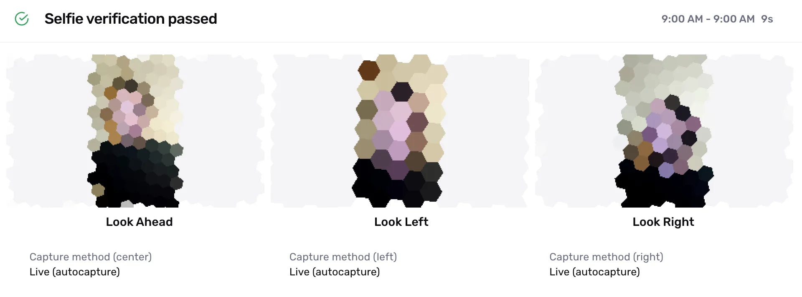
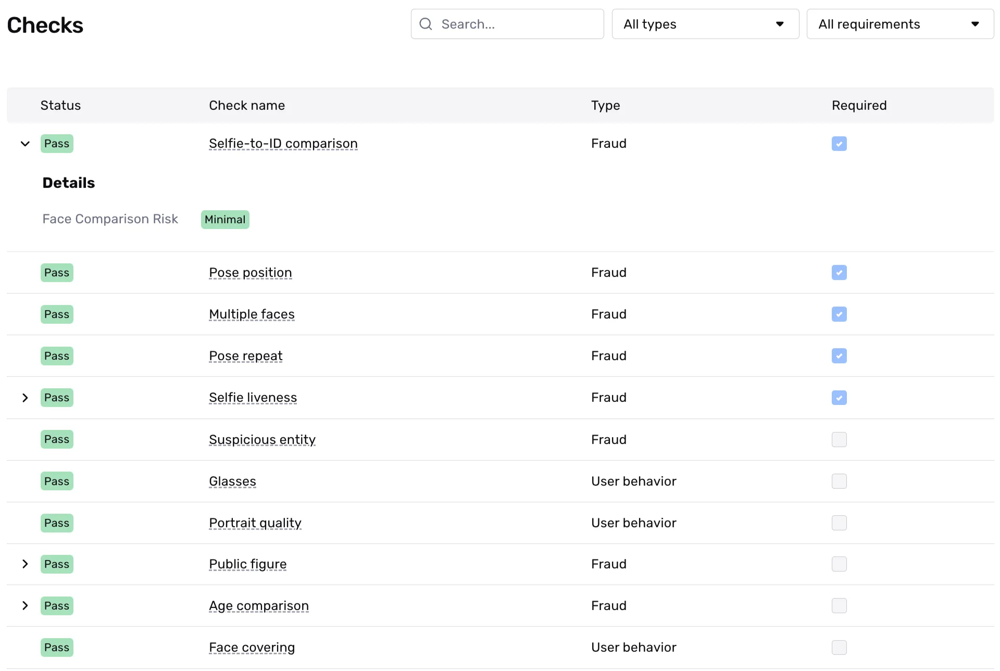
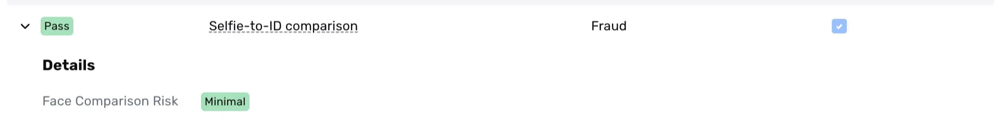

# Understanding Selfie Verification results

# Overview

Selfie Verification protects against identity spoofing by comparing a selfie to a Government ID Verification portrait using three-point facial matching and performing liveness checks. For more details, see the [Selfie Verification overview](./1l0WTbR5UsfiggNDPWbnUp.md).

This page examines an example of a Selfie Verification run and guides you through the results. You'll learn how to interpret Verification checks and understand why they **passed** or **failed**.

ℹ️ Note: A Verification run represents a single attempt to verify specific information. Within an Inquiry, users may get multiple Verification results due to user error, network issues, or other configureable factors in Persona. For this reason, we recommend reviewing, listening, or retrieving the status of the parent Inquiry or Transaction rather than individual Verifications. This approach allows you to use Inquiry Templates or Workflows to better evaluate approval conditions, declines, and cases needing additional review.

## Example Selfie Verification run result

As an example, we'll look at a Selfie Verification that checks whether the user submitting an ID matches the photo on that ID. We'll walk through the example Verification below, section by section.

 Note: Images in these screenshots are intentionally blurred for privacy, but represent the actual data submitted during verification.

## Overall Verification run result

When viewing a Selfie Verification run, you’ll first see the overall Verification result. In this example, the Selfie Verification **passed**.

This top-level status is commonly in a “**passed**” or “**failed**” state. The information below the overall result offers further explanation or reasons why it “**passed**” and shows the Verification Template configurations that led to that “**passed**” status.

## A note on Inquiry status vs. Verification status

A common best practice for solutions within Persona is to rely on statuses. For example, when integrating via Inquiries (Hosted, Embedded, or Mobile SDK), businesses typically listen for the status of an Inquiry to decide whether a user should proceed within a user experience or not—if **passed**, otherwise it may require additional review. That additional review allows you to automatically or manually review the different verification attempts by conditioning on or reviewing the statuses of those verifications. You can also go one level deeper and review the statuses of the verification checks within a Verification to further understand the exact reasons for Verification failures.

These different statuses, let you quickly determine if an identity meets your Verification threshold and which ones don't. It gives you the ability to automate the attempts you feel most confident about, while leaving a pathway open for the longer tail, more complicated situations. For those complicated situations that need review—such as higher-risk, failed, or declined identities—you can drill down into specific details based on what you need to investigate further.

## Images

This Selfie Verification uses the default three-point comparison and conducts a liveness check. The Verification captures images of the individual looking straight ahead, to the left, and to the right.

The Selfie Verification can also be configured to capture one "Look Ahead" image, disable autocapture, allow for upload, and other Verification Template configurations. Those that impact the collected images will be noted explicitly in this section.

# Verification Checks

## What are Verification Checks?

Verification checks evaluate specific aspects of the submitted images. Each Verification type has its own set of Verification checks that run instantly during the Verification run. A check can result in one of three statuses: "**passed**,” "**failed,**" or "**not applicable (N/A).”** The following section explains these statuses in detail.

## What does each Verification Check mean?

Every Verification Type has it's own Verification Checks, as each type verifies different pieces of information. For a complete look at the definition of Verification Checks per Verification Type, active customers can view a complete list of Verification Checks and associated failure reasons by going to **Documentation > [Verification Checks](https://app.withpersona.com/dashboard/resources/verification-checks)** in your Persona Dashboard.

## What do Verification Check results look like?

Let's zoom in on all the checks.

Here's what each column means at a high level:

-   **Status**: This is a high-level result of the check. Possible values are:
    -   `Passed`: The check passed in the Verification attempt and meets the check’s configuration.
    -   `Failed`: The check failed in the Verification attempt and does not meet the check’s configuration.
    -   `N/A`: Not applicable. The check was not evaluated in the Verification attempt. This may happen because this check’s configuration depends on a piece of information that was not collected as part of the Inquiry and the check can not be performed.
-   **Check Name**: The name of the Verification check.
-   **Type**: If a Verification check falls into the `Fraud` or `User behavior` category.
    -   `Fraud`: Checks in this category are designed to help catch fraudulent submissions. If a check in this category fails, there may be a higher chance the submission is fraudulent.
    -   `User behavior`: Checks in this category are designed to flag instances when a user submits information that does not meet the quality bar Persona requires. If a check in this category fails, it does not necessarily indicate a higher chance that the submission is fraudulent. Note: You may see this as `user action required` in the API response.
-   **Required**: The Verification checks required to pass in order for the Selfie Verification to successfully complete.

## How do I know if a Verification check is required?

In this example, we see that five Verification checks were [required](./7IAy61dAMRDQ1Q77ugwpcA.md) (indicated by blue checkmarks in the Required column). All of the checks **passed.** While reviewing non-required Verification checks is common practice, consider updating your Verification Template to require any check whose failure would be unacceptable. This ensures future Verification runs will properly evaluate these critical checks.

## Verification Check details

Some Verification checks offer deeper levels of information allowing you gain an even granular view of what information was checked or verified. An example is Selfie-to-ID comparison check. For all Verification Checks that offer additional detail, you can use the toggle to further explore that information. In this example, the Selfie-to-ID comparison check offers further detail on the Face Comparison Risk and the value is `minimal`.

## Related articles

[Selfie Verification](./1l0WTbR5UsfiggNDPWbnUp.md)

[Configuring Selfie Verification checks](./1dsXklKVFkvpSdX90CTtNo.md)
