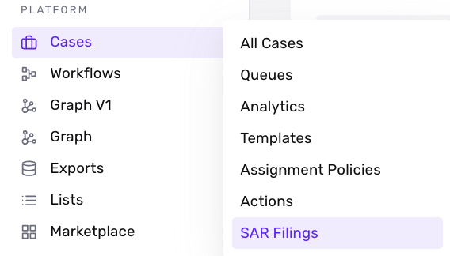
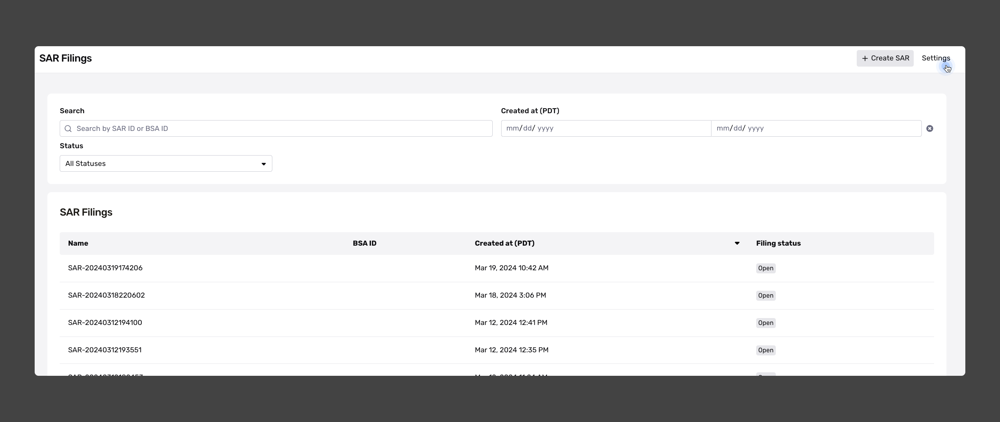
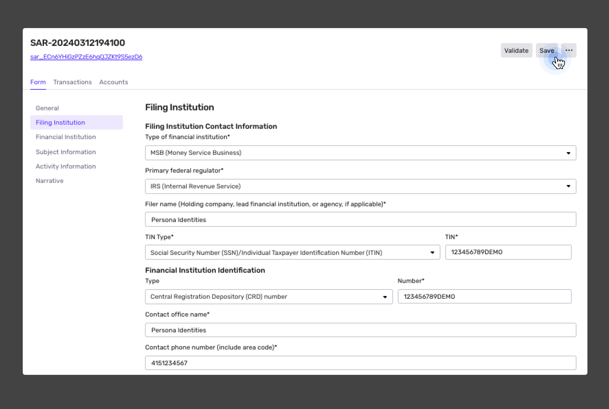
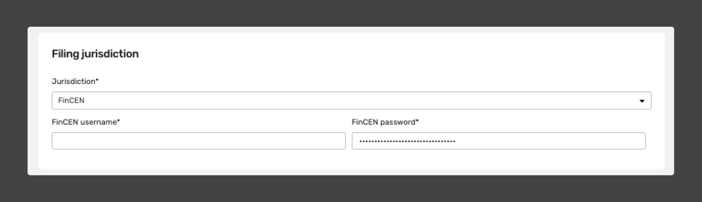

# Update SAR Filing Configurations

Whenever new Suspicious Activity Reports (SARs) are created within Persona, the details of the filing institution are used to pre-fill the Filing Institution and Financial Institutions sections of your report. If you need to make any changes to this information, follow the configuration steps below.

# **Update SAR Filing Configurations**

**👷🏽 Who can configure permissions?**  
Only roles with view and edit permissions for SAR configuration view can make updates to SAR Filing Configurations. These permissions can be updated under **Team** > [Roles](https://app.withpersona.com/dashboard/user-roles?currentPage=1&filter=%7B%22omni%22%3A%22%22%7D&pageSize=25).

### **Find SAR Filings Settings**

Within the left-side navigation bar, under **Cases** > **SAR Filings**, you can update your SAR Filing Configurations. 

Within the SAR Filings page, click on the Settings button located at the top right-hand corner.

### Update Institution information

The Filing Institution is the entity filing the report, while the Financial Institution identifies the entity where unusual activity has been detected. Typically, the Filing Institution and the Financial Institution are the same. By default, we use the information configured under the Filing Institution to auto-fill the Filing Institution and Financial Institution sections of your Suspicious Activity Report.

Once you've saved your changes, you can test the auto-fill feature in your sandbox environment by manually creating a new SAR case.

### **Update Filing jurisdiction credentials**

Update your FinCEN username and password under Filing Jurisdiction. These are your **Secure Data Transfer Mode (SDTM)** **credentials**. If you've never filed a SAR before, you will have to request new credentials from the BSA.

Note: FinCEN provides separate credentials for sandbox and production accounts. Please ensure that you add your SDTM sandbox credentials within your sandbox environment for testing purposes. Once these credentials have been updated, Persona can begin validation of your credentials.

If you don’t have SDTM sandbox credentials, you’ll have to request these through the [BSA E-Filing System Help Desk](https://bsaefiling1.fincen.treas.gov/HelpTicketForm).

For more information on how to obtain SDTM credentials, [see here](./3PQYXlkWnkxRyWmAijjVux.md#sar-e-filing).
