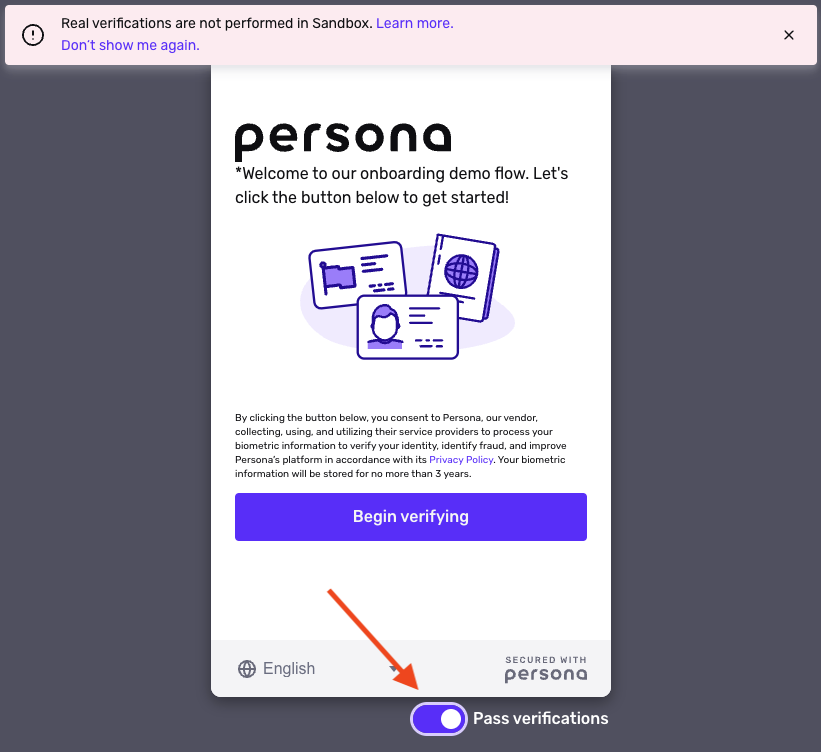

# Previewing an Inquiry

## Overview

After you configure an [Inquiry Template](./ETA0GIS8K60DSoiFRpA9z.md), you can preview the Template to experience and test out what the end user sees.

Real Verifications are not run when you preview an Inquiry Template. Previews always run in the [Sandbox environment](./6I2kGhfPvSuUjYq4z6tpmB.md).

You can simulate the user passing or failing each Verification attempt.

## Preview a Template

To preview an Inquiry Template:

1.  In the Persona Dashboard, navigate to the [All Templates page](https://app.withpersona.com/dashboard/inquiry-templates) and select the Inquiry Template you want to preview.
2.  In the Inquiry Template Editor, select the preview button pictured below from the menu at the top right of the Dashboard. Note: The Preview button will be greyed out if you're not in a Sandbox environment.

## Pass or fail each Verification

Within Preview, you can simulate passing or failing each Verification attempt.

Change the toggle under the Inquiry UI to either **Pass verifications** or **Fail verifications**. This setting affects the current Verification you're interacting with. You can change the toggle throughout the flow to simulate passing certain Verifications, and failing others.

