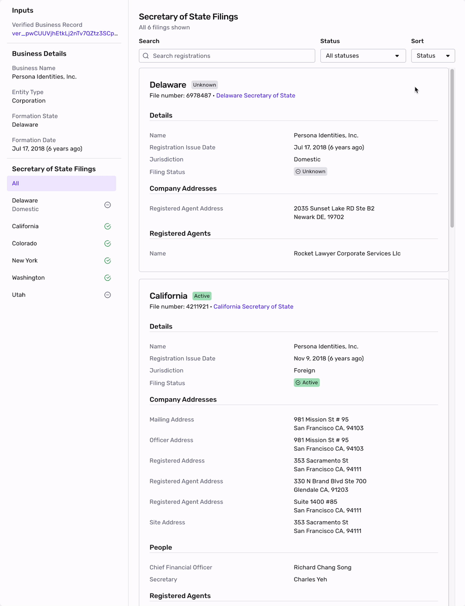

# Business Registrations Report

## Overview

The Business Registrations Report (BRR) is used in KYB to surface Secretary of State (SoS) filings and their associated details for a given business entity in the United States.

Customers use the BRR to:

**Conduct due diligence on a business**

Businesses are required to submit SoS filings periodically to the Secretary of State (SOS) or a similar regulatory agency in the state where they are registered. These filings often have information about the entity, company address, and associated people that may be useful in Enhanced Due Diligence.

**Step up verification depending on SoS details**

Some customers may want to see and make decisions based on more granular information from a SoS filing. For instance, the Good Standing or Active Status of a filing indicates that a business complies with that jurisdiction’s legal and filing requirements. Consequently, customers may want to establish a workflow that sends businesses with a SoS filing in “bad standing” to manual review.

**Set a foundation for US KYB**

The Business Registrations Report is one of many Reports that Persona offers for KYB in the United States. The Business Registrations Report is typically used after an initial Business Registry Verification has run.

## Interpreting the Business Registrations Report

The Business Registrations Report takes the Verified Business Record from the Business Registry Verification and searches against the SoS data sources to return all filings with granular detail available for each filing.

**Attributes Per State Filing Exposed in the Report**

-   Status
    -   Jurisdiction
        -   Domestic or Foreign
    -   Filing Status
    -   Sub Status
-   Entity Details
    -   Company Name
    -   Company Type
    -   Registration Issue Date
-   Company Addresses
    -   Address
    -   Address Type
-   People
    -   Name
    -   Title
-   Registered Agents
    -   Agent Name
    -   Agent Address

Note: The specific status and filing details available in the report vary by state, depending on what each Secretary of State exposes via their public data feeds. For example, Delaware does not provide updated status information (such as Good Standing) through its data feed. The only way to retrieve that status is by purchasing the official document directly from the Delaware Secretary of State.

## Understanding Secretary of State filings

While registering a business is not a legal requirement in every state, a business forfeits many of its protections if it does not register or falls out of good standing.

**(SoS) Domestic Filing**

A business’s domestic filing represents the initial state in which it chooses to incorporate or form its entity. This is often referred to as its “home state,” “state of formation,” or “incorporation state.”

**(SoS) Foreign Filing**

When a business formed in one state (the "domestic" state) wants to expand its operations to another state, it must register in the other state as a "foreign" entity. This term does not refer to international business but to any state outside the entity's original formation.

**Good Standing Status**

In the context of Secretary of State filings, Good Standing Status is a certification issued by a state’s Secretary of State affirming that a business complies with the jurisdiction’s legal and filing requirements. While these requirements can vary by state, some common ones include:

-   Timely Tax Payments: This includes federal, state, and local income tax, sales tax, and franchise tax.
-   Filing Annual Reports: On-time submission of annual reports and other mandatory documentation is crucial.
-   Maintaining a Registered Agent: Having an agent for legal and official correspondence is mandatory.
-   Keeping Licenses Current: Ensuring that business and professional licenses are up-to-date.

Failure to meet these requirements can result in a business falling out of good standing, leading to a status of "bad standing," “not in good standing,” "forfeited," or "suspended."

### Frequently Asked Questions

**What is the difference between this report and the Business Registry Verification?**

This report surfaces all SoS filings for a given business and is intended to serve as an enrichment report after the Business Registry Verification (BRV) has been completed. The BRV verifies a business against the SoS registries based on a given business name and address, without returning the actual details from the SoS registry.

**Why does the information vary by state?** Each state’s Secretary of State manages its own data availability and format. Some states expose granular filing details, while others—such as Delaware—limit access to certain fields like Good Standing or Active Status, which can only be retrieved by purchasing an official document from the state.

## Related articles

[Business Registry Verification](./3pkLBWKg5wIQJru7PATxBc.md)

[Verifying Businesses: How Persona can help verify businesses](./3OGe9IwySJmDvXL2DOfV7N.md)
