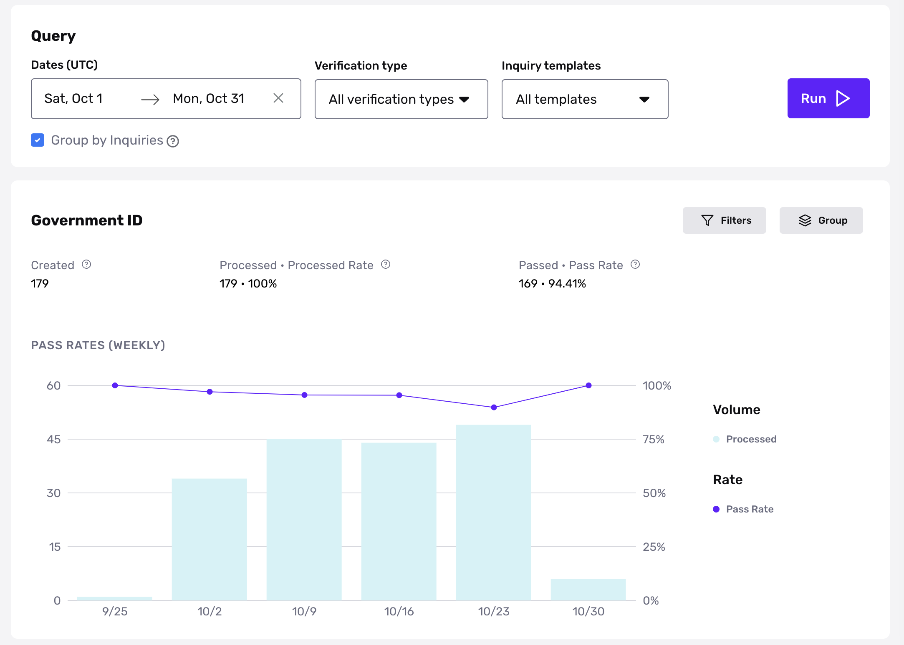
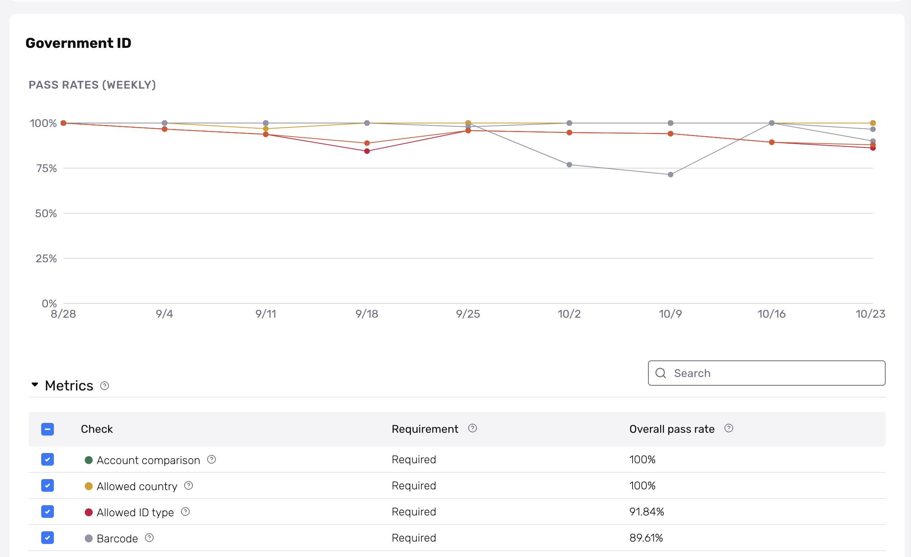
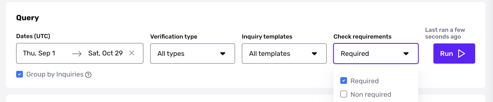
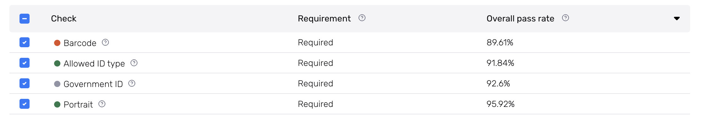

# Verification Analytics

## Overview

Verification Analytics provides visibility into key metrics for each verification type in an inquiry template, so you can uncover useful insights to optimize your users’ pass rates.

You can view Verification Analytics within the dashboard by navigating to the Verifications section and selecting [Analytics](https://app.withpersona.com/dashboard/verification-analytics/volume?filter=%7B%22createdAtStart%22%3A%222022-05-01T04%3A00%3A00.000Z%22%2C%22createdAtEnd%22%3A%222022-10-19T03%3A59%3A59.999Z%22%2C%22templateIds%22%3A%5B%5D%2C%22verificationTypes%22%3A%5B%5D%2C%22groupBy%22%3A%22inquiries%22%2C%22checkRequirements%22%3A%5B%5D%2C%22checkTypes%22%3A%5B%5D%2C%22groupByDimension%22%3A%7B%22verification%2Fdatabase%22%3Anull%2C%22verification%2Fgovernment-id%22%3Anull%2C%22verification%2Fselfie%22%3Anull%7D%7D). Once there, the Volume tab will allow you to filter deeper into metrics for each verification type (Government ID, Selfie, etc.), while the Checks tab provides pass rates for each verification check (glare, blur, etc.).

## Verification Volume

Within Verification Volume, analyze the volume and pass rates of verifications to answer questions such as:

-   How does my Government ID Verification Pass Rate compare between US and CA users?
-   Is there a difference in Selfie Verification Pass Rate between Auto or Manual capture method?
-   How many Database Verifications are being run in Japan for this template?

Select a date range to get started, then specify a specific verification type and/or inquiry template from the drop-down menu. _Please note that when “Group by Inquiries” is selected, this will capture the most recent verification result within an inquiry._

For each verification type on the Volume tab, you will see metrics such as created, processed, and pass rate. You can use this information to track trends over time and observe differences in pass rates for each verification type.

Our Verification Filters enable you to understand these metrics more deeply by honing in on attributes surfaced or extracted from a processed verification, such as Capture Method, ID Class, Issuing Country, and more. You can also break down this data by those attributes using the Group function.

If you encounter NULL values, this could be due to customer redacted data or if you are running verifications on an older API version. Please [contact the Persona support team](https://app.withpersona.com/dashboard/contact-us) for assistance.

## Verification Checks

Within Verification Checks, dive deeper into pass rates for required and non-required checks to answer questions such as:

-   Which required checks are contributing to failed verifications?
-   Are there any noticeable trends in pass rates over time for a given verification check? Has there been a shift in user demographic?
-   How might the overall verification pass rate be impacted if we make a specific non-required check required?

By examining which checks have low pass rates and may be hindering your users’ ability to complete the flow successfully, you can decide which verification checks to require.

For example, if our goal is to maximize the number of Government ID verifications that successfully pass, we should prioritize required checks with high pass rates and consider making checks with low pass rates non-required. How might you approach this?

First, select Government ID from the Verification type drop-down menu and select Required from the Check requirements drop-down menu.

Then, within the Metrics section, we can sort the Overall pass rate from lowest to highest percentage by clicking on the header.

We can see that the Overall pass rate for Barcode is lower than the other required checks, suggesting that some users have difficulty passing this check successfully. As a result, we may want to make this check non-required if it is not crucial for our identity verification flow.

After making changes to required and non-required checks, use the time-series chart view to continue to monitor your metrics for fluctuations.

Your analytics is a source of truth for the performance of your specifics solutions, but should not be treated as such for your billing. Your contract will determine how your bill is calculated and your invoice should be treated as the source of truth.

For example, verification analytics will count unique inquiries containing a verification, but not the number of individual verifications in the inquiry, whereas billing counts the total number of verifications. If you have an inquiry with 2 Gov ID verifications, this can cause a disparity in the count between the analytics numbers and billing.
