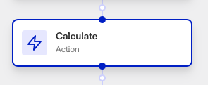
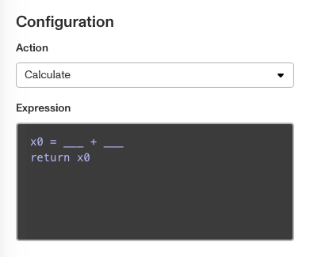
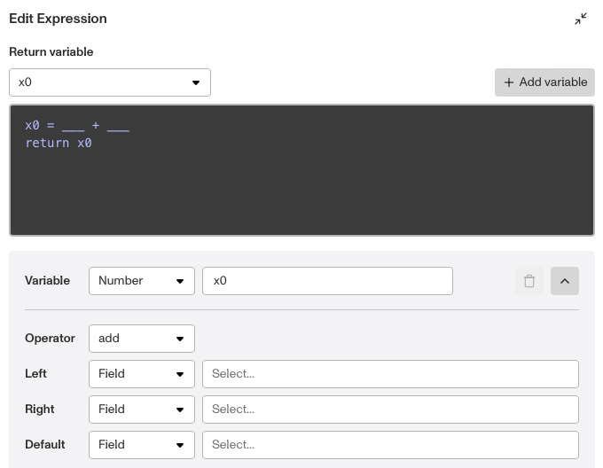

# Workflows: Calculate Step

# What is the Calculate step?

**Calculate** is a Workflow Action step that performs mathematical operations on specified values, outputting a result. It is useful for performing data manipulations, or deriving new values based on existing inputs within your Workflow.

The crucial part of a Calculate step is its **Variables**, which are the results of mathematical operations and can represent numbers, strings, or boolean logic. You can have multiple variables (and therefore, multiple operations) in a Calculate step, but the step will only return one of the variables.

For each Variable you can set.

-   The Variable label, which should be chosen so a user can intuitively understand the Variable’s meaning.
-   The **Operator**: a mathematical operator to add, subtract, multiply, or divide several inputs together. Alternatively, you can set it to `SUM` (add together) or `AVG` (average) an array of data. The result of the Operator is stored in the Variable.
-   The **Left** and **Right** items, which appear on either side of the Operator. They can be data Fields, specific values, or variables.
-   The **Default** item, which is set as the Variable’s value if the mathematical operation fails. It can be a data Field, specific value, or another variable’s value.

# How do you add a Calculate step?

1.  Navigate to the Dashboard, and click on **Workflows > All Workflows**.
2.  Find and click on the workflow you want to edit, or **Create** a new workflow.
3.  Click on **+** when hovering over a circle to add an Action step.

4.  Use the **Find Action** select box to click on **Compute > Calculate**.
    
5.  Click on the **Expression** box to open an edit box. Within the **Edit Expression** box:
    
    1.  Choose the step’s **Return variable**.
    2.  Create your mathematical operations. For a Variable, edit:
        1.  **Type** and **Label**, beside `Variable`. Its `type` defaults to `Number`.
        2.  **Operator**, which defines the mathematical operation that produces the Variable’s value. It defaults to `add`.
        3.  **Left** and **Right**, which are operated on by the Operator. Choose their **Type** and **Contents**. Their `types` default to `Field`.
        4.  **Default**, which is set as the Variable’s value if the Operator fails. Choose its **Type** and **Contents**. Its `type` defaults to `Field`.
        5.  (Optional) Click the arrow to the right of the Variable to hide its associated Operator, Left/Right items, and Default item.
    
    
    
    3.  (Optional) **Click + Add Variable** to add another Variable with an associated mathematical operation, and edit the operation as described in Step 5.
        1.  You can have one Variable’s operation include the Variable produced by another operation.
        2.  Remember that the Calculate step will only output one Variable at the end.
6.  (Optional) In "Advanced Configuration" in the Step Type window, click the **Continue on error** box if you want the Workflow to continue running even if this Action raises an error.
    
7.  **Close** the Action. You’ll have to **Save** and **Publish** the workflow to begin using it.
    

# Plans Explained

## Calculate step by plan

|  | Startup Program | Essential Plan | Growth Plan | Enterprise Plan |
| --- | --- | --- | --- | --- |
| Calculate step | Not Available | Not Available | Available | Available |

[Learn more about pricing and plans.](./6oZbzp7jb7AWGClF5vpY3K.md)
