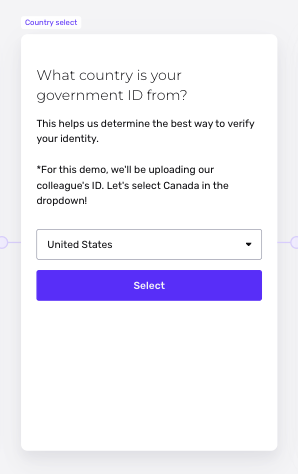

# How do I configure country options for a Country Select screen?

## Overview

The Country Select screen may be part of your identity verification flow.

For example, if you use Government ID Verification in your flow, you may use a Country Select screen at the start of your flow to communicate which countries you accept IDs from, and to collect a data point that helps you understand what users submit.

You can configure which countries appear as options on the Country Select screen.

## Steps

To configure the country options on your Country Select screen, follow these steps:

1.  In the Persona Dashboard, navigate to **Inquiries** > **Template**. Select a template that uses a Country Select screen.
2.  In the upper corner of the Flow Editor, click **Configure**.
3.  Find the section named Country select options.
4.  Edit or remove countries from the list.
5.  In the upper corner of the Flow Editor, click **Save**.
