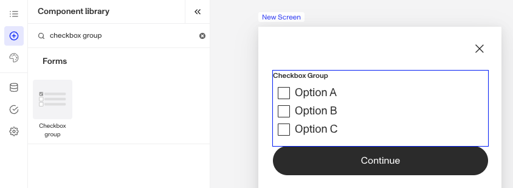
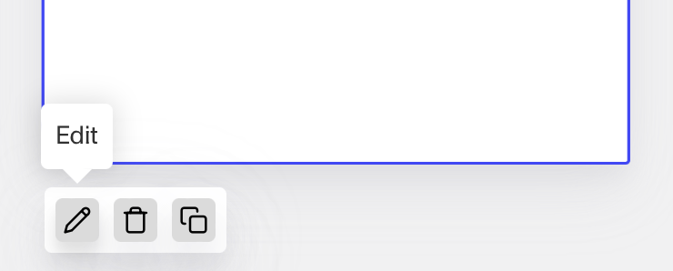
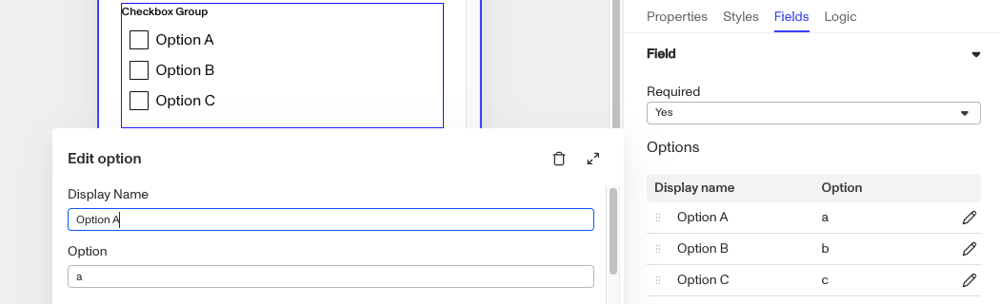
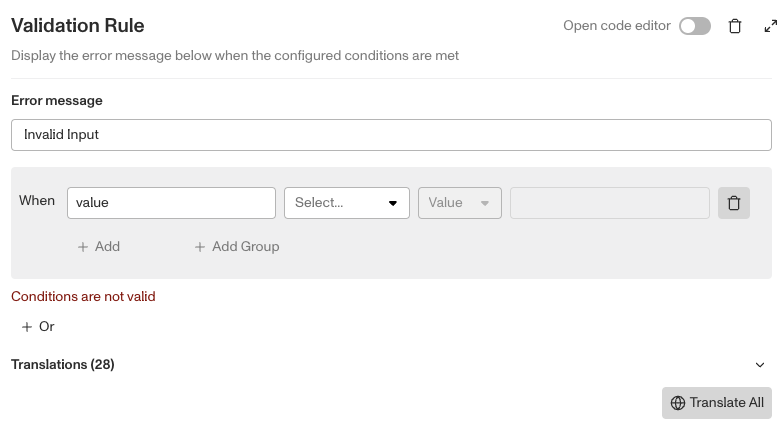
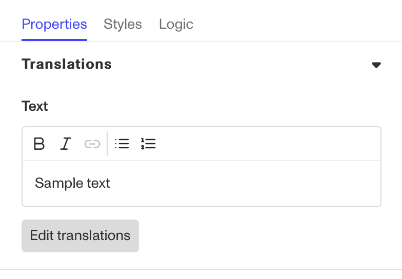
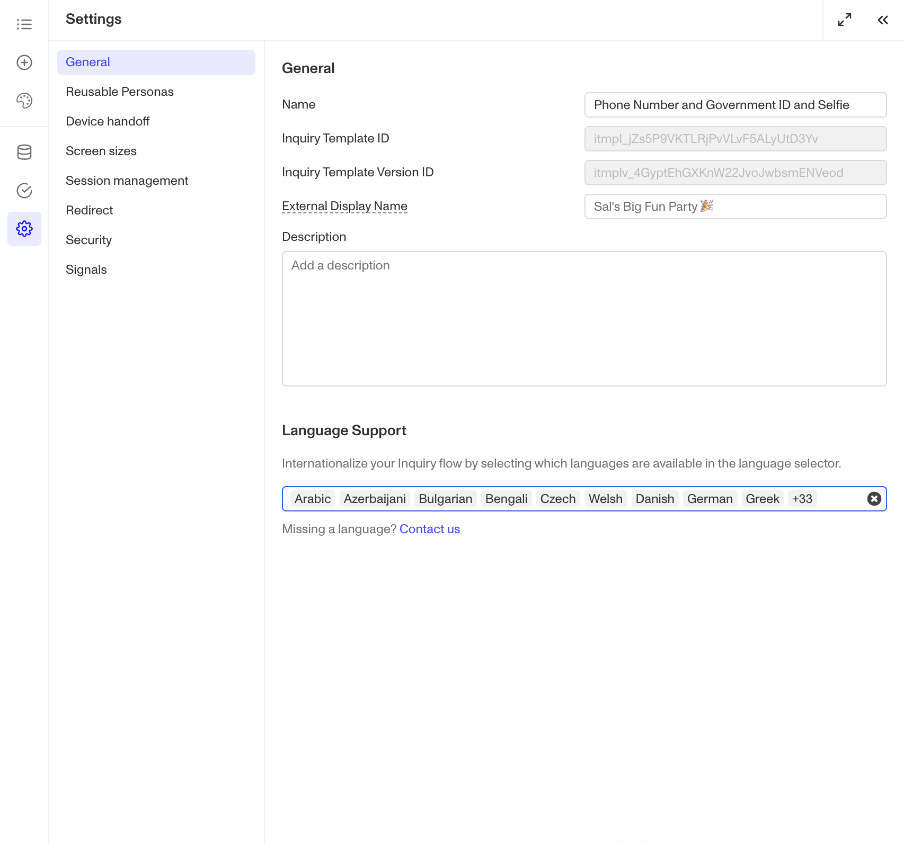
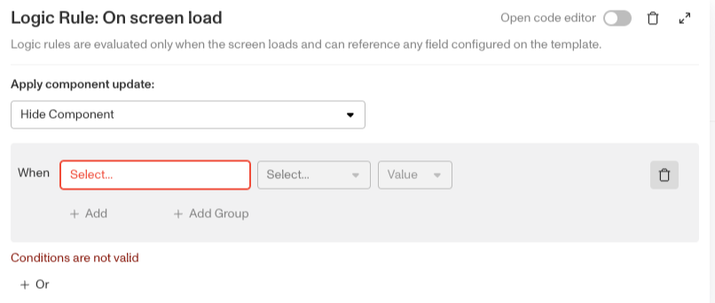
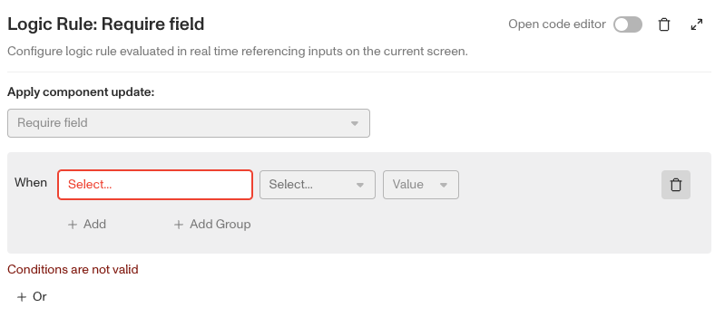

# Inquiries: Checkbox Group component

# What is the Inquiry Checkbox Group component?

**Checkbox Group** is an Inquiry screen component that adds a group of interactive components that allow a user to select or toggle an option on or off.

A **Checkbox Group** component is ideal for scenarios like accepting Terms & Conditions, setting preferences, or allowing a user to make multiple selections.

# How do you add an Inquiry Checkbox Group component?

1.  Navigate to the Dashboard, and click on **Inquiries > Templates**.
2.  Find and click on the Inquiry template you want to edit, or **Create** a new template.
3.  Hover over a screen and click the **Pencil** icon, or double-click the screen to open it in the Screen Editing View.

4.  In the Left Panel, click **Component Library** and search for ‘**Checkbox Group**’.
5.  Drag and drop the Checkbox Group component into your screen, and reposition it by dragging it around.
6.  Click on the Checkbox Group component, and go to **Properties** in the Right Panel.
    1.  (Optional) Add customized **validations.** Learn more about **Validations** below.
    2.  (Optional) Add a customized **label**, **placeholder** and **translations**:
        1.  Edit the text in the **Label** box. The **Label** is a text element displayed above the Checkbox Group component to describe its purpose, such as “Select Country” helping users understand what information to provide.
        2.  Add translations for the text by clicking **Edit translations.** You can **Translate All** or **Translate** individual languages, manually or automatically. If you don’t set translations, you’ll be prompted to do so upon **Publishing** the template.
7.  In the **[Fields](./5rT2Llik2kUvJTXKapZb8c.md)** tab, you can set up and customize the behavior of the Checkbox Group component.
    1.  **Required**: Choose whether the field is mandatory (**Yes)**, optional (**No**), or based on conditions (**Conditional**). If you choose **Conditional** you will need to set a Logic rule, you can read more about **Logic** below.
    2.  **Options:**
        1.  Edit **Options** by clicking the Pencil icon to the right of the **Option** you want to edit. You can change the **Display Name** and **Option** text, as well as add translations.
        2.  Add **Options** by clicking the “Add Option” button.
        3.  Delete **Options** by clicking the Pencil icon to the right of the **Option** you want to delete. Then click the Trash can icon on the right of the **Edit** **Option** pop up box.

8.  (Optional) In the **Logic** tab, you can add rules that govern when the component appears, and when it does not. You can read more about **Logic** below.
9.  **Close** the step. You’ll have to **Save** and **Publish** the template to begin using it.

# Validations

Validation rules can be set on a Checkbox Group component to ensure that the entered data is a properly formatted and is a valid. This can prevent errors such as invalid inputs, and can ensure only usable and accurate selections s are submitted.

The **Error message** can be edited to provide the user with more information on why the Checkbox Group selection is not valid. Translations for the error message can be added by clicking **Edit translations.** You can **Translate All** or **Translate** individual languages, manually or automatically. If you don’t set translations, you’ll be prompted to do so upon **Publishing** the template.

## Validation Rules

Validation rules consist of three main components:

1.  **Field**: The object that will have a condition linked to it.
2.  **Condition**: How the field is compared to the value (e.g., equals, does not equal).
3.  **Value**: The value to test against.

### Creating Validation Rules

-   **AND Statements**: Combine multiple conditions that must all be true for the rule to pass. Add these using the **"Add"** button.
-   **OR Groups**: Combine conditions where only one needs to be true for the rule to pass. Create these by clicking **"Add OR Group"**.

## How to use Validation Rules

1.  Click on the Checkbox Group component, and go to **Logic** in the Right Panel.
    1.  Create a validation rule by filling in the three boxes following **When**, which correspond to an object, its condition, and its value being assessed, respectively. When that validation rule passes, the component update is applied.
    2.  (Optional) Add additional validation rules by clicking either **\+ Add** (if you want to add 'AND' rules, where all must be passed to continue) or **\+ Or** (if you want to add 'OR' rules, where one must be passed to continue). You can also nest a group of OR statements within an AND statement by clicking **\+ Add Group**.
    3.  (Optional) To edit the validation directly, you can open the **code editor**.

# Translations

Persona can automatically translate new text into other languages in the component’s **Properties** tab. You can also customize the translation for any particular language.

To configure available languages for your template, click the **Gear** icon in the Left Panel to access **Settings**, then select languages under the **General** tab.

# Logic

Persona provides you with the ability to add logic to a Checkbox Group component. For example, a component may only become visible to a user if certain conditions are met. On the **Logic** tab, there are two options for logic rules:

-   **On screen load**: Logic rules are evaluated only when the screen loads. They can reference any field configured on the template.
-   **On screen update**: Logic rules are evaluated in real time. They can only reference inputs on the current screen.

For form components a field can be labeled as required under specific conditions.

-   **Require field**: Logic rules are evaluated in real time referencing inputs on the current screen. They can only reference inputs on the current screen.

## Logic Rules

Logic rules consist of three main components:

1.  **Field**: The object that will have a condition linked to it.
2.  **Condition**: How the field is compared to the value (e.g., equals, does not equal).
3.  **Value**: The value to test against.

### Creating Logic Rules

-   **AND Statements**: Combine multiple conditions that must all be true for the rule to pass. Add these using the **"Add"** button.
-   **OR Groups**: Combine conditions where only one needs to be true for the rule to pass. Create these by clicking **"Add OR Group"**.

## How to use Logic Rules

1.  Click on the Checkbox component, and go to **Logic** in the Right Panel.
    1.  Choose either “**On screen load**” or “**On screen update**” and click **Add.**
    2.  Choose what **Component Update to apply**. This determines what happens to the component when the logical rules are met.
    3.  Create a logical rule by filling in the three boxes following **When**, which correspond to an object, its condition, and its value being assessed, respectively. When that logical rule passes, the component update is applied.
    4.  (Optional) Add additional logical rules by clicking either **\+ Add** (if you want to add 'AND' rules, where all must be passed to continue) or **\+ Or** (if you want to add 'OR' rules, where one must be passed to continue). You can also nest a group of OR statements within an AND statement by clicking **\+ Add Group**.
    5.  (Optional) To edit the logic directly, you can open the **code editor**.

# Plans Explained

## Checkbox Group component by plan

|  | Startup Program | Essential Plan | Growth Plan | Enterprise Plan |
| --- | --- | --- | --- | --- |
| Checkbox Group component | Available | Available | Available | Available |
| Validations for Checkbox Group component | Available | Available | Available | Available |
| Translations for Checkbox Group component | Available | Available | Available | Available |
| Logic for Checkbox Group component | Not Available | Not Available | Available as part of Inquiries Enhanced | Available as part of Inquiries Enhanced |

[Learn more about pricing and plans](./6oZbzp7jb7AWGClF5vpY3K.md).

# Learn more

[Learn more about Inquiries.](../../docs/docs/inquiries.md)
