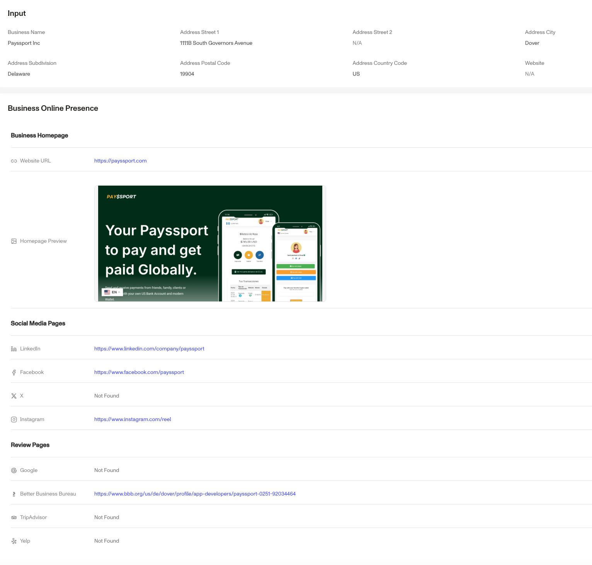

# Business Online Presence Report

## Overview

The Business Online Presence Report helps surface a business's homepage, social media sites, and third party review sites.

**The report is intended to be used with other online credibility products like the [Business Website Verification](./6YMwMNVZpOYO4n6bpUhokY.md) or the [Business Classification Report.](./60dDv0ttzy8rDFNPLaiszs.md)**

## Why is this report valuable?

This report automates the manual process an analyst would undertake to locate a business’s online presence. A business’s website and broader online presence provide key insights into its legitimacy, operations, and offerings.

A strong online presence can signal legitimacy, while a lack of one may indicate potential risk. Many businesses already incorporate website verification into their KYB processes, making this report a valuable tool for streamlining due diligence efforts.

## What information does this report provide?

After a business's name, URL, and address (optional) are submitted, the Report returns the following sections:

-   **Identified Homepage**: Displays a link and screenshot of the most relevant webpage found for the business.
-   **Social Media Pages**: Returns links to social media pages associated with the business (including LinkedIn and Instagram).
-   **Review pages**: Returns links to review pages associated with the business (including Google Reviews, Yelp, and TripAdvisor).

## Frequently Asked Questions (FAQ)

**How does this report determine the homepage?**

The report uses automated searches to retrieve relevant business pages, then evaluates their credibility by checking for matching business information such as name and address.

**What should I do if no homepage is found?**

If a homepage isn’t found, the business may have limited online presence or be listed primarily on third-party sources. Consider using self-reported information.

**Is the Business Online Presence Report a replacement for Business Website Verification?**

No, this report simply finds websites associated with a business while the Business Website Verification verifies additional data about a business's website.

**What locales and languages do this report support?**

The report isn’t limited to English and generally performs well across other languages. No special locale setup is required.

## Related articles

[Verifying Businesses: How Persona can help verify businesses](./3OGe9IwySJmDvXL2DOfV7N.md)

[Business Website Verification](./6YMwMNVZpOYO4n6bpUhokY.md)

[Business Classification Report](./60dDv0ttzy8rDFNPLaiszs.md)
