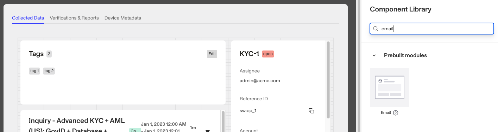
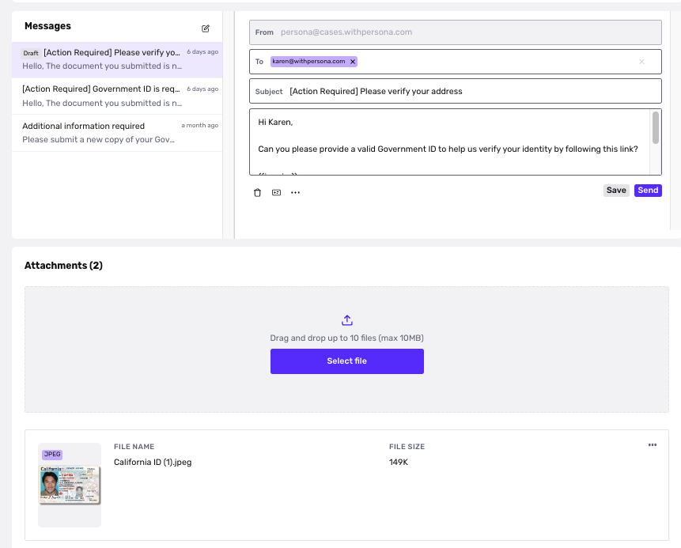
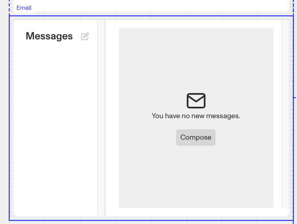
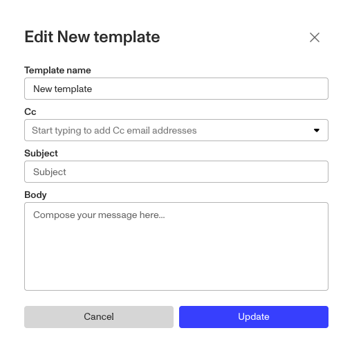

# Cases: Email prebuilt module

# What is the Case Email module?

The **Case Email module** is a prebuilt component that can be added to a Case Template. It sends and receives messages from within the Case UI. You can define logic that governs when it appears.

It allows you to more easily communicate with your customers. You can request missing or additional documentation from customers, automatically add that information into the Case list view, and view a history of previous email communications with customers. The **Email module** supports email drafts, email templates, and embedded Inquiry links.

# How do you add a Case Email module?

1.  Navigate to the Dashboard, and click on **Cases** > **Templates**.
2.  Find and click on the Case template you want to edit, or **Create** a new template.
3.  Navigate to the **Tab** you want to add a Case component to. Click an empty space to view the Component Library.
4.  In the right toolbar, search for ‘**Email**.’
5.  Drag and drop the **Email module** into your Case UI and reposition it by dragging it around.

6.  Click on the **Email module** on the right toolbar you can customize the module.
    1.  Under **Settings**, add the **Default sender address** to specify which email address recipients will see messages from. A screenshot is provided below in the section **Default sender address**.
    2.  Under **Email Templates**, you will need to create at least one Email Template. You can read more about adding an **Email template** below.
    3.  Under **Module Layout**, you can change:
        1.  Dynamic height: Module will grow or shrink to fit its contents.
        2.  Visibility: Dynamically control whether the module is hidden. This is a toggle button that lets you set conditions for when the button should be displayed or hidden from view based on your case requirements. You can read more about **Visibility configuration** below.
    4.  Under **Advanced Options > Module Enablement**, you can define custom control conditions that determine when the **Email module** is enabled or disabled. Advanced options are typically configured for specific customers by a Persona team member.
7.  Click the **“Delete”** button if you want to remove the component from the Case UI.

## Default sender address

## Email templates

1.  Click "**\+ Add**" to add a new template.

2.  A pop-up will appear where you can create your email template. Define the template name, CC recipients, subject line, and body message. You can add more email templates.
3.  Click the “**…**” button next to an email template to edit or delete it.

## Visibility configuration

If you toggle this on you will have two options to customize visibility.

1.  **Basic** visibility allows you to set rules on the **Email module** to determine when it will be visible. You can read more about **Basics visibility configuration** below.
2.  **Advanced** visibility allows you to set logic to control when the **Email module** is enabled or disabled based on custom conditions. Advanced options are typically configured for specific customers by a Persona team member.

## Basic visibility configuration

Visibility configuration consist of three main components:

1.  **Field**: The object that will have a condition linked to it.
2.  **Condition**: How the field is compared to the value (e.g., equals, does not equal).
3.  **Value**: The value to test against.

### Creating visibility configuration

-   **AND Statements**: Combine multiple conditions that must all be true for the rule to pass. Add these using the **"Add"** button.
-   **OR Groups**: Combine conditions where only one needs to be true for the rule to pass. Create these by clicking **"Add OR Group"**.

## How to use visibility configuration

1.  Click on the **Email module**, and go to **Module Layout** and toggle the button next to **Visibility** in the right toolbar.
    1.  Click on “**Empty rule**” to see **Visibility configuration**.
    2.  Create a logical rule by filling in the three boxes following **Show if**, which correspond to an object, its condition, and its value being assessed, respectively. When that logical rule passes, the **Email module** is shown.
    3.  (Optional) Add additional logical rules by clicking either ”**Add”** (if you want to add 'AND' rules, where all must be passed to continue) or ”**Or group”** (if you can also nest a group of OR statements within an AND statement).

# Plans Explained

## Case Email module component by plan

|  | Startup Program | Essential Plan | Growth Plan | Enterprise Plan |
| --- | --- | --- | --- | --- |
| Case Email module component | Limited | Limited | Available | Available |
| Advanced options - Module enablement | Limited | Limited | Limited | Available |
| Visibility - Advanced configurations | Limited | Limited | Limited | Available |

[Learn more about pricing and plans](./6oZbzp7jb7AWGClF5vpY3K.md).
