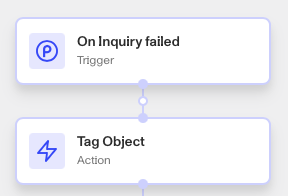

# Workflows: Tag Object step

# What is the Tag Object step?

**Tag Object** is a Workflow Action step that adds a Tag or Tags to a specific Persona object, such as an Account or Inquiry. You can use this step to add existing tags or create new ones.

Tags are used to organize and classify objects (such as Accounts and Inquiries) based on specific characteristics or conditions. Tags reflect attributes that are unlikely to change during the verification process, such as “Under 21 years old”, “Non-eligible geo”, or “Watchlist match”.

Tags can also be used to mark an object for any observations that can aid in the improvement of your solution. If a set of tags exist on one object representing an individual verifying their identity, it may make sense to copy those tags to other objects related to that individual.

Tags help in filtering and managing accounts by providing additional context or status that can be useful for decision-making or further processing.

💡 Tags should be used to mark certain conditions or states that are relevant to your organization’s needs.

# How do you add a Tag Object step?

1.  Navigate to the Dashboard, and click on **Workflows** > **All Workflows**.
2.  Find and click on the workflow you want to edit, or **Create** a new workflow.
3.  Click on **+** when hovering over a circle to add an **Action**.

4.  Use the **Find Action** select box to click on **Other** > **Tag Object**.
5.  Click the **Object** box to add the object you want to tag.
6.  Click on the **Tag** box to include any tags you want added to the object. You can either choose existing tags, or begin typing to create a new tag. A good tag label is brief and clear, to convey information quickly.
7.  (Optional) In ‘Advanced Configuration’, click the **Continue on error** box if you want the workflow to continue running even if this step raises an error.
8.  **Close** the step. You’ll have to **Save** and **Publish** the workflow to begin using it.

# Plans Explained

## Tag Object step by plan

|  | Startup Program | Essential Plan | Growth Plan | Enterprise Plan |
| --- | --- | --- | --- | --- |
| Tag Object step | Limited to pre-configured solutions | Available | Available | Available |

[Learn more about pricing and plans.](./6oZbzp7jb7AWGClF5vpY3K.md)
