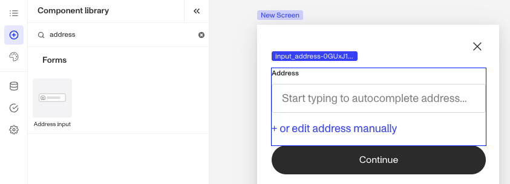
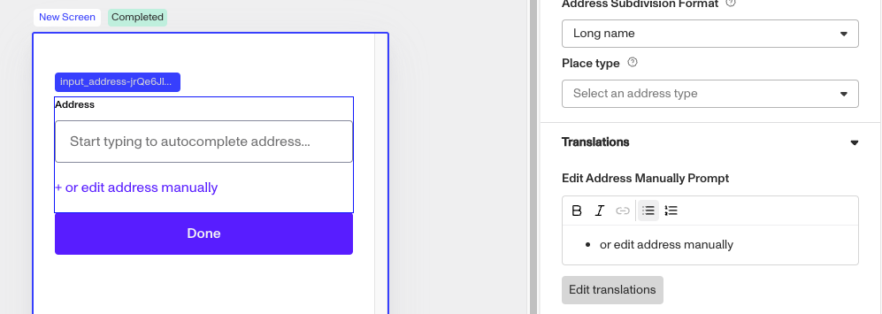

# Inquiries: Address Input component

# What is the Inquiry Address Input component?

**Address Input** is an Inquiry screen component that allows a user to enter and validate an address within a predefined format.

An **Address Input** component is ideal for scenarios where structured address collection is needed, such as shipping details or residency verification.

# How do you add an Inquiry Address Input component?

1.  Navigate to the Dashboard, and click on **Inquiries > Templates**.
2.  Find and click on the Inquiry template you want to edit, or **Create** a new template.
3.  Hover over a screen and click the **Pencil** icon, or double-click the screen to open it in the Screen Editing View.

4.  In the Left Panel, click **Component Library** and search for ‘**Address Input**’.
5.  Drag and drop the Address Input component into your screen, and reposition it by dragging it around.
6.  Click on the Address Input component, and go to **Properties** in the Right Panel.
    -   (Optional) Under **Settings**, you can Configure **Autocomplete and Formatting Settings**:
        1.  **Autocomplete Method**: Choose whether autocomplete is enabled for this component. Selecting ‘None’ disables autocomplete, while selecting ‘Google Maps’ enables it. ‘Google Maps’ will be selected as the default.
        2.  **Address Subdivision Format**: Determines whether autocomplete provides a full or abbreviated value for subdivisions/states (e.g., two-letter state codes). Choosing ‘Long name’ returns the full value, while ‘Short name’ provides the abbreviated version. ‘Long name’ will be selected as the default. **This setting is only available for web-based integrations.**
        3.  **Place Type**: Defines the type of places returned in autocomplete results. Options include **Geocode**, **Address**, and **Establishment**, based on the Google Place Autocomplete API.
7.  (Optional) Add a customized **label**, **placeholder**, and **translations.** You can learn how to use the **Edit Address manually** prompt below.
8.  In the **[Fields](./5rT2Llik2kUvJTXKapZb8c.md)** tab, you can set up and customize the behavior of the Address Input component.
    1.  **Required**: Choose whether the field is mandatory (**Yes**), optional (**No**), or based on conditions (**Conditional**). If you choose **Conditional**, you will need to set a Logic rule, you can read more about **Logic** below.
9.  (Optional) In the **Logic** tab, you can add rules that govern when the component appears and when it does not. You can read more about **Logic** below.
10.  **Close** the step. You’ll have to **Save** and **Publish** the template to begin using it.

# Translations

Persona can automatically translate new text into other languages in the component’s **Properties** tab. You can also customize the translation for any particular language.

To configure available languages for your template, click the **Gear** icon in the Left Panel to access **Settings**, then select languages under the **General** tab.

# Edit Address manually

You can edit the text in the **Edit Address Manually Prompt** box. The text element displayed below the Address Input component provides an option for a user to enter an address manually.

1.  Edit the text in the **Label** box. The **Label** is a text element displayed above the Address Input component to describe its purpose, such as “Enter your address” helping users understand what information to provide.
2.  Edit the text in the **Placeholder** boxes. The **Placeholder** boxes display temporary text inside the Address Input components, such as “Street, City, State, ZIP” offering an example or guidance on the expected format until the user enters their own input.
3.  Add translations for the text by clicking **Edit translations.** You can **Translate All** or **Translate** individual languages, manually or automatically. If you don’t set translations, you’ll be prompted to do so upon **Publishing** the template.

# Logic

Persona provides you with the ability to add logic to an Address Input component. For example, a component may only become visible to a user if certain conditions are met. On the **Logic** tab, there are two options for logic rules:

-   **On screen load**: Logic rules are evaluated only when the screen loads. They can reference any field configured on the template.
-   **On screen update**: Logic rules are evaluated in real time. They can only reference inputs on the current screen.

For form components a field can be labeled as required under specific conditions.

-   **Require field**: Logic rules are evaluated in real time referencing inputs on the current screen. They can only reference inputs on the current screen.

## Logic Rules

Logic rules consist of three main components:

1.  **Field**: The object that will have a condition linked to it.
2.  **Condition**: How the field is compared to the value (e.g., equals, does not equal).
3.  **Value**: The value to test against.

### Creating Logic Rules

-   **AND Statements**: Combine multiple conditions that must all be true for the rule to pass. Add these using the **"Add"** button.
-   **OR Groups**: Combine conditions where only one needs to be true for the rule to pass. Create these by clicking **"Add OR Group"**.

## How to use Logic Rules

1.  Click on the Address Input component, and go to **Logic** in the Right Panel.
    1.  Choose either “**On screen load**” or “**On screen update**” and click **Add.**
    2.  Choose what **Component Update to apply**. This determines what happens to the component when the logical rules are met.
    3.  Create a logical rule by filling in the three boxes following **When**, which correspond to an object, its condition, and its value being assessed, respectively. When that logical rule passes, the component update is applied.
    4.  (Optional) Add additional logical rules by clicking either **\+ Add** (if you want to add 'AND' rules, where all must be passed to continue) or **\+ Or** (if you want to add 'OR' rules, where one must be passed to continue). You can also nest a group of OR statements within an AND statement by clicking **\+ Add Group**.
    5.  (Optional) To edit the logic directly, you can open the **code editor**.

# Plans Explained

## Address Input component by plan

|  | Startup Program | Essential Plan | Growth Plan | Enterprise Plan |
| --- | --- | --- | --- | --- |
| Address Input component | Available | Available | Available | Available |
| Translations for Address Input component | Available | Available | Available | Available |
| Logic for Address Input component | Not Available | Not Available | Available as part of Inquiries Enhanced | Available as part of Inquiries Enhanced |

[Learn more about pricing and plans](./6oZbzp7jb7AWGClF5vpY3K.md).

# Learn more

[Learn more about Inquiries.](../../docs/docs/inquiries.md)
