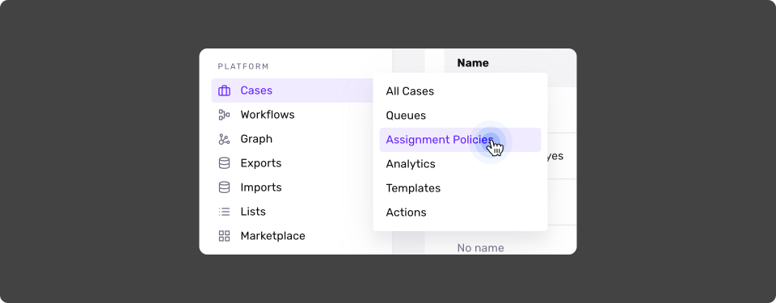
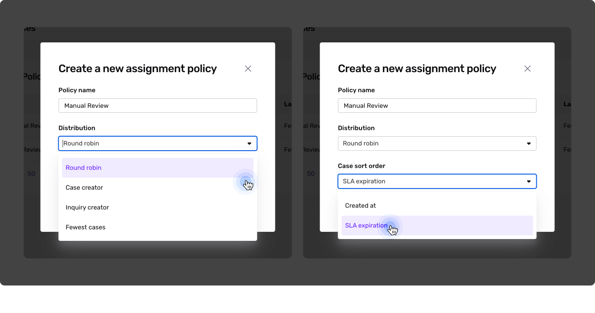
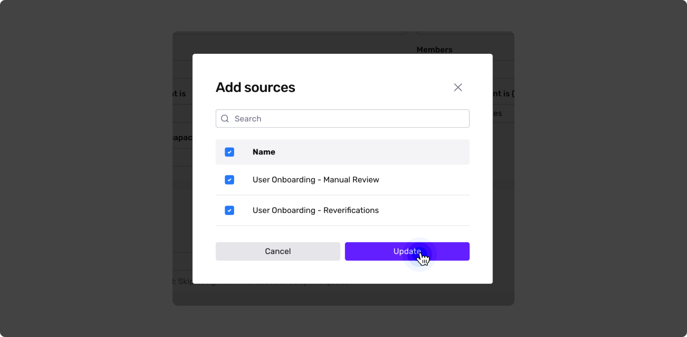
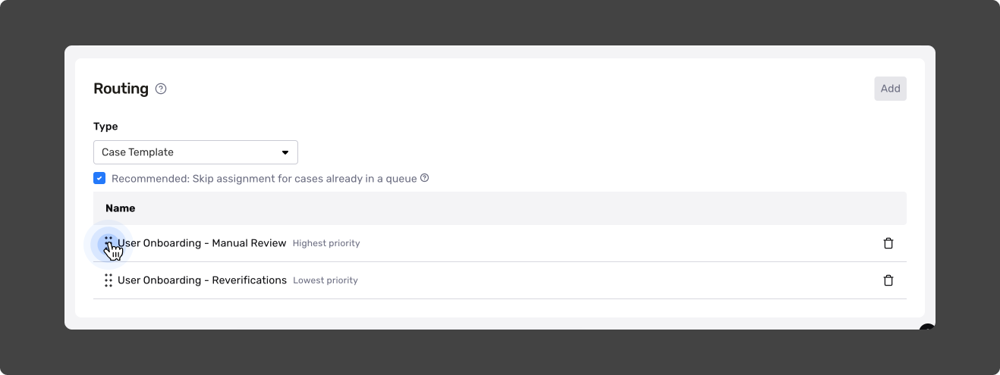
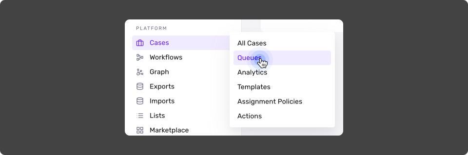
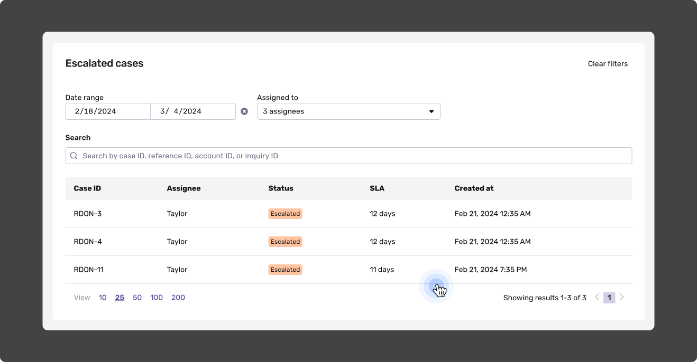
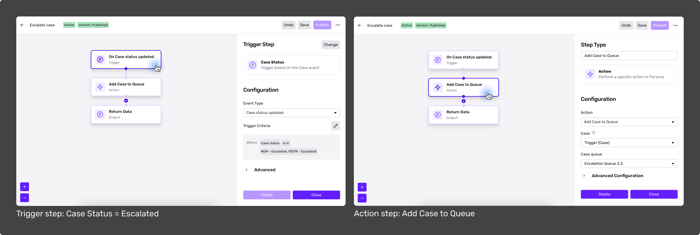

# Global Assignment Policies and Queues

⚠️ **Who can access these features?**

-   Organizations with [Cases Enhanced](./2EgyDJx3nt6M49pL9vedAm.md) or Cases Enterprise plans have **full access** to this set of features.
-   Organizations with Cases Basic or Cases Free have limited access to Global Assignment Policies.

[Learn more about plans and pricing](../../landing/pricing.md)

This article covers Global Assignment Policies and Queues. Both Cases features have been designed for organizations with complex case assignment needs, large review teams, or high volumes of cases.

Your organization can use these features to funnel cases to the correct teams and ensure that they resolve the highest priority cases first.

### What you’ll learn in this article

Global Assignment Policies and Queues will enable you to:

1.  Distribute and assign cases at the global level (across all templates, rather than at the template level).
2.  Prioritize cases by SLA or template type, meaning that cases from a higher priority template will be assigned first.
3.  Dynamically route cases to an assignment policy (based on case tags, case status, or another conditional) by storing groups of cases in queues.
4.  Preserve the automated case assignment policy regardless of case status.
5.  Prevent disruptions to case assignment when an agent goes offline.

# Global Assignment Policies

Previously, organizations could only set assignment policies for individual Case Templates. But with Global Assignment Policies, Persona is introducing the ability to set assignment policies across all templates (at the “global level”).

We built this capability for organizations that want to support complex Case Assignments, such as those who need to prioritize certain Case Templates or handle cross-team escalation policies.

You can configure Global Assignment Policy Manager to first assign all Cases from higher priority templates based on SLAs and template types.

### Create a Global Assignment Policy

In the Persona Dashboard, navigate to **Case > Assignment Policies**.

Here, you’ll find all policies active in your Dashboard. Click **\+ Create policy** in the upper right corner.

Set up **Distribution** and **Case sort order**, which are the basic functions of your Assignment Policy. You can change these and add additional configurations in the next screen.

**Distribution** is the method by which the policy divides Case assignments among agents. You can pick from four options:

| Distribution method | Impact |
| :-- | :-- |
| **Round robin** | Cases created from this template will be assigned in a round robin fashion to all possible agents. |
| **Case creator** | Cases created from this template will be assigned to the agent who created the Case. |
| **Inquiry creator** | Cases created from this template will be assigned to the agent who created the Inquiry via the Dashboard. |
| **Fewest Cases** | Cases created from this template will be assigned to the agent who has the fewest open Cases. |

**Case sort order** determines the field by which Cases are prioritized. There are two options:

| Case sort order method | Impact |
| :-- | :-- |
| **Created at** | This option will sort Cases based on when they were created. |
| **SLA expiration** | This option will sort Cases based on their [service level agreements](./5JQzBlB1uHQkyXLpysk1W1.md), which are essentially deadlines set for Case reviews. |

Once you have chosen your basic configurations, hit **Create**.

## Configure your Global Assignment Policy

You can make additional configurations from here or even revise what you configured in the last step. Here’s everything you can set:

### Agents

You can elect possible Case assignees from among the [Teams](./2Ucor7PGqindbKCAEVoTRV.md) and Users in your Organization. By default, Global Assignment Policies select **All agents** in your Organization.

### Assign/unassign when agent is…

**Assign when agent is…** is an optional configuration that uses your agents’ availability to determine when they get assigned cases. You can use this feature to make sure that important Cases aren’t automatically assigned to unavailable agents.

By default, the Global Assignment Policy selects _all user availabilities_, meaning that the policy will assign Cases to all possible assignees when they are available, unavailable, and busy. However, you can customize the policy’s sensitivity to availability by checking each availability status on and off.

**Unassign when agent is…** is an optional configuration. You can use it to set your Global Assignment Policy to unassign Cases from individual assignees based on their availability, so that they can be reassigned to others. For example, you might unassign Cases from your teammate when they’re unavailable, so that the Policy can reassign it to someone who is available.

Unlike **Assign when agent is…**, it selects _no_ user availabilities, or is not configured by default.

### Agent maximum Case capacity

This number determines how many cases you’ll allow assignees to have assigned at once. This setting applies to all possible assignees.

## Routing

The Global Assignment Policy Routing feature can operate via Case Templates or Queues.

**Routing with Case Templates**

You can set Routing to prioritize assignments according to Case Templates. For example, you can choose this option when you want to prioritize a template for existing users over a template for new users to ensure that existing customer issues are addressed first.

-   When Routing with Case Templates, Routing assigns Cases from highest- to lowest-priority Case Template.
-   Within each Case Template, the assignment order follows the Case Sort order (Created at/SLA expiration).

**Routing with Queues**

You can also set Routing to prioritize assignments according to Queues. You can choose this option when you want to funnel groups of cases to a specific team. For example, you can route Cases to the general review team, while routing high-risk Cases to the fraud specialist team.

-   When Routing with Queues, Routing assigns Cases from highest- to lowest-priority Queues.
-   Within each Queue, the assignment order follows the Case Sort order (Created at/SLA expiration).

### Add a Source to Routing

Every Global Assignment Policy needs to draw Cases from a specific Source.

You can add a Source by clicking the **Add** button in the upper right corner of the Routing section.

If you add more than one Routing source, you can use drag and hold the **⋮⋮ symbol** to rearrange them. Routing will rank the Routing sources from top to bottom as highest to lowest priority.

You can delete a Routing source by clicking the 🗑️ (trash) icon on the far right of each source. This is not a permanent action—you can add it back by clicking the Add button and selecting the deleted Routing source.

# Queues

Queues automatically groups Cases based on filters for Case status, Tags, Verification check status, and/or Report matches, as determined through Global Assignment Policies.

Queues give organizations more granular Case routing. For example, Cases tagged with “Fraud” or “High risk” can be routed to an escalation Queue. They also help administrators see how cases are routed to assignees.

⚠️ **Using Queues is optional.** This feature is designed to support nuanced case assignment needs and is a good fit for organizations with multiple teams who need to review the same case or an escalation flow.

### Create a Queue

In the Persona Dashboard, navigate to **Cases > Queues**.

Click the Create Queue button in the upper right corner of the Dashboard. Provide a name for your Queue.

In this screen, you can add two filters per Queue: **Date range** and **Assignees**. To clear any selected filters, click the **Clear filters** button in the upper right corner.

⚠️ **By default, the Queue will select All assignees**.

You can also search for cases within the Queue using the search bar via Case ID, Reference ID, Account ID, or Inquiry ID.

### Add Cases to a Queue

At this time, you can add Cases to a Queue by:

1.  [Creating a Workflow](./20Zvcq50493eMUdt7aDhRY.md) that adds a Case to a Queue based on a Trigger.
2.  Using **Case Actions** to manually add it to a Queue (for example, by changing the Status on a Case to Escalated so that a Queue will automatically pick it up).

See this simple example of a Workflow that adds all Cases tagged as `Escalated` to a Queue called "Escalation Queue 2.3."

### Archive a Queue

You can deactivate a Queue by archiving it permanently. Click the ••• button on the Queue you want to deactivate, then click **Archive**. Confirm or cancel in the next screen. You cannot undo this action.
