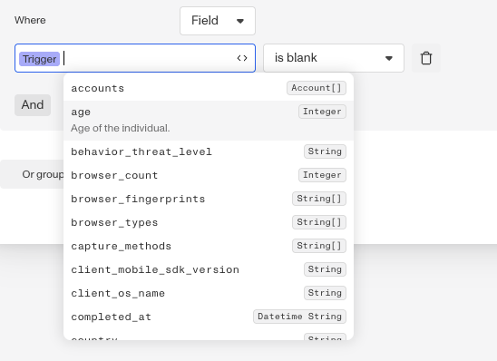
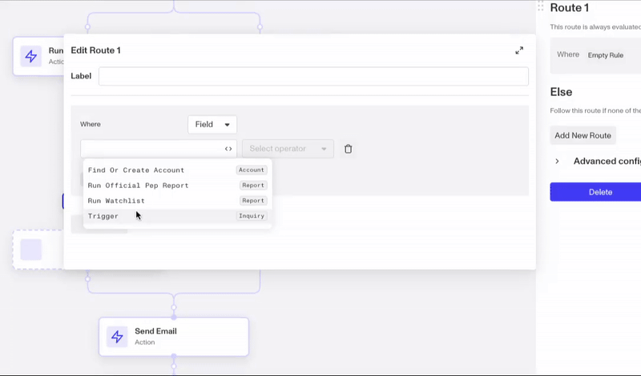
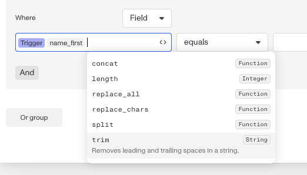
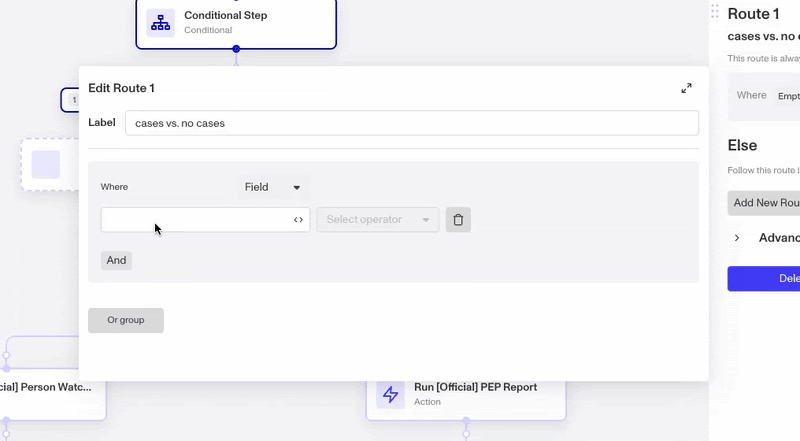
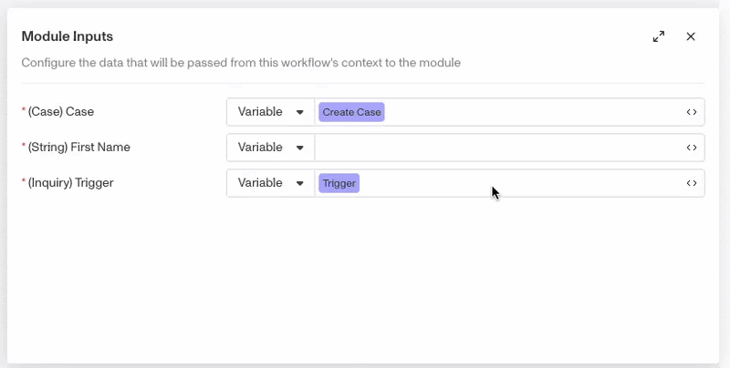
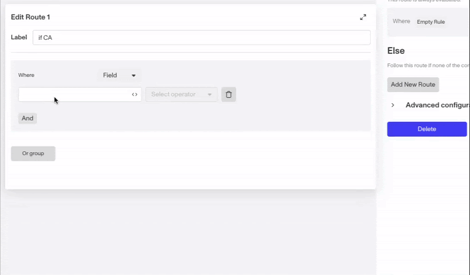

# Accessing Persona data in Workflows

# Overview

Workflows enable builders to automate business logic that adapts to each user or verification in real time. For example, you might want to have different business behavior based on fields, such as running different checks depending on a user’s age, segment, or country. Persona supports this by allowing you to access relevant data and displaying descriptions and data types. This makes it easier to find and reference the right information within your workflow.

# Accessing attributes

An attribute (or field) represents a single data point within an object, such as `inquiry.age` or `inquiry.country`. You can access attributes of different Persona objects by first selecting the object, then selecting the attribute. Note that the object that triggered the workflow is referenced by Trigger (i.e. for an Inquiry Completed workflow, the attributes of the inquiry are available under Trigger). System fields are available directly after selecting the object, whereas custom fields are available under Object > Fields.

While it’s most common to use attributes of Persona objects, it’s also possible in some steps to reference a hash in it’s entirety (i.e., in Update Object step).

# Using functions

In addition to accessing Persona data, you can also run basic functions. Available functions appear in drop-downs, based on what data type you’ve just entered. For instance, if you’ve entered `inquiry.name_first`, the functions that are available for strings will appear, since `inquiry.name_first` is a string.

The full list of functions can be found below, with examples of how these functions can help drive more powerful and efficient workflows in the section following.

| **Name** | **Input** | **Output** | **Description** |
| --- | --- | --- | --- |
| `string.length` | String | Integer | Returns the character count of a string |
| `string.trim` | String | String | Removes leading and trailing spaces in a string |
| `string.split` | String | Array of String | Divides string by a specified delimiter and puts each fragment into a separate item in an array |
| `string.replace_all(string to replace, string to replace with)` | String | String | Replaces all instances of a specified string with a different string |
| `string.replace_chars(characters to replace, string to replace with)` | String | String | Replaces all instances of each character in a set with a different string |
| `array.first` | Array | Item | Returns the first item of an array |
| `array.last` | Array | Item | Returns the last item of an array |
| `array.count` | Array | Integer | Counts the number of items in an array |
| `array.includes(item)` | Array | Boolean | Returns whether a specified item is inside the array (note this is case sensitive) |

# Examples

Find below examples where using functions on top of Persona data can help reduce step count and natively support the logic you need.

-   A builder wants to condition separate paths for first time customers versus customers that have previously contacted support/ been reviewed. In this case, the `.count` function (`account.cases.count`) can be used in the conditional step to create a route for >=1 cases. 
    
-   A builder wants to sanitize customer entered inputs (i.e., first name) before using them in a Send Email step in a module. Here, the builder can use `trigger.fields.first_name.trim` when defining their module input, which means any workflow that calls this module will have the first name value trimmed for more professional and polished emails. 
    
-   A builder wants to standardize customer addresses to condition by state correctly. They can use `trigger.fields.address_subdivision.replace_all( ‘California’, ‘CA’)` in their conditional step to catch variations in data entry/ quality and ensure logic is applied consistently. 
