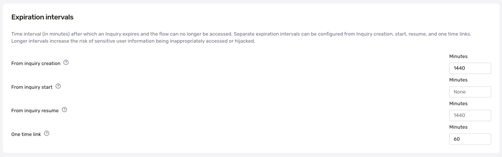

# When does a link to an Inquiry expire?

❓ This question came from a member of the Persona community - a project manager who was trying to remove Inquiries that had been resolved. This question is useful for those who want to understand or change the default Inquiry expiration time.

By default, an Inquiry link will expire 24 hours after the link is created. This 24 hour period can be changed if a different expiration period is preferred.

# Changing the expiration period

To change the default expiration period:

1.  Open the Dashboard.
2.  In the Dashboard, click on **Inquiries** > **Templates.**
3.  Click on the template you want to edit the expiration period for.
4.  In the top right corner, click **Configure.**
5.  Scroll down to **Expiration Intervals**.
6.  Edit the time (in **Minutes**) associated with **From inquiry creation** to your desired expiration period. For security reasons, we typically recommend setting the expiration to be no longer than 15 days (21600 minutes).

7.  In the top right corner, click **Save** to save this template. You will need to **Publish** your updated template in order to have the interval be updated next time you use it.

# Preventing an Inquiry link from expiring

It is not possible to entirely prevent an Inquiry link from expiring.

💡 The link’s expiration allows the link to represent a moment in time, and to capture data that would otherwise be lost through expiration.

# Where to direct a user after their Inquiry expires?

Instead of preventing expiration, you can make a new Inquiry when a user is ready to verify again or resume: [How do I create a new inquiry?](../../docs/creating-inquiries.md)

You can also let a user continue an expired Inquiry where they left off, instead of starting a new one. Resumed inquiries will expire again after their original period (by default this is 24 hours). [How do I resume an expired inquiry?](./7xYuQOCfXXjW4cgS3c7EOg.md)

# Learn more

-   You can also generate one-time Inquiry links [via API](../../docs/docs/inquiry-one-time-links.md).
-   Learn more about [inquiry expiration intervals](../../docs/inquiry-expiration.md).
