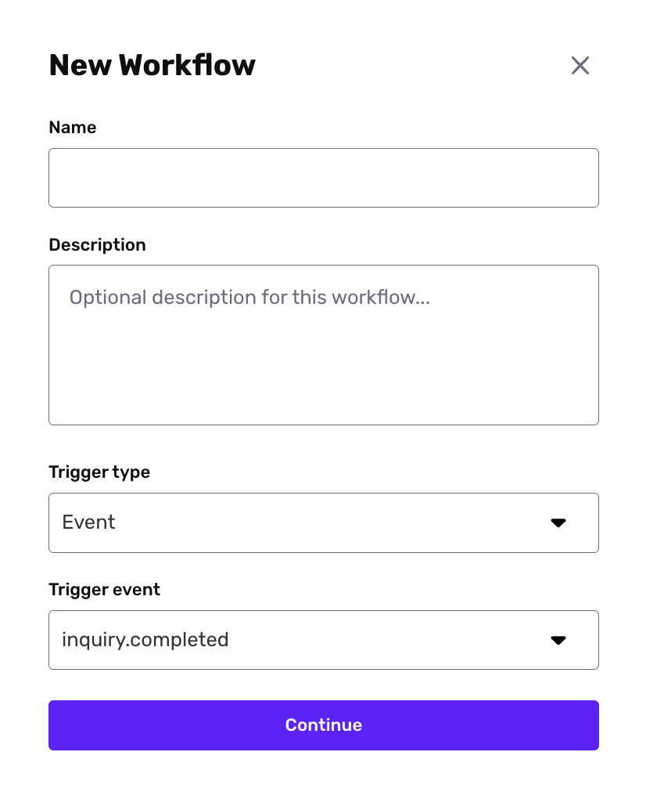
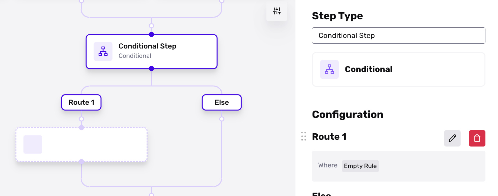
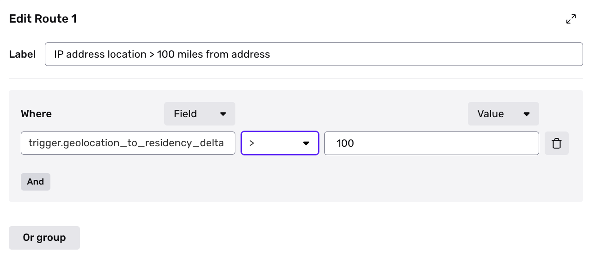

# Automatically compare IP address location with user-inputted location

The ability to configure the Country Select screen is available on paid plans. If you're on the free plan and want to upgrade, please contact us [here](https://app.withpersona.com/dashboard/contact-us).

# Overview

When using an Inquiry template to collect user information, additional metadata is collected about the device and session. This metadata (when paired or compared with inputted data, enriched data, and/or behavioral data) is often helpful a an additional fraud or risk signal.

For example, in the simplest scenario, if the user inputted a location such as a specific country (or a country was extracted from a Government ID), it may indicate some level of risk if the IP address that they shared that information on is not in the same country.

In this "How to" we'll walk you through the steps you can use to compare IP address location from an Inquiry to inputted location values.

# Steps

To compare inferred location based on an Inquiry's IP address to other fields (usually inputted location information, enriched location information, and/or location extracted from a verification), follow these steps:

1.  In the Persona Dashboard, navigate to **Workflows** using the left side navigation.
    
2.  Click on **Create Workflow** in the top right corner of your Dashboard
    
3.  Name and describe your workflow so that team members (and you) can remember what this Workflow is used for. Ensure that Trigger type is Event and Trigger event is set to `inquiry.completed`. This means that anytime a user completes an Inquiry, the workflow will start.
    

4.  Once you're in the Workflow Editor, click on a node and add a new Workflow Conditional step. Note that you can add multiple routes depending on how you'd like to proceed with the various business logic you're will be adding.

5.  We'll use Route 1 as an example of the types of conditional business logic you can adjust. Click on the the pencil icon next to Route 1 in the right panel that popped open.
    
6.  You'll be presented with a modal that allows you to set your location-based (other other) business logic. For the label, name it something like "IP address location > 100 miles from address." For the where clause, type in `trigger.geolocation_to_residency_delta`. Note that additional Inquiry fields and metadata can be used in similar types of use cases to this example in this article that you're reading.
    

7.  Use the operator field and the third field in the where clause to set the desired business logic. The `trigger.geolocation_to_residency_delta` attribute uses meters.

The example below implies that when an Inquiry is completed, this conditional logic will run such that any Inquiry where the Inquiry's device location (based on IP address) is over 100 meters away from the Inquiry's address fields (these are commonly extracted from a government ID or inputted by the user, make sure to check on this in your Inquiry template(s)), then they will proceed through Route 1. And anyone else will move down the Else route.

# Helpful considerations

Some other helpful attributes of the Inquiry that might be useful in configurations include:

-   **`tor_detected`** - Useful if your user base tends to use tor browsers which can obfuscate inferred device location
-   **`proxy_detected`** - Useful if your user base tends to use VPNs or other proxies which can obfuscate inferred device location
-   **`filled_properties`** - Useful to add as a secondary AND to where clauses to ensure that fields you are comparing against (such as Address-Street-1, Address-city, etc) do not have blank values on the Inquiry
-   **`country_comparison`** - Similar to the `geo_location_to_residency_delta` attribute used in the above example but provides more flexibilty because it is based on country instead of a specified location. Especially useful if you are only collecting Country (and not other address-related fields) in the Inquiry.
-   **`country_from_session`** - Similar to `country_comparison`, but instead of a distance you can specify a specific country and condition on that. For example, if your product or service only allows users from a specific country a Where clause may look like `trigger.country_from_session = US` meaning that only users where their device is in the United States can proceed through that route.
-   **`last_two_verifications_geolocation_delta`** - Similar to `geo_location_to_residency_delta` but instead the attribute allows you to set business logic pertaining to distances within one Inquiry where there are at least two Verification Templates within the experience.
