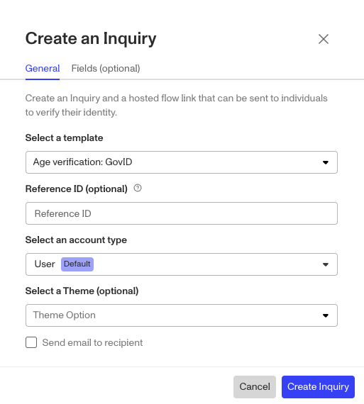
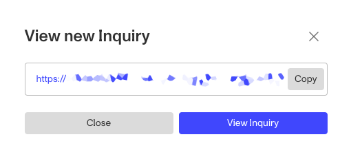

# Hosted flow (verify by link)

## Overview

Hosted Flow (aka verify by link) lets you implement Persona with little to no engineering effort. With Hosted Flow, you send users a URL—for example via email or text—and that URL takes them to your identity verification flow.

As with other integration methods, you can customize this flow to reflect your own brand. See [Configuring your Inquiry Template](https://www.notion.so/articles/ETA0GIS8K60DSoiFRpA9z/) to learn more.

There are two types of Hosted Flow links you can use:

1.  The default generic Hosted Flow link, which can be posted or shared for any of your end users to open and access the specified inquiry.
    -   You can share the Hosted Flow link directly with end users. Each end user then clicks the Hosted Flow link to generate an Inquiry link for themselves.
        -   Note: End users may click the Hosted Flow link many times and generate many links by accident. For example, if a user exits the flow partway through and clicks the Hosted Flow link again later, they will create a new Inquiry link instead of resuming their previous one. This can be confusing for the user.
        -   In general, we recommend you avoid sharing your Hosted Flow link directly with end users. If you choose to share the Hosted Flow link—for example, in an email campaign or mass email—be aware that each end user may generate many links and complete the flow multiple times. Strongly consider prefilling a reference ID. (More on this below.)
2.  Unique Hosted Flow links which are generated on an as needed basis by you, either manually or via automations.
    -   You—or any member of your team—can quickly generate a new Inquiry link by clicking the Hosted Flow link for the Inquiry Template you want to use. Then, you can send the new Inquiry link to an end user.

## Three ways to implement Hosted Flow:

1.  Copy the generic Hosted Flow Inquiry link from the Dashboard
2.  Generate unique Hosted Flow Inquiry links via the Dashboard
3.  Generate unique Hosted Flow Inquiry links via the API

## Copy the generic Hosted Flow Inquiry link from the Dashboard

### Hosted Flow link

For each Inquiry Template in your Persona organization, a Hosted Flow link is automatically created. You can find these Hosted Flow links in your Dashboard, [here](https://app.withpersona.com/dashboard/getting-started/hosted-flow).

You’ll need to select which Inquiry Template you’re creating a link for, as it is used in the link itself.

Whenever you or an end user is directed to the Hosted Flow link, it creates a new Inquiry from that Inquiry Template. Each time the page is refreshed, it starts a new inquiry run.

You can post or send the generic Hosted Flow link to whomever you choose.

## Generate unique Hosted Flow Inquiry links via the Dashboard

1.  Create a new unique Hosted Flow Inquiry link in your dashboard by navigating to **Inquiries** > **All Inquiries** > Click `Create Inquiry`. The below modal will appear:
2.  Select the Inquiry Template you want to use.
3.  We strongly recommend including a Reference ID to tie your specific end user to the Persona Account that will be connected to the Inquiry. Read more on Reference ID’s [here](./617EAw0wpwv3J3MGpHUxEb.md).
4.  Select the Account Type you want used for the Account that will be connected to the Inquiry.
5.  Optionally select one of your [themes](./6SIHupp847yaEuVMucKAff.md) for the Inquiry.
6.  The Fields tab is where you can Prefill the fields of the Inquiry, which you can read more about [here](./79Y8gi2c0QnOzDax63LfDF.md).
7.  Click the `Create Inquiry` button when ready to generate the link.
8.  You’ll get a `View new Inquiry` modal where you can copy the new link. Clicking `View Inquiry` will take you to the that’s Inquiry’s overview screen.

## Generate unique Hosted Flow Inquiry links via the API

Creating a link via API is a way to get the best of both worlds. You can ensure each user gets one unique Inquiry link, without having to create each link manually.

This approach requires some engineering support, but is the best option if you have a high volume of inquiries to create.

See our [developer documentation](../../docs/reference.md#apiv1inquiriesinquiry-id-2) to learn how to set this up.

As with the Hosted Flow link, we recommend that you pass in a reference ID as an attribute when you create the Inquiry link. A reference ID is the unique ID you use to identify a user in your own system. By passing in a reference ID, you can easily find the associated inquiry for a given user by searching for reference ID.

### Additional options:

-   See our [technical documentation](../../docs/docs/quickstart-hosted-flow.md) for more information on reference IDs and other parameters.
-   You can automate passing in parameters by setting up an email template or macro that generates the link with a unique reference ID.
-   To personalize your link, you can specify a subdomain name (for example: [mycompany.withpersona.com](http://mycompany.withpersona.com/)) in the [integration page](https://app.withpersona.com/dashboard/integration/overview) of your dashboard under "Subdomain."
-   Once you've created your link, go ahead and try it out in sandbox. On the left hand side of your dashboard, you can toggle to sandbox and find your sandbox link in the [integration page](https://app.withpersona.com/dashboard/integration/overview). Afterwards, you can view the inquiry on your [inquiry page](../../landing/dashboard/inquiries.md).
-   If you want to be notified when a user completes their inquiry, you can set up a webhook or create a queue in your Persona dashboard to be notified of specific inquiry events.

## FAQs

### When do hosted flow links expire?

See: [When does a link to an Inquiry expire?](./4m6n5LkyT8po1eefaBmBBO.md)

### What can I do if a link (or the inquiry) has expired and I want to allow the user to continue in the same inquiry where they left off?

See: [Resume an expired Inquiry](./7xYuQOCfXXjW4cgS3c7EOg.md)
