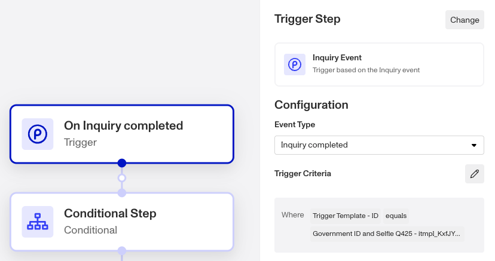
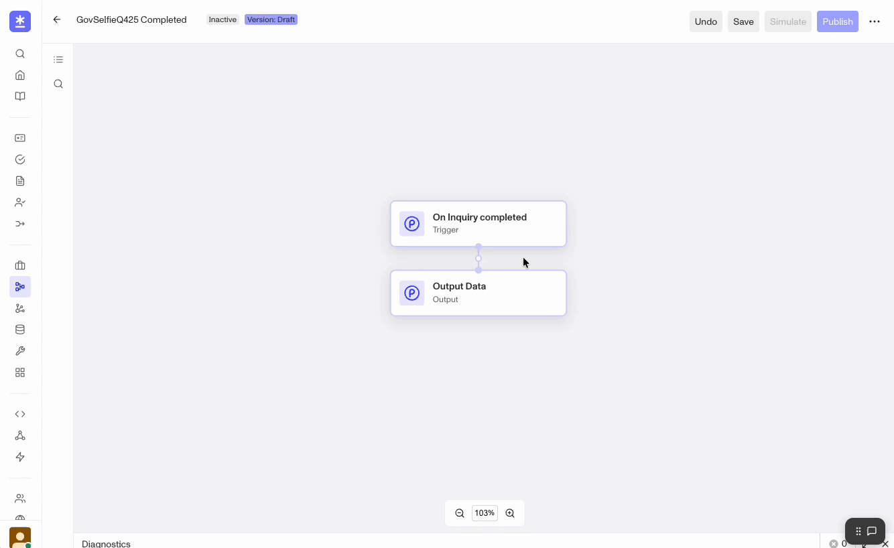
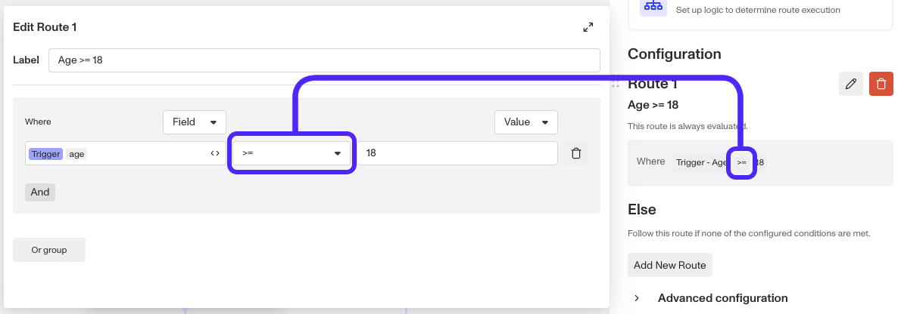
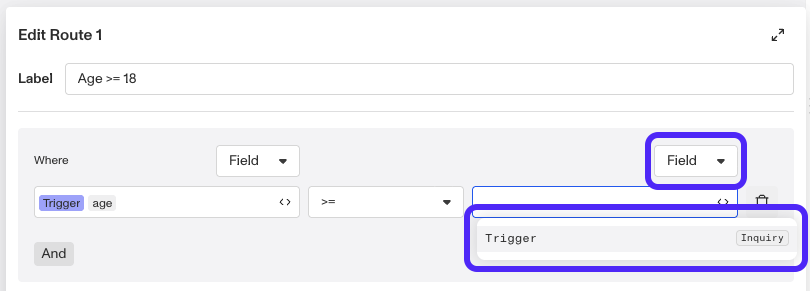
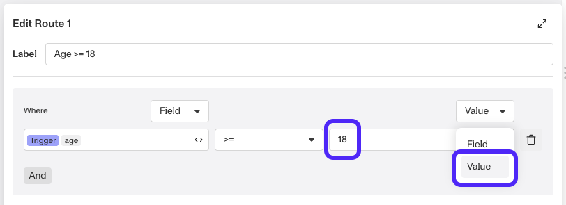
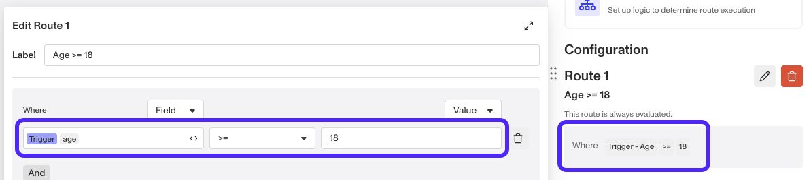

# Trigger Events and Step Types in Workflows

Now that you’ve learned how to [create a Workflow](./20Zvcq50493eMUdt7aDhRY.md), let’s take a closer look at all the configuration options available to you when building out your workflow.

Since Workflows have a broad range of potential applications, we are continuously expanding available options based on your feedback. We're adding new step types to our Workflows frequently, so this may not be an exhaustive list. If you would like to request new event or action types, conditions, or something else, please reach out to your Customer Success Manager or [contact the Persona support team](https://app.withpersona.com/dashboard/contact-us). We'd be happy to work with you!

## Trigger Event Types

In order for a Workflow to run, it must be triggered by an event. A single workflows can be configured to trigger off of multiple events. There are three event types.

### Event (basic)

Within this trigger type, you’ll specify whether the event is based on the status of an Account, Inquiry, Transaction, Report, Case, and another Workflow.

You also have the option to set criteria upon the source of the trigger event. For example, if you want to run your workflow only when an individual completes a specific Inquiry template, you can set the event type to `inquiry.completed` and set trigger criteria to `trigger.template.token` equal to a specific template ID token.

If no trigger criteria is set, the workflow will run on all inquiries with a status of `completed`.

### API _(enhanced feature)_

API events require a parameter schema. Without one, a workflow would not run as expected because it would not be able to access relevant information.

### Scheduled _(enhanced feature)_

Workflows triggered by a scheduled event are typically used for the purpose of automating reverification at a predefined point in time. The subsequent steps should describe the actions you want to happen at a future date.

Note: Workflows can also be triggered by other workflows and you can manaually trigger them. These are just not recognized as "events".

### Action Steps

An Action Step performs a specific action in Persona.

Choose an Action from the drop-down menu. You can select from a list of categories:

-   App Integration _(enhanced feature)_
-   Case
-   Communicate _(some enhanced features)_
-   Compute _(some enhanced features)_
-   Inquiry
-   List
-   Report _(plan-dependent)_
-   Other _(some enhanced features)_
    -   Redact Object - Redact sensitive data; similar to conditionals in that it can operate only on objects made available in previous steps of workflow.
    -   Schedule Workflow - Schedule another workflow to run within the workflow or at a specific time.
    -   Tag Object

Each category includes a set of actions. Once selected, configuration options will appear on the right-side menu.

### Wait Steps

Wait steps pause the workflow on a specified object or amount of time. Some waits are only available to Enhanced users.

Choose either `Object` or `Time` from the `Wait for` drop-down menu.

-   If `Object` is chosen, select a `Target Object` from the drop-down menu and `Wait for` events from the checklist.
    -   You can choose at least one or all the options given.
    -   You can optionally configure `Default resolution time` in seconds.  
        If the selected events never happen, setting this would time out on the target object.
-   If `Time` is chosen, input the specified delay period in seconds.

### Parallel Steps

A Parallel step executes multiple branches of your workflow simultaneously. Two common use cases are running multiple [Reports](../reports.md) and tagging objects at the same time.

### Conditional Steps

Say that you want to run logic on an inquiry based on certain criteria. You can do this by adding a Conditional step to your workflow, which consists of at least one Route branch and an `Else` branch. Once a Conditional step is added, you can add more routes, reorder existing routes, and delete routes.

Under the Conditional Step configuration, you can define the logic of a route by clicking on the edit icon next to the route number and configuring your conditional.

Enter the desired conditional criteria into the `Where` field. The entry auto-completes as you type depending on what objects have been made available to the workflow. Additionally, the operator fields populate depending on what field is chosen.

**There are four components to a conditional:**

-   **Operators** - Indicate what action or operation to perform.  
    
    
-   **Fields** - Represent all the information collected on an individual through the inquiry. 
    
-   **Values** - Hardcoded values against which a field can be compared. 
    
-   **Expressions** - Allows you to express conditional logic by building formulas within a route.  
    
    

## Conclusion

Now you have the tools to build your own custom Workflow! Remember: no two workflows are the same. They are highly configurable and there are multiple ways to accomplish the same thing, or account for different edge cases, with a workflow.

One thing to keep in mind is how readable it is to your team and future self. You'll likely come back to make revisions, so make sure to be as descriptive as possible wherever you can!

If you need help with building out your Workflows, please [contact our support team](https://app.withpersona.com/dashboard/contact-us).
