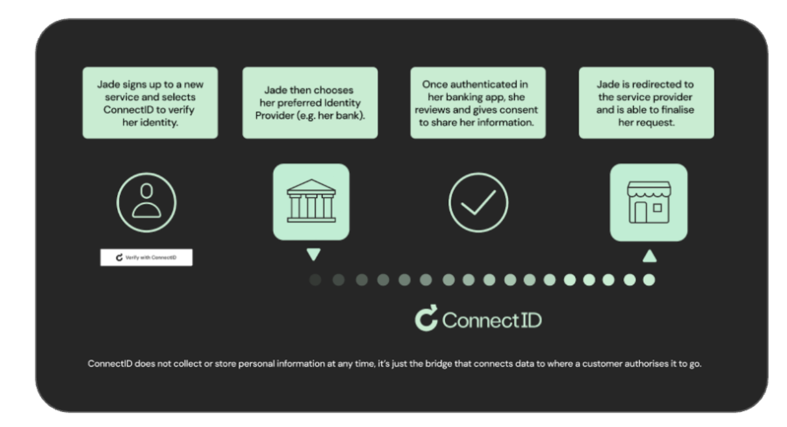

# ConnectID for end users

# Table of Contents

-   [Overview](#overview)
    -   [Who is ConnectID?](#who-is-connectid)
    -   [What do I need to use ConnectID?](#what-do-i-need-to-use-connectid)
    -   [How do I verify using ConnectID?](#how-do-i-verify-using-connectid)
-   [Frequently Asked Questions](#frequently-asked-questions)
    -   [Does Persona have access to my banking information?](#does-persona-have-access-to-my-banking-information)
    -   [What data is shared?](#what-data-is-shared)
-   [Terms and Conditions](#what-are-connectid-terms-and-conditions)

---

# Overview

Persona has partnered with **Australian Payments Plus** to integrate **ConnectID** into our platform.

ConnectID enables end users to securely share verified identity and age claims directly from their financial institutions. They do so by managing a network of Australian identity service providers and partners with major Australian banks.

> **Note:** It is important to note that **neither Persona nor ConnectID ever sees or stores personal information** received by participating ConnectID partners, preserving user privacy throughout the process. Only the necessary and consented claims such as name and address matches or age thresholds are passed back to Persona.

## Who is ConnectID?

ConnectID is an initiative of **Australian Payments Plus (AP+)**. Australian Payments Plus brings together EFTPOS, BPAY and New Payments Platform (NPP) Australia as one organisation to shape the future of payments.

## What do I need to use ConnectID?

-   An active account with a participating financial institution
-   The latest version of your banking app installed on your mobile device

## How do I verify using ConnectID?

1.  During a trusted transaction that requires age or identity assurance, Persona presents users with an option to opt into verifying with ConnectID
2.  The user is presented with required consent and information about ConnectID
3.  The user selects their bank from a list of verified identity providers.
4.  The user authenticates using their bank login and authorizing the verification of claims between their bank and Persona
5.  ConnectID shares the verified/approved claims to Persona to verify a transaction

---

# Frequently Asked Questions

### Does Persona have access to my banking information?

**No.** The sign in page is hosted by your banking provider and Persona will not access your bank details or account information. You’ll get to review the claims that will be shared with Persona before you give consent. If your bank has verified your identity, they will confirm your full name and date of birth.

### What data is shared?

Users are always shown exactly which claims are being requested before any transaction occurs. The specific claims requested depend entirely on the use case.

-   **For organisations verifying for Australia’s Social Media Minimum Age Act:** The only claim requested will be **Over16**, which verifies whether the bank account is owned by someone who is 16 years of age or older
-   **For KYC and fraud use cases:** The claims will let us know whether we can verify your details that include one or more of the following matches:
    -   Name
    -   Phone
    -   Email
    -   Address
    -   Birthdate

### Does Persona or ConnectID save any bank details?

**No.** Neither Persona nor ConnectID has access to any information via ConnectID beyond what is consented to for any given use case.

### Does ConnectID store my information?

**No.** ConnectID does not collect or store personal information at any time, it’s just the bridge that connects the bank and Persona when you authorise it.

---

# What are ConnectID terms and conditions?

**End user terms and conditions (Click to Expand)**

The terms below (_“User Terms”_) set out important information about your use of the _“Connect ID Network”_ which enables you to request various third party organizations with whom you have an existing relationship (_“Identity Providers”_) to provide identity and attribute information (together _“Identity Data”_) about you to Persona and its business customers (the _“Business”_).

By using the ConnectID option, you are agreeing to be bound by these User Terms. You will be sent to the third party Connect ID Network once you agree.

### Eligibility

You will only be able to use the Connect ID Network if:

-   You have a digital account enabled with the relevant Identity Provider and have verified your identity with such Identity Provider within the prior five (5) years.
-   You meet the minimum age requirements set out in the relevant Identity Provider’s terms of service for ConnectID Pty Ltd or its related bodies corporate (_“ConnectID”_).

### Customer Acknowledgements

You acknowledge and agree:

1.  Neither Persona nor ConnectID endorse or make any representations or recommendations in respect of any Identity Providers, including in respect of the suitability of their security or privacy practices; and
2.  Both Persona and ConnectID exclude all liability to you to the maximum extent permitted by law in connection with any acts or omissions of the Identity Provider.
3.  Persona does not participate in the Consumer Data Rights scheme, as defined under applicable privacy laws.

Although the ConnectID is not a party to these terms, it can rely on your acknowledgment of and agreement to these exclusions.

Your Identity Data, once transferred to us, will be processed in accordance with the privacy policy and terms and conditions agreed to with the Business. In the unlikely event of a data incident, you agree Persona may share personal information with the Identity Providers to address the incident and for fraud prevention purposes.

### Suspension of Service

Persona may withdraw or suspend your use of the Connect ID Network at any time. Persona may also, or the relevant Identity Provider may, be unable to make available the Connect ID Network for a number of reasons, including if:

-   The underlying transaction that you are conducting with us is not a transaction for which Persona is able to utilize the Connect ID Network;
-   You do not meet the eligibility requirements set out in section 1.2 or the relevant Identity Provider is not otherwise able to supply the requested identity data;
-   There are suspicions on reasonable grounds that any fraud (including identity fraud) or security incident has or may be occurring in connection with you, your use of the Connect ID Network or the relevant Identity Provider;
-   Our participation in the ConnectID Network has been suspended or terminated; or
-   There are grounds to believe that your use of the Connect ID Network requires intervention, for example because it relates to you as a vulnerable person.

### Complaints

If you have any complaints or disputes relating to our participation in the Connect ID Network relating to you, please contact us at [https://withpersona.com/contact](../../landing/contact.md). However, please note that if your complaint or dispute relates to activities of an Identity Provider that you asked to disclose Identity Data to us, Persona may direct you to contact that Identity Provider directly.

_®ConnectID is a registered trademark of ConnectID Pty Ltd ABN 80 648 970 101._
