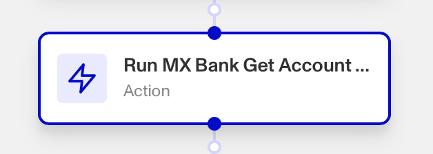

# Workflows: Run MX Bank Get Account Owners Report step

# What is the Run MX Bank Get Account Owners Report step?

**Run MX Bank Get Account Owners Report** is a Workflow action step from the MX integration that runs a report to allow customers to view the name on the bank account that MX returns, and compare it to the name of the Individual.

MX is a leading financial data platform, available as a [Marketplace integration](./6YaRAGHHcXb6MQ0c6CGvbJ.md).

If your organization processes and verifies bank accounts with Persona, Persona’s MX Bank integration can be useful for streamlining that process. It’s also useful for fraud prevention at payout for marketplaces, and INFORM ACT compliance for e-commerce marketplaces.

# How do you add a Run MX Bank Get Account Owners Report action step?

1.  Navigate to the Dashboard, and click on **Workflows** > **All Workflows**.
2.  Find and click on the workflow you want to edit, or **Create** a new workflow.
3.  Click on **+** when hovering over a circle to add an **Action**.

4.  Use the **Find Action** select box to click on **Marketplace** > **MX Bank** > **Run MX Bank Get Account Owners Report**.
5.  Select the **Report Template** the step should use. The template must already exist; if it doesn’t, create a new one in **Dashboard** > **Reports** > **Templates**.
6.  (Optional) Edit the **Report** **Fields** the step should assess.
7.  (Optional) In ‘Advanced Configuration’, select the **Object** the step should retrieve its Report Fields from.
8.  (Optional) In ‘Advanced Configuration’, click the **Continue on error** box if you want the workflow to continue running even if this step raises an error.
9.  **Close** the step. You’ll have to **Save** and **Publish** the workflow to begin using it.

# Plans Explained

## Run MX Bank Get Account Owners Report by plan

|  | Startup Program | Essential Plan | Growth Plan | Enterprise Plan |
| --- | --- | --- | --- | --- |
| Run MX Bank Get Account Owners Report action step | Not Available | Not Available | Available | Available |

[Learn more about pricing and plans](./6oZbzp7jb7AWGClF5vpY3K.md).
