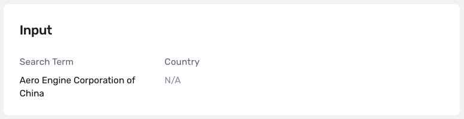
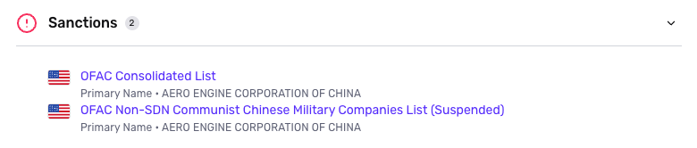
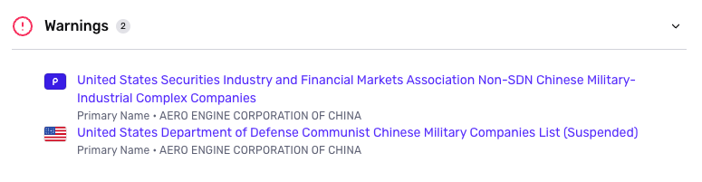

# Business Watchlist Report

## Overview

The Business Watchlist Report screens entities against 100+ **global** Sanctions and Warning lists, adding to and enriching information from an Inquiry that collects and verifies a business or entity.

## Use case

The Business Watchlist Report allows you to take proper action to satisfy AML compliance and regulatory requirements, particularly for Know Your Business (KYB) processes. It is integrated into Persona's [KYB](./3OGe9IwySJmDvXL2DOfV7N/index.html.md) and [Business Verifications](./3JDOsmCePnMLBuOSXtkRoX.md) solutions; the report runs automatically via Workflows after inquiry completion.

The Business Watchlist Report can also be run manually. You can read more about methods of running Reports in the [Tutorial: Run Reports and Review Matches](./042goubhldtkoKAA6AmiZ.md) article.

## Report Features

### Search Inputs

There are two search inputs for the Business Watchlist Report:

1.  **Business or Entity Name (required)**
2.  **Country of Business or Entity (optional)**

Search inputs are typically collected during a KYB Inquiry. The entity's business name is set as the main search term, while the optional country search input is derived from the entity's registered address.

### Report Outputs

If the name of the business or entity is found in a Sanctions or Warnings list, the Business Watchlist Report will include the name of the list under the respective category type.

-   **Sanctions** are punitive measures resulting from failure to comply with laws and regulations. Governments and international organizations impose sanctions on entities and individuals who have committed economic and financial sanctions.
    
    
-   **Warnings** are issued by relevant law enforcement and regulatory bodies. Entities and individuals on Warnings lists are either involved in law-breaking activities at the international level, exist in particular jurisdictions under investigation, or have been found guilty of regulatory breaches in their operating industry. All these indicate a significant financial, compliance, or reputational risk.
    
    

The information surfaced in the Business Watchlist Report can be used to help assess a potential business relationship with these entities and individuals.

## **Configuration options**

Configuration options for Business Watchlist Report are view-only. By default, all category types (Sanctions, Warnings) are enabled and name match requirements are set to "Strict". Please [contact the Persona support team](https://app.withpersona.com/dashboard/contact-us) to make changes to your report configurations.

-   Source categories: Persona can search across 100+ **global** sanctions and warnings, including OFAC and the EU Sanctions List. Sanctions sources are updated within 24 hours of the lists being updated on the source. Warnings lists are updated within a month of the source being updated.
-   Name match requirements: To learn more, refer to [this guide](./1FOJzuI3uMFmcDuR5zkged.md).

## Notifications

The best way to be notified immediately of a match on the Business Watchlist Report is to set up a webhook listening for the event types: `report/business-watchlist.matched` fires whenever a match is found; `report/business-watchlist.ready` fires whenever the report runs, regardless of match status.

## Continuous Monitoring

The Business Watchlist Report can be set to recur at a regular cadence that meets your compliance requirements. Continuous monitoring allows you to stay alert in the event that a previously approved business or entity ends up on Sanctions or Warnings lists.

To view your continuous monitoring settings, tab into the "Continuous monitoring" tab. If you’d like to update your continuous monitoring settings, please [contact Persona support](https://app.withpersona.com/dashboard/contact-us) for assistance.

## Plans Explained

|  | Startup Program | Essential Plan | Growth and Enterprise Plans |
| --- | --- | --- | --- |
| Business Watchlist Report | Not Available | Available as add-on | Available |

## _Disclaimer_

_Persona is not a consumer reporting agency and the services (and the data provided as part of its services) do not constitute a ‘consumer report’ for the purposes of the Federal Fair Credit Reporting Act (FCRA). The data and reports we provide to you may not be used, in whole or in part, to: make any consumer debt collection decision, establish a consumer’s eligibility for credit, insurance, employment, government benefits, or housing, or for any other purpose authorized under the FCRA. If you use any of any of our services, you agree not to use them, or the data, for any purpose authorized under the FCRA or in relation to taking an adverse action relating to a consumer application._
