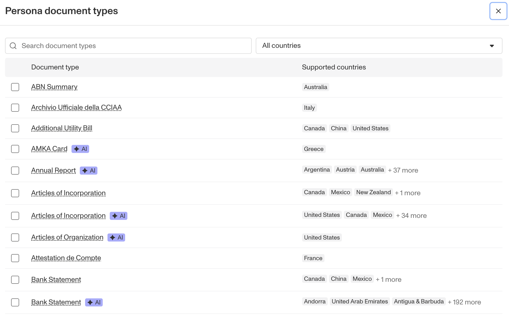

# Documents Verification: Configuring Classifications and Documents Types

## Configuring Classifications

Classification is the process of identifying which Type of document is being submitted. This article explains how to add Document Types to the **Classifications** section of a document group within a Document Verification Template.

A single Document Group can be configured to accept or reject multiple Document Types. Adding a Document Type to a Document Group's Classifications section is what triggers that specific Document Group to be applied. For a submission to pass the **Type Detection** verification check, its classified document type must be configured as **Accepted** in the Document Group that is applied otherwise the submitted document will fail the check.

See also: [_Document AI_](./2ipL09vsPcus5OXuOXdeO9.md), \*\*[Verification Checks reference](https://app.withpersona.com/dashboard/resources/verification-checks)

## Persona vs. Custom Document Types

When configuring Classifications, you can choose from two kinds of Document Types.

### Persona Document Types

-   A library of common, standardized document types managed by Persona (e.g., Bank Statement, Articles of Incorporation).
-   **Recommendation:** If a Persona Document Type exists for your use case, we strongly recommend using it for the highest accuracy and best performance.

### Custom Document Types

-   Document Types that you define and create.
-   Use these when a suitable Persona Document Type does not exist or when you need to classify a unique or internal document (e.g., a specific company form, a niche industry document).

## How to Add Document Types to a Document Group

You configure which Document Types a Document Group accepts from within a Document Verification Template.

1.  Navigate to **Verifications > Templates**.
2.  Select the Document Verification Template you wish to edit.
3.  Select the Document Group you want to configure. If you need to create a new one, click **Add Document Group**.
4.  In the **Classifications** section of the Document Group, click the **Add document type** dropdown.

\[Screenshot: The Classifications section of a Document Group, with the "Add document type" dropdown highlighted.\]

**Note on Document Group application** When a document is submitted, Persona's classification model determines the most likely Document Type. The system then applies the specific Document Group that contains this highest-match Document Type in its Classifications section. To ensure predictable behavior, each Document Type should only be assigned to a single Document Group within a given template.\*

**Note on the General configuration** Every Document Verification Template includes a built-in **General Document Group** which can be renamed but not deleted. It is designed to accept any document type by default, so you **cannot** add specific Document Types to its Classifications section.\*

### To add a Persona Document Type

1.  Select **Persona document types** from the dropdown.
2.  In the modal that appears, you can scroll or use the search bar to find the document type(s) you want to add.
3.  Check the box next to each desired Document Type.
4.  Click **Confirm**.

### To add a Custom Document Type

1.  Select **Custom document types** from the dropdown.
2.  In the modal that appears, enter a clear **Label** for your Document Type.
3.  Provide a short **Description** (2-4 sentences) that explains what the document contains. This is provided to the prompt to the LLM.
4.  Click **Save**.

_**Note: Naming Best Practices** • Use a label that is **clear and descriptive**, for example: **“Form 1098”** or **“Quarterly Tax Document (Q1)”, since this is provided to the LLM as context to perform the classification.** • Avoid overly broad names like **“Tax Document”** or **“My Custom Document Type”**, as these may cause misclassifications._

-   • Use a label that is **clear and descriptive**, for example: **“Form 1098”** or **“Quarterly Tax Document (Q1)”**.
-   • Avoid overly broad names like **“Tax Document”** or **“My Custom Document Type”**, as these may cause misclassifications.

### Setting Accept vs. Reject Configurations

The Type detection validity check is always required. If a submitted doc is not one of the Accepted Doc Types added in the Classifications tabs, type detection will fail. If no Document Groups was added (i.e. only the General Configuration is present), then Type Detection will never fail.

## Related articles

[Document AI](./2ipL09vsPcus5OXuOXdeO9.md)

[Document Verification: Configuring Documents AI overview](./0LPHPwIBZKQI8G7t24zKd.md)
